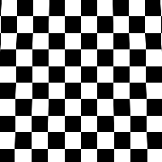

# 사다리꼴 변형

<table>
<tr style="border: 0;">
<td style="border: 0;" valign="top">

{width="128px"}

{width="128px"}

## 사다리꼴 변형(회색 음영)

**내부:** *필터/변형*

**단순**

</td>
<td style="border: 0;" valign="top">

## 설명

원근/사다리꼴 뒤틀기 방식으로 입력을 수정하는 특수 변형 노드입니다. 위/아래 스트레치에 대한 컨트롤이 있습니다. 더 강한 효과를 위해 값을 한도를 넘어 푸시할 수 있습니다.

## 매개변수

* **위쪽 스트레치**: *0.0 - 1.0*&#x200B;위쪽의 스트레치 또는 스쿼시 양을 설정합니다.
* **아래쪽 스트레치**: *0.0 - 1.0*&#x200B;맨 아래에서 스트레치 또는 스쿼시 양을 설정합니다.
* **배경색**: *(회색 음영/색상 값)*\
  타일링이 꺼진 경우 단색 배경색을 설정합니다.
* **샘플링**: *쌍선형, 가장 가까운*&#x200B;샘플링 품질을 설정합니다.

## 예제 이미지

</td>
</tr>
</table>
