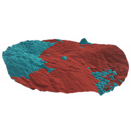

# 재질 Height 혼합

<table>
<tr style="border: 0;">
<td style="border: 0;" valign="top">

{width="128px"}

## 재질 Height 혼합

**내부:** *재질 필터/효과*

**중간**

</td>
<td style="border: 0;" valign="top">

## 설명

이 노드는 두 재질을 높이 맵을 기준으로 혼합하는 [Height 혼합](../../../../../../compositing-graphs/nodes-reference-for-com/node-library/material-filters/effects-material/height-blend/height-blend.md)의 고급 버전입니다. 사용자정의 마스크가 없으므로 각 재질에 대해 하나씩 두 개의 [높이 맵]이 있어야 하며 이 중 하나 이상은 균일 값이 아닙니다.

이는 고품질 혼합 마스크 없이 서로 다른 두 개의 고품질 재료를 결합하는 데 유용할 수 있습니다.

물이나 눈 속에서 섞이고 싶다면 [Snow 표지](../../../../../../compositing-graphs/nodes-reference-for-com/node-library/material-filters/effects-material/snow-cover/snow-cover.md) 및 [수위](../../../../../../compositing-graphs/nodes-reference-for-com/node-library/material-filters/effects-material/water-level/water-level.md) 노드를 대신 사용할 수 있습니다.

## 매개변수

### 매개변수

* **채널**\
  예를 들어 [금속]/[거칠음] 대신 [Specular/광택] 맵을 사용하는 경우 이 그룹에서 재질 채널을 켜거나 끌 수 있습니다.
* **Height 오프셋**: *0.0 - 1.0*&#x200B;혼합 레벨이 Height 축을 따라 이동되도록 높이 맵을 오프셋합니다. 혼합에 대한 기본 컨트롤입니다.
* **대비**: *0.0 - 1.0*\
  혼합의 대비를 조정하고 전환을 더 선명하게 합니다.
* **모드**: *균형 잡힌 Height, 아래쪽 Height 우선 순위*&#x200B;두 다른 혼합 모드 간에 전환합니다.
* **불투명도**: *0.0 - 1.0*\
  전경 Height의 불투명도를 혼합하면 안쪽이나 바깥쪽으로 페이드됩니다.
* **알베도 일치**: *0.0 - 1.0*&#x200B;알베도 색상 간에 수행할 내부 색상 일치의 양입니다.

## 예제 이미지

|  |
| --- |
| 이 페이지에 첨부된 이미지가 없습니다. |

</td>
</tr>
</table>
