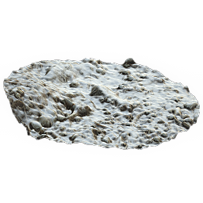

# Snow 표지

<table>
<tr style="border: 0;">
<td width="33.33%" style="border: 0;" valign="top">

{width="128px"}

<b>내부:</b> 재질 필터 > 효과

</td>
<td width="100.00%" style="border: 0;" valign="top">

## 설명

올인원 효과로 전체 소재에 쌓인 눈을 추가할 수 있습니다. Photoscan과 같은 좋은 고품질 Heightmap에 크게 의존합니다. 결과는 PBR 교정이 됩니다.

</td>
</tr>
</table>

## 입력

|  |  |
|:---|:---|
| <b>마스크(선택 사항)</b> <i>회색 음영 입력</i> | 노드의 효과를 마스킹하는 데 사용되는 마스크 슬롯입니다. |

## 매개변수

|  |  |
|:---|:---|
| <b>채널</b> | 예를 들어 [금속]/[거칠음] 대신 [Specular/광택] 맵을 사용하는 경우 이 그룹에서 재질 채널을 켜거나 끌 수 있습니다. |
| <b>새 Snow</b> <i>0.0 - 1.0</i> | 쌓인 영역의 눈 양을 설정합니다. 결과는 용융된 Snow 매개변수와 연관됩니다. |
| <b>녹인 Snow</b> <i>0.0 - 1.0</i> | 낮아진 모퉁이에 녹은 눈의 양을 설정합니다. |
| <b>빌드</b> <i>0.0 - 1.0</i> | 대부분 Height 출력에 영향을 미치고 Height 쌓기 효과를 결정합니다. |
| <b>Smoothness</b> <i>0.0 - 1.0</i> | 적설량을 통해 Height 세부 사항의 매끄러움을 설정합니다. |
| <b>플레이크 강도</b> <i>0.0 - 1.0</i> | 주로 표준 맵, 조각 세부 묘사의 강도에 영향을 줍니다. |
