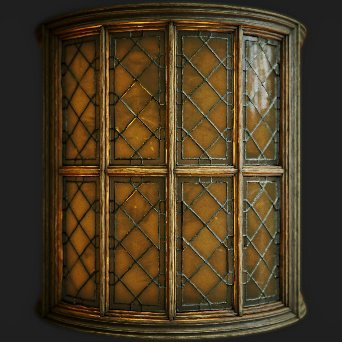

# PBR 렌더링

<table>
<tr style="border: 0;">
<td width="41.60%" style="border: 0;" valign="top">

{width="250px"}

**내부:** *재질 필터/PBR 유틸리티*

**복합**

</td>
<td width="58.30%" style="border: 0;" valign="top">

## 설명

이미지 기반 조명(IBL)을 사용하여 구, 평면 또는 원통에 PBR 재질을 렌더링합니다. 이것은 노드 내의 렌더링 엔진으로, 썸네일, 미리 보기 또는 2D 에셋을 생성하는 데 매우 유용할 수 있습니다. 3D 보기처럼 렌더링되는 것이 아니라 그래프에서 실제 텍스처가 생성되는 것입니다.

이 노드에는 적어도 전체 PBR 자료가 꽂혀 있어야 합니다. [PBR 렌더링 생성 모드]를 사용하여 재질을 링크에 연결하는 것이 좋습니다. 또한 조명을 계산하려면 렌더링에 구형에서 래핑하지 않은 HDRI 환경이 필요합니다. 테스트용 재질은 PBR 재질에서 찾을 수 있으며, 환경 맵은 라이브러리의 [3D 보기에서 찾을 수 있습니다.](../../../../../../compositing-graphs/nodes-reference-for-com/node-library/3d-view-library/3d-view-library.md)

</td>
</tr>
</table>

>[!WARNING]
>
> **CPU(SSE2) 엔진**
> 
> PBR 렌더링 노드가 매우 무거우며 SSE2 CPU 엔진에서 제대로 작동하지 않습니다. 노드가 매우 좋지 않으면 F9 키를 눌러 다른 엔진으로 전환합니다.

## 입력

* **재질 채널** **입력**\
  지오메트리에 재질을 렌더링하는 데 여러 재질 입력이 사용됩니다.
  * 기본 색상
  * 법선
  * 배출
  * 거칠기
  * 금속
  * 반사 수준
  * 높이
  * 주변 폐색
  * 불투명 마스크
  * 비등방성 레벨
  * 비등방성 각도
  * 반투명도
  * 산란 거리 비율
* **렌즈 Dirt 맵**: *회색 음영 입력* Dirt에 대한 사용자 지정 맵으로, 렌즈 플레어가 표시될 때 표시됩니다.
* **렌즈 조리개 맵**: *회색 음영 입력*&#x200B;을 사용하여 초점이 맞지 않는 보케 모양을 재정의할 수 있습니다. 대비가 많을수록 더 잘 보입니다. 텍스처 안의 원만 샘플링되므로 모든 모양이 원 안에 맞아야 한다는 점을 명심하십시오.
* **배경 입력**: *색상 입력*\
  **배경 모드** 매개 변수를 *배경 입력*(으)로 설정한 경우 사용자 지정 맵이 배경으로 사용됩니다.
* **환경 맵**: *색상 입력*&#x200B;조명을 계산하는 데 사용되는 환경 맵. 구형 매핑 및 HDR이어야 합니다.

출력

* **아름다움**\
  최종 렌더링
* **원시 조도**\
  최종 렌더링의 조도 데이터\
  *Alpha:* 불투명도 맵
* **원시 Specular**\
  최종 렌더링의 Specular 데이터\
  *Alpha:* Specular 섀도 맵
* **일반 월드 공간**\
  최종 렌더링의 월드 공간 표준 데이터\
  *Alpha:* 세계 공간 Height 지도
* **수직 탄젠트 공간**\
  최종 렌더링의 탄젠트 공간 수직 데이터\
  *Alpha:* 탄젠트 공간 Height 맵
* **UV**\
  최종 렌더링의 UV 데이터\
  *Alpha:* 불투명도 맵

## 매개변수

* **모양**: *구, 평면, 원통*\
  렌더링에 사용할 모양을 설정합니다. 사용자 정의 모양은 사용할 수 없습니다.
* **변위 강도**: *0.0 - 0.5* Height에서 변위 강도를 설정합니다.
* **환경 회전**: *0.0 - 1.0*\
  조명 환경을 회전합니다. 카메라를 이동할 때와 비교하여 사전 회전합니다.
* **배경 모드**: *색상, 환경, 주변, 배경 입력*\
  배경에 표시되는 내용을 설정합니다. 색상은 단색이며, 환경은 선택적 흐림 효과로 연결한 맵입니다. 주변은 환경의 매우 흐린 버전입니다.
* **배경색**: *(색상 값)*\
  배경 모드가 색상으로 설정된 경우에만 사용할 수 있습니다.
* **환경 배경 흐림 효과**: *0.0 - 1.0*\
  배경 모드가 환경으로 설정된 경우에만 사용할 수 있습니다.
* **모양**
  * **비율**: *0.0 - 2.0*\
    구의 배율을 설정합니다.
  * **평면 크기**: *0.0 - 1.0*\
    평면의 배율을 설정합니다.
  * **실린더 반경**: *0.0 - 1.0*\
    원통의 반경을 설정합니다.
  * **실린더 길이**: *0.0 - 1.0*\
    원통 길이를 설정합니다.
  * **회전**: *0.0 - 1.0*\
    조명을 회전하지 않고 모양을 회전합니다.
  * **회전 방향**: *0.0 - 1.0*\
    회전 축을 2D로 설정합니다.
  * **방향을 중심으로 회전**: *0.0 - 1.0*\
    회전 축에 모양을 회전합니다.
  * **모양 위치**: *-1.0 - 1.0*\
    모양을 이동합니다.
  * **UV 타일링**: *1.0 - 6.0*\
    UV 타일링의 양을 설정합니다.
  * **구 UV 비율**: *0.0 - 4.0*\
    구의 UV 비율을 설정합니다.
  * **평면 UV 비율**: *1.0 - 4.0*\
    평면의 UV 비율을 설정합니다.
  * **실린더 UV 비율**: *1.0 - 6.0*\
    [원통]의 UV 비율을 설정합니다.
  * **UV 오프셋**: *0.0 - 1.0*\
    UV 오프셋
  * **기울기 UV**: *거짓/참*\
    구의 UV를 45도 기울입니다.
* **카메라**
  * **노출**: *-4.0 - 4.0*\
    카메라 노출을 설정합니다.
  * **톤 매퍼**: *선형, ACES, 영화 헤더*\
    최종 이미지에 사용할 톤 매핑 솔루션을 설정합니다.
  * **카메라 모드**: *원근, 정사영*\
    두 투영 모드 간에 카메라를 전환합니다.
  * **보기 필드**: *0.01 - 100.0*\
    카메라 FOV 각도를 설정합니다.
  * **거리**: *0.0 - 4.0*\
    개체 중심으로부터의 카메라 거리를 설정합니다.
  * **비네팅 강도**: *0.0 - 1.0*\
    비네팅 효과의 강도를 설정합니다.
  * **비네팅 반경**: *0.0 - 1.0*\
    비네팅 효과의 반경을 설정합니다.
  * **화면 위치**:\
    개체 주위로 카메라를 이동하고 2D 보기에서도 gizmo로 변경할 수 있습니다.
* **필드 깊이**
  * **조리개 반경** : *0.0 - 0.1*&#x200B;조리개의 반경을 설정합니다. 값이 높을수록 포커스가 맞지 않는 영역이 더 흐려집니다(보케).
  * **조리개 블레이드**: *3 - 9*\
    보케 흐림 효과의 모양을 설정합니다.
  * **조리개 링**: *0.0 - 1.0*\
    보케 모양에 내부 그레이디언트를 추가합니다.
  * **조리개 분수**: *0.0 - 2.0*\
    보크에 색수차를 추가합니다.
  * **소용돌이 보케**: *0.0 - 1.0*\
    초점이 맞지 않는 보케 흐림 영역에 소용돌이 또는 회전하는 효과 유형을 추가합니다.
  * **초점 모드**: *자동, 지점*\
    포커스가 미리 결정되거나 사용자 세트인지 설정합니다. 점 초점 을 사용하면 2D 뷰에서 점을 이동하여 초점 거리를 확인할 수 있습니다.
  * **초점**:\
    포커스가 포인트로 설정되어 있으면 해당 포인트를 이동할 수 있습니다. 2D 보기 gizmo가 있습니다.
  * **초점 오프셋**: *-0.5 - 0.5*\
    포커스가 [자동]으로 설정되어 있으면 포커스를 앞뒤로 이동할 수 있습니다.
  * **사용자 지정 조리개 맵 사용**: *False/True*\
    위의 조리개 설정을 재정의하고 조리개 맵 입력을 사용하여 보케 모양을 결정합니다. 입력이 필요합니다.
* **Post Effects**
  * **Post Effects 사용**: *False/True*\
    최종 렌더링에서 *모두* 후 효과를 전환합니다.
  * **개화 강도** : *0.0 - 2.0*&#x200B;개화 효과의 강도를 설정합니다.
  * **개화 임계값** : *0.0 - 2.0*&#x200B;개화가 나타나도록 낮은 임계값을 설정합니다.
  * **블룸 크로마 시프트** : *0.0 - 1.0*
  * **렌즈 후광 강도** : *0.0 - 1.0*&#x200B;렌즈 후광 효과의 강도를 설정합니다.
  * **렌즈 플레어 강도** : *0.0 - 1.0*&#x200B;렌즈 플레어의 강도를 설정합니다. 이 효과를 제대로 보려면 환경 배경의 빛이 보이는지 확인하십시오.
  * **렌즈 Dirt 강도** : *0.0 - 1.0*&#x200B;렌즈 플레어에 렌즈 Dirt 맵의 효과를 설정합니다.
* **렌더링 설정**
  * **확산 품질**: *16개 샘플, 32개 샘플, 64개 샘플, 128개 샘플*\
    확산 맵의 품질 수준 간을 전환합니다.
  * **확산 발광 배율기**: *0.0 - 1.0*\
    방출 부분이 조도에 기여하는 정도를 제어합니다.
  * **그림자 확산 강도**: *0.0 - 1.0*\
    분산된 그림자의 강도를 제어합니다.
  * **Specular 디더링**: *0.0 - 1.0*\
    Specular의 디더링 양을 설정합니다.
  * **Specular 그림자 배율**: *0.0 - 1.0*\
    Specular 반사에서 어두운 영역의 강도를 제어합니다.
  * **불투명도 모드** *디더링 Alpha 테스트, 간단한 Alpha 혼합*\
    투명도를 적용하는 방법을 제어합니다. *단순 Alpha 혼합* 모드가 균일한 배경에서 가장 많이 표시됩니다.
  * **주변 오클루전 강도**: *0.0 - 1.0*\
    주변 오클루전 그림자의 강도를 설정합니다.
* **재질 조정**
  * **정규식 다시 계산**: *False/True*\
    표준은 Height 강도에 따라 변위 맵에서 다시 계산됩니다.
  * **표준 형식**: *DirectX, OpenGL*\
    다른 표준 맵 포맷 간 전환(녹색 채널을 반전함)
  * **유전체 F0 입력**: *상수 값, Specular level 입력*\
    드라이브 F0 값을 설정합니다. Specular level 입력 은 입력 맵에 의해 구동됨을 의미합니다.
  * **유전체 F0**: *0.0 - 0.08*\
    유전체 F0 입력에 대해 상수 값 을 선택한 경우 이 슬라이더를 사용하면 전체 값을 설정할 수 있습니다.
* **코트 지우기**
  * **Clear Coat 사용**: *False/True*\
    입력 재질 상단에 간단한 투명 코트 층을 추가로 사용할 수 있습니다.
  * **코트 두께 지우기**: *0.0 - 1.0*\
    클리어코트 레이어의 강도나 강도를 설정합니다.
  * **코트 Specular level 지우기**: *0.0 - 1.0*\
    클리어코트 레이어의 거칠기를 설정합니다.
  * **기본 레이어에서 일반 상속**: *False/True* clearcoat이 기본 재질에서 표준을 무시하거나 사용하는 경우 설정합니다.
* **발광**
  * **발광 조명 사용** *True/False*&#x200B;발광 조명의 확산 기여도를 전환합니다.
  * **발광 강도**: *0.0 - 10.0*\
    방출 맵의 전역 승수를 설정합니다.
* **하위 표면 분산**
  * **하위 표면 분산 사용** *참/거짓*\
    최종 렌더링에서 서브서피스 스캐터링을 전환합니다.\
    *참고:* 하위 표면 산란을 사용하려면 **반투명도** 입력 값이 *0.0*&#x200B;보다 높아야 합니다.
  * **분산 거리** *0.0 - 1.0*\
    분산 효과의 최대 거리를 조정합니다.\
    *참고:* 이 값은 **분산 거리 비율** 입력 값 *색상 채널당*&#x200B;에 대해 곱해집니다.
  * **Red Shift** *0.0 - 1.0*\
    분산에서 빨강 이동 효과의 강도를 조정합니다.
  * **Rayleigh** *0.0 - 1.0*\
    분산에서 레일리 효과의 강도를 조정합니다.

## 예제 이미지

모든 이미지는 [Substance 3D 에셋](https://substance3d.adobe.com/assets) 라이브러리의 재질을 사용하여 Designer의 2D 뷰포트 내부에서 직접 생성되었습니다.

| 

 | 

 | 

 | 

 |
| --- | --- | --- | --- |
|  |  |  |  |
| 

 | 

 | 

 | 

 |
|  |  |  |  |
