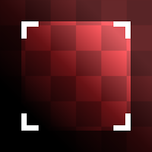

# 자르기

<table>
<tr style="border: 0;">
<td width="33.33%" style="border: 0;" valign="top">

{width="128px"}

{width="128px"}

<b>내부:</b> 재질 필터 > 스캔 처리

</td>
<td width="100.00%" style="border: 0;" valign="top">

## 설명

[자르기]는 익숙한 자르기 도구의 패라메트릭 비파괴 버전입니다. 이미지의 한 영역을 선택하면 선택되지 않은 영역이 삭제된 상태로 결과가 반환됩니다.

원자 노드로 자르기 작업을 수행하는 것이 그렇게 간단하지 않으므로 여러 가지 방법으로 유용할 수 있습니다. 특히 정사각형이 아닌 이미지를 변환하는 경우 이 노드가 유용합니다. 이 경우 입력 해상도를 올바르게 설정해야 합니다.

이 노드를 쉽게 사용하려면 편집 중인 매개 변수가 아닌 다른 노드를 미리 볼 수 있는 기능을 잘 사용해야 한다는 점을 이해해야 합니다.\
요컨대: 이 노드(잘리지 않은 원본 이미지)에 대한 입력으로 사용 중인 노드를 **두 번 클릭**&#x200B;한 다음 바로 뒤에 오는 자르기 노드를 **한 번 클릭**&#x200B;합니다. 그런 다음 자르려는 영역에 맞게 자르기 기즈모를 수정할 수 있습니다.

</td>
</tr>
</table>

## 매개변수

|  |  |
|:---|:---|
| <b>입력 크기</b> <i>0 - 8192</i> | 이미지의 해상도와 비율을 입력합니다. 정사각형이 아닌 이미지에 매우 중요합니다. |
| <b>배경</b> <i>(색상 값) / (회색 음영 값)</i> | [자르기]로 가려지지 않은 영역의 배경에 균일한 값 |
| <b>변형</b> <i>(변환 행렬)</i> | 결과를 회전하고 크기를 조절합니다. 캔버스와 직접 상호 작용하여 결과를 수정할 수 있습니다. |
| <b>오프셋</b> <i>0.0 - 1.0</i> | 결과를 이동하거나 변환합니다. 캔버스와 직접 상호 작용하여 결과를 수정할 수 있습니다. |
| <b>일반(색상 버전에만 해당)</b> <i>거짓/참</i> | 입력을 정규맵으로 처리할지 여부를 지정합니다. |
