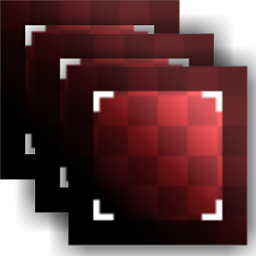

# 다중 자르기

<table>
<tr style="border: 0;">
<td width="33.33%" style="border: 0;" valign="top">

{width="128px"}

{width="128px"}

<b>내부:</b> 재질 필터 > 스캔 처리

</td>
<td width="100.00%" style="border: 0;" valign="top">

## 설명

자르기의 멀티 채널 버전입니다. 이미지에서 영역을 자르고 주로 다각 사진에 사용하기 위한 것으로, [다각 대 알베도](../../../../../../compositing-graphs/nodes-reference-for-com/node-library/material-filters/scan-processing/multi-angle-to-albedo/multi-angle-to-albedo.md) 또는 [다각 대 일반](../../../../../../compositing-graphs/nodes-reference-for-com/node-library/material-filters/scan-processing/multi-angle-to-normal/multi-angle-to-normal.md)과 결합됩니다.

>[!NOTE]
>
> 자세한 내용은 원본 [자르기](../../../../../../compositing-graphs/nodes-reference-for-com/node-library/material-filters/scan-processing/crop/crop.md)를 참조하세요.

</td>
</tr>
</table>

## 매개변수

|  |  |
|:---|:---|
| <b>입력 수</b> <i>1 - 8</i> | 병렬로 처리할 입력 수를 설정합니다. |
| <b>입력 크기</b> <i>0 - 8192</i> | 이미지의 해상도와 비율을 입력합니다. 정사각형이 아닌 이미지에 매우 중요합니다. |
| <b>배경</b> <i>(색상 값) / (회색 음영 값)</i> | [자르기]로 가려지지 않은 영역의 배경에 균일한 값 |
| <b>변형</b> <i>(변환 행렬)</i> | 결과를 회전하고 크기를 조절합니다. 캔버스와 직접 상호 작용하여 결과를 수정할 수 있습니다. |
| <b>오프셋</b> <i>0.0 - 1.0</i> | 결과를 이동하거나 변환합니다. 캔버스와 직접 상호 작용하여 결과를 수정할 수 있습니다. |
| <b>일반(색상 버전에만 해당)</b> <i>거짓/참</i> | 입력을 정규맵으로 처리할지 여부를 지정합니다. |
