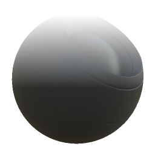

# 아래에서 위로

<table>
<tr style="border: 0;">
<td style="border: 0;" valign="top">

{width="128px"}

## 아래에서 위로

**내부:** *메시 기반 생성기/마스크 생성기*

**단순**

</td>
<td style="border: 0;" valign="top">

## 설명

베이킹된 맵 및 사용자 설정을 기반으로 흑백 마스크를 생성합니다. [Painter](https://experienceleague.adobe.com/en/docs/substance-3d-painter/using/home)의 [스마트 마스크](https://experienceleague.adobe.com/en/docs/substance-3d-painter/using/features/smart-materials-and-masks)와 비슷합니다.

그러면 모델의 아래쪽에서 위쪽으로 흰색에서 검정으로 전환되어 형상 기반 밝기 감소 및 선택 영역을 만드는 데 유용합니다.

## 매개변수

### 입력

* **위치**: *색상 입력*\
  위치 맵을 구웠습니다. 필수!
* **거칠음:** *회색 음영 입력*\
  이는 PBR 거칠음과는 무관하지만 전환을 나누기 위한 (선택 사항) 변형 맵입니다. [거칠음]이 0보다 높게 설정된 경우에만 표시됩니다.
* **마스크(선택 사항)**: *회색 음영 입력*\
  노드의 효과를 마스킹하는 데 사용되는 마스크 슬롯입니다.

### 매개변수

* **수준**: *0.0 - 1.0*\
  명도 조정처럼 결과의 평균 레벨을 검정색이나 흰색으로 이동합니다.
* **대비**: *0.0 - 1.0*\
  전환의 대비를 조정합니다.
* **거칠기\_변형**: *0.0 - 1.0*&#x200B;변형에 대해 혼합할 거칠기 맵의 양을 결정합니다. 이 값을 0으로 늘리면 맵 슬롯이 표시됩니다.

## 예제 이미지

</td>
</tr>
</table>
