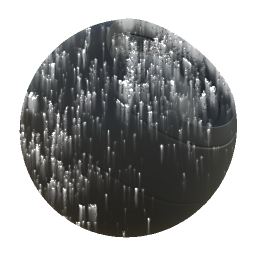

# 드리핑 녹

<table>
<tr style="border: 0;">
<td style="border: 0;" valign="top">

{width="128px"}

## 드리핑 녹

**내부:** *메시 기반 생성기**/마스크 생성기*

**중간**

</td>
<td style="border: 0;" valign="top">

## 설명

베이킹된 맵 및 사용자 설정을 기반으로 흑백 마스크를 생성합니다. [Painter](https://support.allegorithmic.com/documentation/display/SPDOC/Substance+Painter)의 [스마트 마스크](https://support.allegorithmic.com/documentation/display/SPDOC/Smart+Materials+and+Masks)와 비슷합니다.

이 마스크는 흘러내리는 누출과 함께 녹 플레이크 및 스펙을 나타냅니다.

## 매개변수

### 입력

* **곡률**: *회색 음영 입력*\
  녹 배치에 도움이 되도록 맵을 작성하거나 생성했습니다.
* **주변 오클루전**: *회색 음영 입력*\
  녹 배치에 도움이 되도록 맵을 작성하거나 생성했습니다.
* **위치**: *회색 음영 입력*\
  점적 방향에 대해 구워지거나 생성된 맵
* **마스크(선택 사항)**: *회색 음영 입력*\
  노드의 효과를 마스킹하는 데 사용되는 마스크 슬롯입니다.

### 매개변수

* **녹 확산**: *0.0 - 1.0*&#x200B;녹 양에 대한 기본 제어.
* **녹 대비**: *0.0 - 1.0*&#x200B;생성된 녹 스펙트럼에 대비 양을 설정합니다(물방울에는 영향을 주지 않음).
* **Smoothness 확산**: *0.0 - 1.0*&#x200B;녹 얼룩 전체에 적용할 흐림/희미하게 하는 효과의 양.
* **물방울 강도**: *0.0 - 1.0*&#x200B;겹침에서 물방울의 강도와 길이를 설정합니다.
* **Smoothness 물방울**: *0.0 - 1.0*&#x200B;물방울에 적용할 흐림 및 매끄러움의 양입니다.
* **드립스 샘플 양**: *0 - 32*&#x200B;드립스 효과의 품질 수준(단계)을 설정합니다. 속도에 약간의 영향을 미칩니다.

## 예제 이미지

</td>
</tr>
</table>
