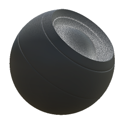

# Dust

<table>
<tr style="border: 0;">
<td style="border: 0;" valign="top">

{width="128px"}

## Dust

**내부:** *메시 기반 생성기**/마스크 생성기*

**중간**

</td>
<td style="border: 0;" valign="top">

## 설명

베이킹된 맵 및 사용자 설정을 기반으로 흑백 마스크를 생성합니다. [Painter](https://support.allegorithmic.com/documentation/display/SPDOC/Substance+Painter)의 [스마트 마스크](https://support.allegorithmic.com/documentation/display/SPDOC/Smart+Materials+and+Masks)와 비슷합니다.

이 마스크는 가려지고 내려간 영역은 물론 위쪽을 향하는 영역에만 누적된 Dust을 나타냅니다. 제대로 된 AO와 월드 스페이스 노멀이 작동해야 합니다.

## 매개변수

### 입력

* **주변 오클루전**: *회색 음영 입력*\
  Dust 배치에 사용되는 베이킹된 맵. 필수!
* **월드 스페이스 표준**: *색상 입력*\
  Dust 배치에 사용되는 베이킹된 맵. 필수!
* **노이즈**: *회색 음영 입력*\
  사용자 정의 Dust 맵(선택 사항)은 [노이즈 재정의]가 True로 설정된 경우에만 나타납니다.
* **마스크(선택 사항)**: *회색 음영 입력*\
  노드의 효과를 마스킹하는 데 사용되는 마스크 슬롯입니다.

### 매개변수

* **수준**: *0.0 - 1.0*\
  총 Dust 양을 설정합니다.
* **대비**: *0.0 - 1.0*\
  Dust 대비를 조정합니다.
* **오클루전 양**: *0.0 - 1.0* AO의 영향을 설정합니다. 가려진 영역에서 더 많은 Dust이 나타납니다.
* **노이즈 불투명도**: *0.0 - 1.0*&#x200B;먼지가 많은 영역에 표시되는 노이즈 양을 설정합니다.
* **노이즈 재정의**: *False/True*&#x200B;사용자 지정 Dust 맵 입력을 사용하도록 설정합니다.

## 예제 이미지

</td>
</tr>
</table>
