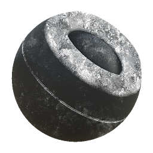

# 그리스

<table>
<tr style="border: 0;">
<td width="33.33%" style="border: 0;" valign="top">

{width="128px"}

<b>내부:</b> 메시 기반 생성기 > 마스크 생성기

</td>
<td width="100.00%" style="border: 0;" valign="top">

## 설명

베이킹된 맵 및 사용자 설정을 기반으로 흑백 마스크를 생성합니다. [Painter](https://support.allegorithmic.com/documentation/display/SPDOC/Substance+Painter)의 [스마트 마스크](https://support.allegorithmic.com/documentation/display/SPDOC/Smart+Materials+and+Masks)와 비슷합니다.

이 마스크는 특히 캐릭터 얼굴 및 기타 특정 영역을 위한 것입니다. Thickness이 낮은 영역에 스킨 그리스 유형의 마스크를 생성합니다.

</td>
</tr>
</table>

## 입력

|  |  |
|:---|:---|
| <b>Thickness</b> <i>회색 음영 입력</i> | 전체 효과의 기초가 되는 Thickness 맵을 구웠습니다. 필수! |
| <b>노이즈</b> <i>회색 음영 입력</i> | 그리스 그런지를 재정의할 선택적 노이즈 맵 |
| <b>마스크(선택 사항)</b> <i>회색 음영 입력</i> | 노드의 효과를 마스킹하는 데 사용되는 마스크 슬롯입니다. |

## 매개변수

|  |  |
|:---|:---|
| <b>수준</b> <i>0.0 - 1.0</i> | 표시할 효과의 총 양을 설정합니다. |
| <b>대비</b> <i>0.0 - 1.0</i> | 결과의 대비를 조정합니다. |
| <b>Thickness 임계값</b> <i>0.0 - 1.0</i> | 효과가 나타나야 하는 최소 Thickness을 설정합니다. [레벨]과 동일하게 중요합니다. 이 값을 두께 맵에 맞게 조정합니다. |
| <b>노이즈 재정의</b> <i>거짓/참</i> | 내부 그리스 그런지 맵을 사용자 지정 입력 슬롯으로 재정의하도록 설정합니다. |

## 예

<table style="margin-top: 32px; margin-bottom: 32px">
    <tr style="border: 0">
        <td style="border: 0; background: transparent">
            
        </td>
    </tr>
</table>
