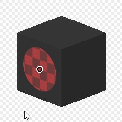

# 3D 평면 투영

<table>
<tr style="border: 0;">
<td width="33.33%" style="border: 0;" valign="top">

<b>내부:</b> 메시 기반 생성기 > 유틸리티

</td>
<td width="100.00%" style="border: 0;" valign="top">

## 설명

구운 메시 데이터(위치 및 세계 노멀 맵)를 기반으로 평면 투영을 수행합니다. 원래 UV 매핑과 관계없이 이음새 간에 데칼을 투영하고 배치할 수 있습니다.

</td>
</tr>
</table>

## 입력

|  |  |
|:---|:---|
| <b>위치 맵</b> <i>색상 입력</i> | 위치 맵 굽기 |
| <b>월드 스페이스 표준</b> <i>색상 입력</i> | Baked World Space 표준 지도 |
| <b>예상 텍스처</b> <i>색상 입력</i> | 대상에 투영할 입력 텍스처. |

## 매개변수

|  |  |
|:---|:---|
| <b>위치</b> |  |
| <b>프로젝트 입력</b> <i>UV 위치, 세계 우주 위치</i> | 투영 위치를 2D/UV로 설정할지, 3D/월드 공간으로 설정할지 선택합니다. |
| <b>대상 UV 위치</b> | UV 위치 입력에서만 [위치] 맵의 2D 보기에서 점을 선택하는 데 가장 적합합니다. |
| <b>대상 위치</b> <i>(색상 값)</i> | 월드 공간 위치 입력을 통해서만 정확한 3D 좌표를 정의할 수 있습니다. |
| <b>대상 정상</b> <i>(색상 값)</i> |  |
| <b>회전</b> <i>0.0 - 1.0</i> | 투영된 텍스처를 수직 축을 따라 회전합니다. |
| <b>크기 조절</b> <i>0.0 - 1.0</i> | 투영된 텍스처의 전체 배율을 설정합니다. |
| <b>크기</b> <i>0.0 - 2.0</i> | 투영된 텍스처에서 균일하지 않은 배율 조정을 수행합니다. |
| <b>마스킹</b> |  |
| <b>최대 깊이</b> <i>0.0 - 1.0</i> | 잘릴 때 투영된 텍스처의 표시 깊이를 제어합니다. |
| <b>깊이 페이드</b> <i>0.0 - 1.0</i> | 잘라내기 깊이의 전환을 급격하게 또는 희미하게 설정합니다. |
| <b>정상 임계값</b> <i>-1.0 - 1.0</i> | 투영에 정확히 정렬되지 않은 서피스의 트레숄드를 설정합니다. |
| <b>일반 페이드</b> <i>0.0 - 1.0</i> | 급랭 또는 페이드에 정렬되지 않은 서피스에 대한 전환을 설정합니다. |

## 예

<table style="margin-top: 32px; margin-bottom: 32px">
    <tr style="border: 0">
        <td style="border: 0; background: transparent">
            
        </td>
    </tr>
</table>
