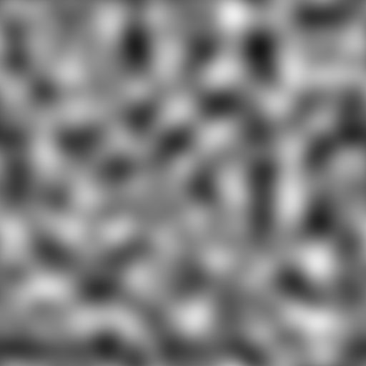

# 패스에 마스크 적용

<table>
<tr style="border: 0;">
<td width="33.33%" style="border: 0;" valign="top">

<b>인:</b> 스플라인 및 패스 도구 > 패스 도구

</td>
<td width="100.00%" style="border: 0;" valign="top">

## 설명

회색 음영 입력 패턴 <b>마스크</b>를 출력 <b>패스</b>로 인코딩된 패스 세그먼트 목록으로 변환합니다.

생성된 패스의 시작 위치와 목록에서 해당 순서를 제어할 수 있습니다.

생성된 패스는 전용 노드(예: [패스 2D 변형](../../../../../../compositing-graphs/nodes-reference-for-com/node-library/spline-paths-tools/path-tools/path-2d-transform/path-2d-transform.md), [패스 뒤틀기](../../../../../../compositing-graphs/nodes-reference-for-com/node-library/spline-paths-tools/path-tools/paths-warp/paths-warp.md))를 사용하여 추가로 처리하거나 [스플라인 패스](../../../../../../compositing-graphs/nodes-reference-for-com/node-library/spline-paths-tools/path-tools/paths-to-spline/paths-to-spline.md) 노드를 사용하여 스플라인으로 변환하여 모양을 매핑하거나 산란에 사용할 수 있습니다.

</td>
</tr>
</table>

>[!NOTE]
>
> 경로를 인코딩하는 데 사용되는 방법은 [경로 형식 사양](../../../../../../compositing-graphs/nodes-reference-for-com/node-library/spline-paths-tools/path-tools/paths-format-spe/paths-format-specifications.md) 페이지에 설명되어 있습니다.

## 입력 커넥터

<b>마스크</b> *회색 음영*\
패스 목록으로 변환해야 하는 입력 패턴입니다.

## 출력 커넥터

<b>미리 보기</b> *색상*&#x200B;매개 변수의 효과를 시각화하는 데 도움이 되도록 마스크 위에 합성된 미리 보기입니다.

<b>경로</b> *색상*\
색상 이미지로 인코딩되는 경로의 목록입니다. 각 경로는 인코딩된 세그먼트 목록을 설명합니다.\
결과는 다른 패스 처리 노드를 사용하여 처리하거나 [스플라인으로 패스](../../../../../../compositing-graphs/nodes-reference-for-com/node-library/spline-paths-tools/path-tools/paths-to-spline/paths-to-spline.md) 노드로 보내 스플라인으로 추가로 처리할 수 있습니다.

## 매개변수

<b>마스크 다듬기</b> *부동*\
입력 마스크에 매끄러움을 적용합니다.\
입력 패턴의 가장자리가 매우 날카로워 일반적으로 가공물이 발생하는 경우에 유용합니다.

<b>마스크 임계값</b> *부동*&#x200B;모양의 외부(값 &lt; 마스크 임계값)와 내부(값 > 마스크 임계값)를 분리하는 데 사용되는 <b>마스크</b>의 회색 음영 값.

<b>데시메이트 경로</b> *부동*&#x200B;생성될 세그먼트의 양을 암시적으로 제어합니다.\
높은 양의 데시메이션은 다소 다각형의 둥근 형상을 만들 것인 반면, 데시메이션은 거의 하나의 세그먼트를 픽셀로 생성하지 않을 것이다.\
적당한 양은 직선에 대한 중간 점을 많이 만들지 않고도 직선과 곡선 모두의 모양에 더 잘 맞도록 합니다.

<b>열린 패스 닫기</b> *부울*&#x200B;열린 패스의 시작 정점과 끝 정점 사이에 선분을 만듭니다.\
이 옵션을 비활성화하면 패턴을 가로지르는 바람직하지 않은 선이 예기치 않은 방식으로 수정될 수 있지만 경로가 더 이상 닫히지 않을 수 있습니다.

<b>모퉁이 임계값</b> *부동*\
경로들로 인코딩된 각각의 정점은 그것이 하드(즉, 코너) 또는 스무드인지를 표시하는 플래그를 보유할 수 있다.\
이 매개 변수를 사용하면 인접한 선분 사이의 각도에 따라 더 많거나 더 적은 모퉁이를 표시할 수 있습니다.\
*참고:* 이 &#39;corner&#39; 플래그는 현재 기존 노드에서 지원되지 않지만 [경로 정점 프로세서](../../../../../../compositing-graphs/nodes-reference-for-com/node-library/spline-paths-tools/path-tools/paths-vertex-processor/paths-vertex-processor.md) 노드에서 사용할 수 있습니다. [미리 보기 경로](../../../../../../compositing-graphs/nodes-reference-for-com/node-library/spline-paths-tools/path-tools/preview-paths/preview-paths.md) 노드를 사용하여 모퉁이를 시각화할 수도 있습니다.

<b>경로 시작 모드</b> *정수*&#x200B;마스크에서 모양 주위에 생성된 각 패스의 시작 정점을 선택하는 방법입니다.\
이는 여러 스플라인 노드가 스플라인의 시작과 끝을 사용하므로 전용 노드를 사용하여 생성된 <b>패스를 스플라인으로 변환</b>할 때 상당한 영향을 미칩니다.\
*- 가장 예리한 정점:* 이전 정점과 다음 정점과 함께 가장 낮은 각도를 형성하는 정점\
*- 지정한 방향의 끝에 있는 정점:* 지정한 방향의 마지막 정점입니다.\
*- 지정된 위치에 가장 가까운 정점
* 지정된 위치에서 가장 먼 정점
* 사용자 정의 시작 함수:* 사용자 정의 함수를 사용하여 각 경로의 시작으로 사용할 정점을 선택합니다.

<b>시작 방향</b> *부동*&#x200B;시작 정점을 선택하는 데 사용되는 방향을 설명하는 각도입니다. 각 패스에 대해 이 방향의 마지막 정점이 선택됩니다.\
값은 X-왼쪽 방향 벡터를 회전하는 데 사용되는 *회전수*&#x200B;입니다. 즉, 0은 (-1, 0)의 방향 벡터를 설정하고, 0.25(90도)는 (0, 1)의 방향 벡터를 설정한다.\
*참고:* 이 매개 변수는 <b>경로 시작 모드</b>가 &#39;지정된 방향의 맨 끝에 있는 정점&#39;으로 설정된 경우에 사용할 수 있습니다.

<b>시작 대상 위치</b> *Float2*&#x200B;시작 정점을 선택하는 데 사용되는 이미지의 위치입니다.\
선택한 <b>패스 시작 모드</b>에 따라 각 패스에 대해 이 위치에 가장 가깝거나 가장 먼 정점이 선택됩니다.\
*참고:* 이 매개 변수는 <b>경로 시작 모드</b>가 &#39;지정된 위치에서 가장 가까운 정점&#39; 또는 &#39;지정된 위치에서 가장 먼 정점&#39;으로 설정되어 있을 때 사용할 수 있습니다.

<b>시작 함수</b> *부동*&#x200B;시작 정점을 선택하는 데 사용되는 함수입니다. Float 값을 반환합니다.\
각 정점에 대해 함수가 실행되고 함수가 *가장 높은 결과*&#x200B;를 반환하는 정점이 선택됩니다.\
사용 가능한 변수:\
*-* vertex.cornerness(Float)*:* 모서리가 될 후보인 정점의 점수\
*-* vertex.pos(Float2)*:* 이미지 공간의 정점 위치\
*참고:* 이 매개 변수는 경로 시작 모드가 &#39;지정된 위치에 가장 가까운 정점&#39; 또는 &#39;사용자 지정 시작 함수&#39;로 설정되어 있을 때 사용할 수 있습니다.

<b>주문 모드</b> *정수*&#x200B;생성된 경로의 순서를 지정하는 방법입니다.\
위치 또는 크기 패스의 *테두리 상자*(Bbox)가 패스 순서 지정의 기준으로 사용될 수 있습니다.\
이는 여러 스플라인 노드에서 스플라인의 순서를 사용하므로 전용 노드를 사용하여 생성된 <b>패스를 스플라인으로 변환</b>할 때 상당한 영향을 미칩니다.\
*- 레거시(고속):* 이 노드의 이전 버전에서 사용되는 메서드로, 훨씬 더 나은 성능을 제공합니다.\
*- 방향을 따라 상자 가운데 위치별:* 경로는 상자의 가운데 위치에 따라 지정된 방향을 따라 첫 번째부터 마지막 순으로 정렬됩니다\
*- 상자 기준 방향을 따라 왼쪽 위 위치:* 경로는 상자의 왼쪽 위 모퉁이 위치에 따라 지정된 방향을 따라 첫 번째부터 마지막 순서대로 정렬됩니다.\
*- Bbox 크기별 - 최대값 - 최소값:* 경로가 Bbox 크기에 따라 최대값 - 최소값 순으로 정렬됩니다.\
*- 상자 크기별 - 최소에서 최대까지:* 패스는 상자 크기에 따라 최소에서 최대까지 정렬됩니다.\
*- 사용자 지정 순서 함수:* 사용자 지정 함수를 사용하여 경로 순서 지정

<b>정렬 방향</b> *부동*&#x200B;방향을 따라 처음부터 끝까지 패스를 정렬하는 데 사용되는 방향을 설명하는 각도입니다.\
이 값은 X 왼쪽 방향 벡터를 회전하는 데 사용되는 *회전수*&#x200B;입니다. 즉, 0은 (-1, 0)의 방향 벡터를 설정하고, 0.25(90도)는 (0, 1)의 방향 벡터를 설정한다.

<b>순서 지정 함수</b> *Float*&#x200B;경로를 정렬하는 데 사용되는 함수입니다. Float 값을 반환합니다.\
경로는 이 함수 값에 따라 *오름차순*&#x200B;으로 정렬됩니다. 즉, 각 경로에 대한 함수의 결과는 경로 순서를 지정하는 데 사용된 *정렬 키*&#x200B;입니다.\
사용 가능한 변수:
* bbox.center (Float2): 경로 Bbox의 중심 위치
* bbox.topleft (Float2): 경로 Bbox의 왼쪽 위 모퉁이 위치
* bbox.size (Float2): 경로 Bbox의 크기(X: width, Y: Height)

## 예

<table>
<tr style="border: 0;">
<td style="border: 0;" valign="top">

<table>
  <tr>
    <td>
      
       <i>이전</i>
    </td>
    <td>
      
       <i>이후</i>
    </td>
  </tr>
</table>

</td>
<td style="border: 0;" valign="top">

<table>
  <tr>
    <td>
      
       <i>이전</i>
    </td>
    <td>
      
       <i>이후</i>
    </td>
  </tr>
</table>

</td>
</tr>
</table>

<table>
<tr style="border: 0;">
<td style="border: 0;" valign="top">

{zoomable="yes"}

</td>
<td style="border: 0;" valign="top">

{zoomable="yes"}

</td>
</tr>
</table>

<table>
<tr style="border: 0;">
<td style="border: 0;" valign="top">

{zoomable="yes"}

</td>
<td style="border: 0;" valign="top">

{zoomable="yes"}

</td>
</tr>
</table>
