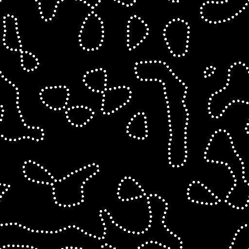

# 패스를 스플라인으로

<table>
<tr style="border: 0;">
<td width="33.33%" style="border: 0;" valign="top">

<b>인:</b> 스플라인 및 패스 도구 > 패스 도구

</td>
<td width="100.00%" style="border: 0;" valign="top">

## 설명

패스를 스플라인으로 변환하고, 이 스플라인은 [스플라인 렌더링](../../../../../../compositing-graphs/nodes-reference-for-com/node-library/spline-paths-tools/spline-tools/spline-render/spline-render.md) 노드를 사용하여 시각화하고 [스플라인 노드](../../../../../../compositing-graphs/nodes-reference-for-com/node-library/spline-paths-tools/spline-tools/spline-tools.md)를 사용하여 처리합니다.

</td>
</tr>
</table>

>[!NOTE]
>
> 스플라인은 곡선이므로 패스의 선명도를 유지할 수 없습니다. 패스를 스플라인으로 변환할 때 모양이 약간 매끄러워질 수 있습니다.

>[!TIP]
>
> 이 노드는 [패스에 마스크 적용](../../../../../../compositing-graphs/nodes-reference-for-com/node-library/spline-paths-tools/path-tools/mask-to-paths/mask-to-paths.md) 노드 뒤에 사용하여 마스크를 스플라인으로 변환하는 체인을 만들 수 있습니다.

## 입력 커넥터

<b>경로</b> *색상*\
인코딩된 세그먼트 경로 목록입니다. 이 입력을 [패스에 마스크](../../../../../../compositing-graphs/nodes-reference-for-com/node-library/spline-paths-tools/path-tools/mask-to-paths/mask-to-paths.md) 또는 다른 패스 처리 노드에 연결합니다.

## 출력 커넥터

<b>스플라인 좌표&#x200B;</b>*색상*&#x200B;색상 이미지의 RGBA 채널로 인코딩된 입력 스플라인의 점 좌표:\
<b>R</b> - X 위치\
<b>G</b> - Y 위치\
<b>B</b> - Height\
<b>A</b> - 압축된 데이터:\
* Sign: 스플라인이 닫히거나(음수) 열림(양수);\
* 절대값: Thickness + 1.

<b>스플라인 데이터</b> *색상*\
<b>색상</b> 이미지의 RGBA 채널로 인코딩된 입력 스플라인의 추가 데이터:\
<b>R</b> - 접선 X\
<b>G</b> - 접선 Y\
<b>B</b> - 사용되지 않음\
<b>A</b> - 사용되지 않음

<b>스플라인 양</b> *정수*\
입력 스플라인의 수입니다.

## 매개변수

<b>스플라인 정밀도</b> *정수*\
해당 스플라인을 빌드하기 위해 입력된 [패스] 입력의 각 패스에서 샘플링된 정점 수의 밑이 2인 로그(log2)입니다.

## 예

<table>
<tr style="border: 0;">
<td style="border: 0;" valign="top">

<table>
  <tr>
    <td>
      
       <i>이전</i>
    </td>
    <td>
      
       <i>이후</i>
    </td>
  </tr>
</table>

</td>
<td style="border: 0;" valign="top">

<table>
  <tr>
    <td>
      
       <i>이전</i>
    </td>
    <td>
      
       <i>이후</i>
    </td>
  </tr>
</table>

</td>
</tr>
</table>
