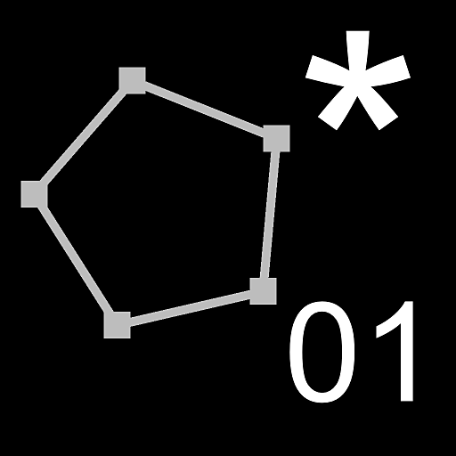

# 패스 정점 프로세서

<table>
<tr style="border: 0;">
<td width="33.33%" style="border: 0;" valign="top">

<b>인:</b> 스플라인 및 패스 도구 > 패스 도구

</td>
<td width="100.00%" style="border: 0;" valign="top">

## 설명

입력 <b>패스</b>의 정점 위치에 변형을 적용합니다.

노드는 다음과 같이 사용해야 합니다.

1. <b>정점별 함수 </b>매개 변수 함수 편집;
1. <b>Get Float2</b> 노드를 사용하여 획득합니다. *vertex.pos*, *prev.pos* 및/또는 *next.pos* 변수
1. 해당 값에 대해 몇 가지 작업을 수행합니다(예: 곱하기를 통해 패스 크기를 조절합니다).
1. 계산 결과를 출력으로 설정합니다.

</td>
</tr>
</table>

*prev.pos* 또는 *next.pos*&#x200B;을 쿼리하기 전에 적절한 <b>액세스된 이전 정점</b> 및 <b>액세스된 다음 정점</b> 값을 설정해야 합니다\
입력 이미지를 추가하고 함수에서 샘플링할 수도 있습니다. 함수에서 샘플링하려면 먼저 입력을 연결해야 합니다. (첫 번째 입력은 *이미지 1*&#x200B;입니다!)\
*prev[2].pos*(Float2), *next[2].pos*(Float2), *vertex.corner*(bool) 및 *path.id*(float) 변수에 액세스할 수도 있습니다.

>[!TIP]
>
> 고급 사용자를 위해 [패스 형식 사양](../../../../../../compositing-graphs/nodes-reference-for-com/node-library/spline-paths-tools/path-tools/paths-format-spe/paths-format-specifications.md)에서는 패스의 데이터를 컬러 이미지로 인코딩하는 방법을 설명하고 이 데이터를 직접 조작하기 위한 팁을 제공합니다.

>[!NOTE]
>
> [패스 정점 프로세서 단순](../../../../../../compositing-graphs/nodes-reference-for-com/node-library/spline-paths-tools/path-tools/paths-vertex-processor-1/paths-vertex-processor-simple.md)도 참조하십시오.

## 입력 커넥터

<b>경로</b> *색상*\
인코딩된 세그먼트 경로 목록입니다. 이 입력을 [패스에 마스크](../../../../../../compositing-graphs/nodes-reference-for-com/node-library/spline-paths-tools/path-tools/mask-to-paths/mask-to-paths.md) 또는 다른&#x200B;*패스* 처리 노드에 연결합니다.

<b>입력 #</b> *색상/회색 음영*\
<b>정점별 함수</b> 매개 변수 함수에서 샘플링해야 하는 이미지에 대한 입력입니다.

## 출력 커넥터

<b>경로</b> *색상*\
변형된 패스. [패스 미리 보기](../../../../../../compositing-graphs/nodes-reference-for-com/node-library/spline-paths-tools/path-tools/preview-paths/preview-paths.md)를 사용하여 결과가 어떻게 나타나는지 파악하거나 다른 패스 처리 노드를 사용하거나 [스플라인으로 패스](../../../../../../compositing-graphs/nodes-reference-for-com/node-library/spline-paths-tools/path-tools/paths-to-spline/paths-to-spline.md)에 입력하여 스플라인으로 추가로 처리할 수 있습니다.

## 매개변수

<b>이전 정점이 액세스됨</b> *정수*\
이 매개 변수를 사용하면 <b>정점별 함수</b> 매개 변수 함수에서 <b>Get</b> 노드를 사용하여 경로(*prev.pos*) 및 이전 정점(*prev[2].pos*)을 따라 이전 정점의 위치를 가져올 수 있습니다.

<b>액세스된 다음 정점</b> *정수*\
이 매개 변수를 사용하면 <b>정점별 함수</b> 매개 변수 함수에서 <b>Get</b> 노드를 사용하여 경로(*next.pos*) 및 다음 정점(*next[2].pos*)을 따라 다음 정점의 위치를 가져올 수 있습니다.

<b>이미지 입력 횟수</b> *정수*\
<b>정점별 함수</b> 매개 변수 함수에서 샘플링해야 하는 이미지를 연결하기 위해 표시되는 <b>입력 #</b> 입력 커넥터 수입니다.\
원하는 샘플 설정을 모두 완료하면 이 매개 변수의 값을 다시 0으로 줄여서 사용하지 않는 핀을 숨길 수 있습니다.

<b>정점별 함수</b> *Float2*\
각 정점에 적용되는 함수입니다. 새 정점 위치를 반환해야 합니다.\
지침은 이 페이지의 <b>설명</b> 섹션을 참조하십시오.

## 예

<table>
<tr style="border: 0;">
<td style="border: 0;" valign="top">

</td>
<td style="border: 0;" valign="top">

</td>
</tr>
</table>
