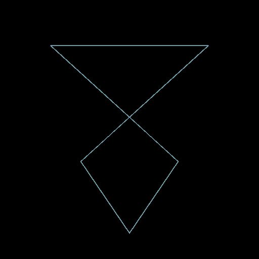

# 패스 상의 4중 변형

<table>
<tr style="border: 0;">
<td width="33.33%" style="border: 0;" valign="top">

<b>인:</b> 스플라인 및 패스 도구 > 패스 도구

</td>
<td width="100.00%" style="border: 0;" valign="top">

## 설명

4개의 핸들을 사용하여 패스를 변형합니다.

</td>
</tr>
</table>

## 입력

|  |  |
|:---|:---|
| <b>경로</b> <i>색상</i> | 인코딩된 세그먼트 경로 목록입니다. 이 입력을 [패스에 마스크](../../../../../../compositing-graphs/nodes-reference-for-com/node-library/spline-paths-tools/path-tools/mask-to-paths/mask-to-paths.md) 또는 다른 *패스* 처리 노드에 연결합니다. |

## 출력

|  |  |
|:---|:---|
| <b>경로</b> <i>색상</i> | 변형된 패스. [패스 미리 보기](../../../../../../compositing-graphs/nodes-reference-for-com/node-library/spline-paths-tools/path-tools/preview-paths/preview-paths.md)를 사용하여 결과가 어떻게 나타나는지 파악하거나 다른 패스 처리 노드를 사용하거나 [스플라인으로 패스](../../../../../../compositing-graphs/nodes-reference-for-com/node-library/spline-paths-tools/path-tools/paths-to-spline/paths-to-spline.md)에 입력하여 스플라인으로 추가로 처리할 수 있습니다. |

## 매개변수

|  |  |
|:---|:---|
| <b>p00</b> <i>Float2</i> | 왼쪽 상단 핸들의 위치입니다. |
| <b>p01</b> <i>Float2</i> | 오른쪽 위 핸들의 위치입니다. |
| <b>p02</b> <i>Float2</i> | 왼쪽 아래 핸들의 위치입니다. |
| <b>p03</b> <i>Float2</i> | 오른쪽 아래 핸들의 위치입니다. |

## 예

<table>
<tr style="border: 0;">
<td style="border: 0;" valign="top">

<table>
  <tr>
    <td>
      
       <i>이전</i>
    </td>
    <td>
      
       <i>이후</i>
    </td>
  </tr>
</table>

</td>
<td style="border: 0;" valign="top">

<table>
  <tr>
    <td>
      
       <i>이전</i>
    </td>
    <td>
      
       <i>이후</i>
    </td>
  </tr>
</table>

</td>
</tr>
</table>

<table>
<tr style="border: 0;">
<td style="border: 0;" valign="top">

</td>
<td style="border: 0;" valign="top">

</td>
</tr>
</table>
