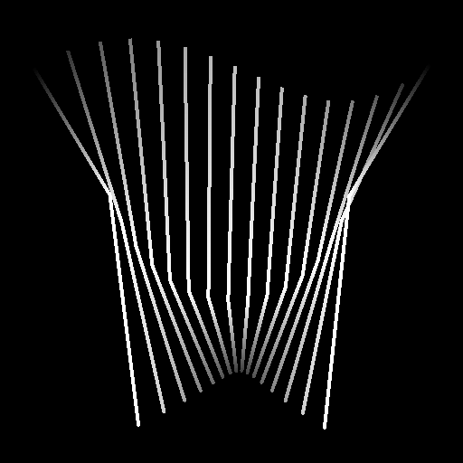

# 스플라인 브리지(목록)

<table>
<tr style="border: 0;">
<td width="33.33%" style="border: 0;" valign="top">

<b>인:</b> 스플라인 및 패스 도구 > 자유 곡선 도구

</td>
<td width="100.00%" style="border: 0;" valign="top">

## 설명

해당 스플라인을 따라 입력 목록의 모든 스플라인을 가로지르는 스플라인을 생성합니다.

생성된 스플라인은 [선형] (직선) 또는 [2차 베지어] (곡선)일 수 있습니다.

</td>
</tr>
</table>

>[!TIP]
>
> 생성된 스플라인은 목록의 첫 번째 스플라인에서 마지막 스플라인으로 이동하고 목록의 이러한 스플라인 순서를 엄격하게 준수하여 중간 스플라인을 가로지릅니다.
> 
> 따라서 사전에 스플라인을 함께 붙이는 순서에 주의해야 합니다.

## 입력

|  |  |
|:---|:---|
| <b>미리 보기</b> <i>회색 음영</i> | 입력 미리보기가 회색 음영 이미지로 분할됩니다. |
| <b>스플라인 코드</b> <i>색상</i> | 색상 이미지의 RGBA 채널로 인코딩된 입력 스플라인의 좌표: <b>R</b> - X 위치 <b>G</b> - Y 위치 <b>B</b> - Height <b>A</b> - 압축된 데이터: - 기호: 스플라인이 닫힘(음수) 또는 열림(양수); - 절대값: Thickness + 1. |
| <b>스플라인 데이터</b> <i>색상</i> | 색상 이미지의 RGBA 채널에 인코딩된 입력 스플라인의 추가 데이터입니다. <b>R</b> - 탄젠트 X <b>G</b> - 탄젠트 Y <b>B</b> - 미사용 <b>A</b> - 미사용 |
| <b>스플라인 양</b> <i>정수</i> | 입력 스플라인의 수입니다. |

## 출력

|  |  |
|:---|:---|
| <b>미리 보기</b> <i>회색 음영</i> | 출력 미리 보기가 회색 음영 이미지로 분할됩니다. |
| <b>스플라인 코드</b> <i>색상</i> | 색상 이미지의 RGBA 채널로 인코딩된 출력 스플라인의 좌표입니다. <b>R</b> - X 위치 <b>G</b> - Y 위치 <b>B</b> - Height <b>A</b> - 압축된 데이터: - 기호: 스플라인이 닫힘(음수) 또는 열림(양수); - 절대값: Thickness + 1. |
| <b>스플라인 데이터</b> <i>색상</i> | 색상 이미지의 RGBA 채널로 인코딩된 출력 스플라인의 추가 데이터입니다. <b>R</b> - 탄젠트 X <b>G</b> - 탄젠트 Y <b>B</b> - 미사용 <b>A</b> - 미사용 |
| <b>스플라인 양</b> <i>정수</i> | 출력 스플라인의 수입니다. |

## 매개변수

|  |  |
|:---|:---|
| <b>브리지 스플라인 양</b> <i>정수</i> | 입력 스플라인을 가로질러 생성된 스플라인 수입니다. |
| <b>Bridge 스플라인 유형</b> <i>정수</i> | 생성되는 스플라인 유형:  - 선형: 중간 스플라인을 시작에서 끝까지의 직선 궤적과 연결하는 날카로운 스플라인; - 이차 베지어: 중간 스플라인을 시작에서 끝까지의 부드러운 궤적과 연결하는 곡선 스플라인.  참고: 이차 베지어 스플라인을 계산하려면 최소 3개의 입력 스플라인이 필요합니다. |
| <b>입력 스플라인이 닫혔습니다</b> <i>부울</i> | 입력 스플라인의 첫 번째와 마지막 포인트를 단일 포인트로 처리할지 여부를 제어합니다. 그러면 첫 번째와 마지막 통과 스플라인이 중복되지 않습니다. |
| <b>방향 뒤집기</b> <i>부울</i> | 스플라인의 방향을 반전합니다. |
| <b>Bridge 스플라인 닫기</b> <i>부울</i> | 통과 스플라인을 확장하여 입력 목록의 첫 번째 스플라인에 다시 연결합니다. |
| <b>첫 번째 브리지 스플라인 오프셋</b> <i>부동2</i> | 횡단된 모든 스플라인의 시작 부분에 오프셋을 적용합니다. 값은 입력 스플라인의 정규화된 길이입니다.통과된 스플라인의 시작 또는 끝 부분을 만나는 생성된 스플라인은  남아 있습니다. |
| <b>마지막 브리지 스플라인 오프셋</b> <i>부동2</i> | 횡단된 모든 스플라인의 끝에 오프셋을 적용합니다. 값은 입력 스플라인의 정규화된 길이입니다.통과된 스플라인의 시작 또는 끝 부분을 만나는 생성된 스플라인은  남아 있습니다. |
| <b>임의 오프셋 범위</b> <i>정수</i> | 스플라인에 적용된 임의 오프셋에 사용되는 최대 거리입니다.  - <i>부모 스플라인:</i> 부모 스플라인의 전체 길이가 사용됩니다. 겹칠 수 있습니다. - <i>간격:</i> 브리지 스플라인 사이의 간격이 사용됩니다. 이 문제는 중복됩니다. 이 거리는 브리지 스플라인의 양이 증가함에 따라 감소합니다. |
| <b>임의 오프셋 시작</b> <i>부동</i> | 브리지 스플라인의 시작 위치에 적용되는 임의 오프셋에 대한 승수입니다. 여기서 최대 거리는 <b>임의 오프셋 범위</b> 매개 변수로 지정됩니다. |
| <b>임의 오프셋 종료</b> <i>부동</i> | 브리지 스플라인의 끝 위치에 적용되는 임의 오프셋에 대한 승수입니다. 여기서 최대 거리는 <b>임의 오프셋 범위</b> 매개 변수로 지정됩니다. |
| <b>전역 무작위 오프셋</b> <i>부동</i> | 브리지 스플라인의 시작 위치와 끝 위치 *모두*&#x200B;에 적용되는 임의 오프셋의 *같은 양*&#x200B;에 대한 승수입니다. 여기서 최대 거리는 <b>임의 오프셋 범위</b> 매개 변수에 의해 지정됩니다. |
| <b>균일 배포</b> <i>부울</i> | True이면 생성된 스플라인의 점이 시작부터 끝까지 고르게 배치됩니다. |
| <b>Thickness</b> |  |
| <b>Thickness 모드</b> <i>정수</i> | 브리지 스플라인의 Thickness 값을 얻는 방법입니다.  - <i>부모 스플라인에서 상속:</i> 브리지 스플라인의 시작 및 끝 위치에 있는 부모 스플라인의 Thickness을 사용합니다. - <i>재정의:</i> <b>Thickness</b> 매개 변수에 지정한 임의의 값이 사용됩니다. |
| <b>Thickness</b> <i>부동</i> | 브리지에 적용되는 절대 Thickness 값입니다. |
| <b>무작위 Thickness</b> <i>부동</i> | 브리지 스플라인의 Thickness에 대한 무작위 승수입니다. 여기서 이 승수가 적용되는 초기 Thickness은 <b>Thickness 모드</b> 매개 변수에 의해 지정됩니다. |
| <b>Height</b> |  |
| <b>Height 모드</b> <i>정수</i> | 브리지 스플라인의 Height 값을 얻는 방법입니다.  - <i>부모 스플라인에서 상속:</i> 브리지 스플라인의 시작 및 끝 위치에 있는 부모 스플라인의 Height을 사용합니다. - <i>재정의:</i> <b>Height</b> 매개 변수에 지정한 임의의 값이 사용됩니다. |
| <b>Height 오프셋</b> <i>부동</i> | Height이 브리지 스플라인에 적용되기 전에 부모 스플라인에서 상속된 Height에 적용되는 오프셋 양입니다. |
| <b>Height</b> <i>부동</i> | 브리지에 적용되는 절대 Height 값입니다. |
| <b>무작위 Height</b> <i>부동</i> | 브리지 스플라인의 Height에 대한 임의의 조정 양입니다. 이 조정은 선택한 <b>Height 모드</b> 매개 변수에 따라 달라집니다.  - <i>상위 스플라인에서 상속:</i> 값은 상속된 Height에 대한 승수입니다. - <i>재정의:</i> 값은 Height에 추가된 오프셋입니다. |
| <b>정사각형이 아닌 수정</b> <i>부울</i> | 점의 위치와 Thickness을 조정하여 정사각형이 아닌 해상도에서 스플라인 모양을 유지합니다. 이는 또한 균일한 분포에도 영향을 미친다. |
| <b>미리 보기</b> |  |
| <b>방향 도우미 표시</b> <i>부울</i> | 미리 보기 출력에서 스플라인의 시작 부분에 점을 표시하고 끝 부분에 화살표를 표시합니다. |
| <b>Thickness 봉투 표시</b> <i>부울</i> | 스플라인 Thickness 모서리에 추가 선을 표시합니다. |
| <b>세그먼트 양</b> <i>정수</i> | [미리 보기] 출력에서 스플라인 시각화를 그리는 데 사용되는 선분의 수를 조정합니다. 값이 높을수록 선이 더 매끄러워집니다. |
| <b>Thickness(px)</b> <i>부동</i> | 미리 보기 출력에서 스플라인 시각화의 Thickness을 픽셀 단위로 조정합니다. |
| <b>배경 미리 보기 강도</b> <i>부동</i> | 미리 보기 시각화의 강도입니다. |

## 예

<table>
<tr style="border: 0;">
<td style="border: 0;" valign="top">

<table>
  <tr>
    <td>
      
       <i>이전</i>
    </td>
    <td>
      
       <i>이후</i>
    </td>
  </tr>
</table>

</td>
<td style="border: 0;" valign="top">

</td>
</tr>
</table>

