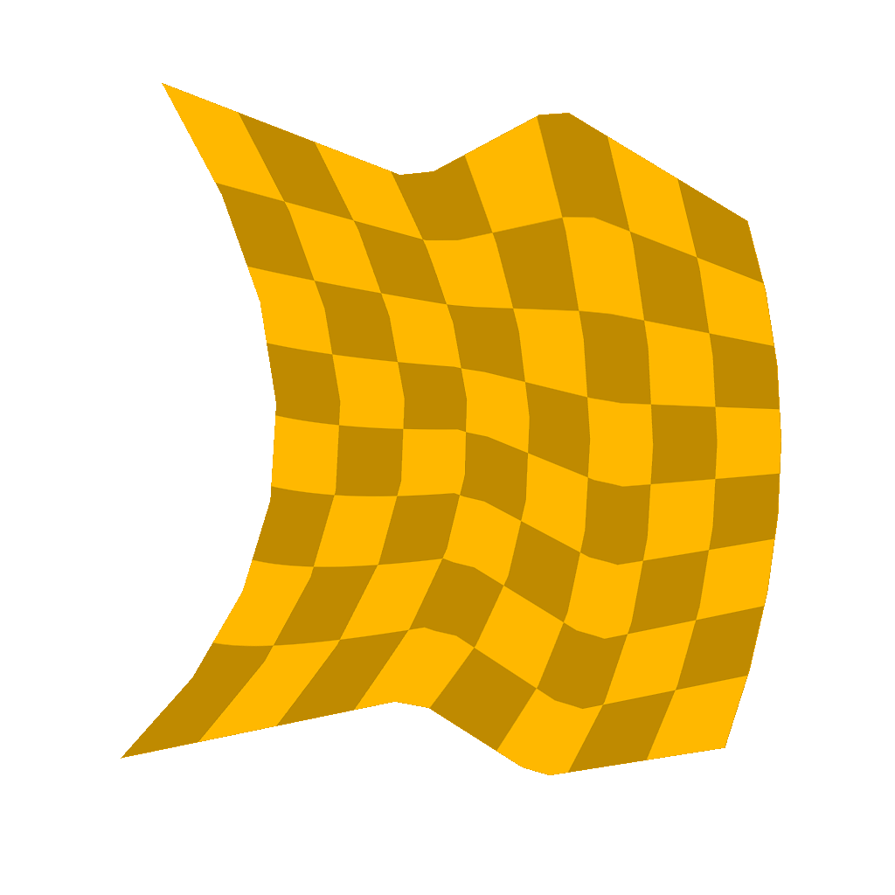

# 스플라인 브리지 매퍼 색상

<table>
<tr style="border: 0;">
<td width="33.33%" style="border: 0;" valign="top">

<b>인:</b> 스플라인 및 패스 도구 > 자유 곡선 도구

</td>
<td width="100.00%" style="border: 0;" valign="top">

## 설명

이미지가 스플라인을 순서대로 가로지르도록 입력 스플라인 목록에 색상 이미지를 매핑합니다.

</td>
</tr>
</table>

>[!TIP]
>
> 매핑은 목록의 첫 번째 스플라인에서 마지막 스플라인으로 이동하고 목록에 있는 이러한 스플라인의 순서를 엄격하게 따라 중간 스플라인을 가로지릅니다.
> 
> 따라서 사전에 스플라인을 함께 붙이는 순서에 주의해야 합니다.

>[!NOTE]
>
> [스플라인 브리지 매퍼 회색 음영](../../../../../../compositing-graphs/nodes-reference-for-com/node-library/spline-paths-tools/spline-tools/spline-bridge-mapper-gra/spline-bridge-mapper-grayscale.md)을 참조하십시오.

## 입력

|  |  |
|:---|:---|
| <b>스플라인 코드</b> <i>색상</i> | 색상 이미지의 RGBA 채널로 인코딩된 입력 스플라인의 좌표: <b>R</b> - X 위치 <b>G</b> - Y 위치 <b>B</b> - Height <b>A</b> - 압축된 데이터: - 기호: 스플라인이 닫힘(음수) 또는 열림(양수); - 절대값: Thickness + 1. |
| <b>스플라인 데이터</b> <i>색상</i> | 색상 이미지의 RGBA 채널에 인코딩된 입력 스플라인의 추가 데이터입니다. <b>R</b> - 탄젠트 X <b>G</b> - 탄젠트 Y <b>B</b> - 미사용 <b>A</b> - 미사용 |
| <b>스플라인 양</b> <i>정수</i> | 입력 스플라인의 수입니다. |
| <b>색상 맵</b> <i>색상</i> | 입력 스플라인 간에 매핑해야 하는 입력 색상 이미지입니다. |

## 출력

|  |  |
|:---|:---|
| <b>색상</b> <i>회색 음영</i> | 입력 색상 이미지를 배경의 스플라인에 색상 이미지로 매핑한 결과입니다. |
| <b>Height</b> <i>회색 음영</i> | 회색 음영 이미지로 스플라인에 매핑된 스플라인의 Height. |
| <b>UV</b> <i>색상</i> | 매핑된 이미지의 UV(즉, 좌표)로서, 컬러 이미지의 빨강(U) 및 녹색(V) 채널로 인코딩됩니다. |
| <b>마스크</b> <i>회색 음영</i> | 스플라인을 가로지르는 매핑의 마스크입니다. |

## 매개변수

|  |  |
|:---|:---|
| <b>세그먼트 양</b> <i>정수</i> | 스플라인은 이미지 좌표가 통과하기 전에 세그먼트로 단순화됩니다. 선분의 양이 많을수록 커브를 따라 매핑이 더 매끄러워집니다. |
| <b>UV 스트레치 줄이기</b> <i>부울</i> | 스플라인 간의 거리가 균일하지 않을 때 이미지 좌표를 한 스플라인에서 다음 스플라인으로 보간하여 스플라인의 거리를 최소화하는 방법을 조정합니다. |
| <b>UV 비율</b> <i>Float2</i> | 이미지 좌표의 비율을 조정합니다. 값이 높을수록 타일이 촘촘하게 배치된 이미지가 더 많아집니다. |
| <b>UV 회전</b> <i>부동</i> | 해당 중심을 중심으로 이미지 좌표를 회전합니다. |
| <b>배경색</b> <i>Float4</i> | 출력 이미지의 배경 색상입니다. |

## 예

<table>
<tr style="border: 0;">
<td style="border: 0;" valign="top">

<table>
  <tr>
    <td>
      
       <i>이전</i>
    </td>
    <td>
      
       <i>이후</i>
    </td>
  </tr>
</table>

</td>
<td style="border: 0;" valign="top">

</td>
</tr>
</table>

<table>
<tr style="border: 0;">
<td style="border: 0;" valign="top">

</td>
<td style="border: 0;" valign="top">

</td>
</tr>
</table>
