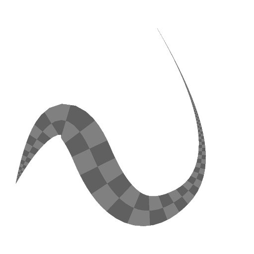

# 스플라인 매퍼 회색 음영

<table>
<tr style="border: 0;">
<td width="33.33%" style="border: 0;" valign="top">

<b>인:</b> 스플라인 및 패스 도구 > 자유 곡선 도구

</td>
<td width="100.00%" style="border: 0;" valign="top">

## 설명

입력 스플라인을 따라 뻗은 기본 모양에 입력 회색 음영 이미지를 매핑합니다.

프리미티브 모양은 평면, 반원통 또는 원통일 수 있습니다. 실린더들은 스플라인을 따라 꼬여져서 그에 따라 맵핑된 이미지를 변형시킬 수 있다.

</td>
</tr>
</table>

노드는 매핑된 이미지를 회색 음영 이미지로서 출력할 뿐만 아니라, Height, UV(즉, 이미지 좌표) 및 매핑된 각 스플라인을 독립적으로 선택하기 위한 ID 마스크와 같은 다른 정보를 출력한다.

>[!IMPORTANT]
>
> 그 결과는 매우 낮은 Thickness 값을 사용할 때 스플라인의 엔벌로프 외부에 원하지 않는 아티팩트를 포함할 수 있다. 이것은 알려진 문제입니다.

>[!NOTE]
>
> [스플라인 매퍼 색상](../../../../../../compositing-graphs/nodes-reference-for-com/node-library/spline-paths-tools/spline-tools/spline-mapper-color/spline-mapper-color.md)도 참조하세요.

## 입력

|  |  |
|:---|:---|
| <b>스플라인 코드</b> <i>색상</i> | 색상 이미지의 RGBA 채널로 인코딩된 입력 스플라인의 좌표: <b>R</b> - X 위치 <b>G</b> - Y 위치 <b>B</b> - Height <b>A</b> - 압축된 데이터:  - 기호: 스플라인이 닫힘(네거티브) 또는 열림(포지티브);  - 절대값: Thickness + 1. |
| <b>스플라인 데이터</b> <i>색상</i> | 색상 이미지의 RGBA 채널에 인코딩된 입력 스플라인의 추가 데이터입니다. <b>R</b> - 탄젠트 X <b>G</b> - 탄젠트 Y <b>B</b> - 미사용 <b>A</b> - 미사용 |
| <b>스플라인 양</b> <i>정수</i> | 입력 스플라인의 수입니다. |
| <b>색상 맵</b> <i>회색 음영</i> | 입력 스플라인을 따라 매핑해야 하는 입력 회색 음영 이미지입니다. |
| <b>Height 맵</b> <i>회색 음영</i> | 입력 스플라인을 따라 매핑해야 하는 입력 회색 음영 높이 맵입니다. |
| <b>Twist Curve</b> <i>회색 음영</i> | 첫 번째 픽셀 행 값을 사용하여 곡선을 설명하는 이미지입니다. <b>모양</b> 매개 변수를 <i>반원통</i> 또는 <i>원통</i>(으)로 설정하면 이 입력을 사용하여 모양 주변의 UV 비틀기를 제어합니다. 이 효과는 <b>비틀기 UV 곡선 승수</b> 매개 변수를 사용하여 제어됩니다. 곡선은 스플라인을 따라 회전하는 양에 대한 프로파일을 제공합니다. 여기서 행의 첫 번째 픽셀은 스플라인이 시작될 때의 회전이고 마지막 픽셀은 끝의 회전입니다. 회색 음영 값은 회전 수를 나타냅니다. 곡선을 만드는 데 [곡선](../../../../../../compositing-graphs/nodes-reference-for-com/atomic-nodes/curve/curve.md) 노드를 사용할 수 있습니다. |

## 출력

|  |  |
|:---|:---|
| <b>색상</b> <i>회색 음영</i> | 입력 색상 이미지를 입력 스플라인에 회색 음영 이미지로 매핑한 결과입니다. |
| <b>Height</b> <i>회색 음영</i> | 입력 Height 이미지를 입력 스플라인에 걸쳐 회색 음영 이미지로 매핑한 결과입니다. |
| <b>UV</b> <i>색상</i> | 입력 스플라인에 걸친 매핑의 UV(즉, 좌표)로서, 컬러 이미지로 인코딩된다. |
| <b>ID</b> <i>회색 음영</i> | 입력 스플라인을 따라 매핑되는 이미지의 마스크입니다. 각 모양을 개별적으로 선택할 수 있도록 흰색 값이 한 스플라인에서 다음 스플라인으로 1씩 증가합니다. |

## 매개변수

|  |  |
|:---|:---|
| <b>세그먼트 양</b> <i>정수</i> | 스플라인은 이미지 좌표가 통과하기 전에 선분으로 단순화됩니다. 선분의 양이 많을수록 곡선을 따라 매핑이 더 매끄러워집니다. |
| <b>UV 자동 크기 조정</b> <i>부울</i> | 스플라인을 따라 매핑할 때 사각형 이미지가 유지되도록 좌표의 배율을 자동으로 조정합니다. |
| <b>UV 비율</b> <i>Float2</i> | X(가로) 및 Y(세로)에서 매핑된 좌표의 크기를 조정합니다. 값이 높을수록 바둑판식 이미지가 더 조밀하게 표시됩니다. |
| <b>모드</b> <i>정수</i> | 이미지를 매핑할 스플라인을 선택하는 방법: - <i>스플라인 목록 그리기</i>: 입력 목록의 모든 스플라인이 사용됩니다. - <i>단일 스플라인 그리기</i>: 지정된 색인의 스플라인만 사용됩니다. - <i>스플라인 범위 그리기</i>: 지정된 범위에 색인이 포함된 스플라인만 사용됩니다. |
| <b>스플라인 색인 그리기</b> <i>정수</i> | (&#39;모드&#39;가 &#39;단일 스플라인 그리기&#39;로 설정된 경우 사용 가능) 이미지를 매핑해야 하는 스플라인의 인덱스입니다. |
| <b>스플라인 범위 그리기</b> <i>정수2</i> | (&#39;모드&#39;가 &#39;스플라인 범위 그리기&#39;로 설정된 경우 사용 가능) 이미지를 매핑해야 하는 스플라인의 인덱스 범위입니다. |
| <b>시작</b> <i>부동</i> | 매핑할 스플라인 부분의 시작을 오프셋합니다. 값은 스플라인의 정규화된 길이를 나타냅니다. |
| <b>종료</b> <i>부동</i> | 매핑할 스플라인 부분의 끝을 오프셋합니다. 값은 스플라인의 정규화된 길이를 나타냅니다. |
| <b>Thickness 모드</b> <i>정수</i> | 매핑된 이미지의 Thickness 설정 방법: - <i>수동</i>: 임의의 값으로 Thickness을 명시적으로 설정합니다. - <i>스플라인에서</i>: 스플라인의 Thickness을 사용합니다. |
| <b>Thickness</b> <i>부동</i> | (&#39;Thickness 모드&#39;가 &#39;수동&#39;으로 설정된 경우 사용 가능) 스플라인을 따라 매핑된 이미지의 Thickness에 대한 임의 값입니다. |
| <b>Thickness 승수</b> <i>부동</i> | (&#39;Thickness 모드&#39;가 &#39;스플라인부터&#39;로 설정되어 있을 때 사용 가능) 스플라인을 따라 매핑된 이미지의 Thickness에 대한 전역 승수입니다. 이 Thickness은 해당 스플라인을 기준으로 제어됩니다. |
| <b>모양</b> <i>정수</i> | 스플라인을 따라 이미지 좌표를 매핑하는 데 사용되는 기본 모양: - <i>평면</i>: 좌표가 평면 평면에 매핑됨; - <i>절반 실린더</i>: 좌표가 기본 원의 축이 스플라인 방향을 따르는 반실린더에 매핑됨; - <i>실린더</i>: 좌표가 기본 원의 축이 스플라인 방향을 따르는 실린더에 매핑됨 |
| <b>실린더 Height 멀티플라이어</b> <i>부동</i> | (&#39;모양&#39;이 &#39;절반 실린더&#39; 또는 &#39;실린더&#39;로 설정되어 있을 때 사용 가능) Height 출력에서 실린더의 Height 기여도 강도에 대한 승수입니다. Height 조정은 누적됩니다. |
| <b>실린더 Height 오프셋</b> <i>부동</i> | (&#39;모양&#39;이 &#39;반원통&#39; 또는 &#39;원통&#39;으로 설정되어 있을 때 사용 가능) 원통 또는 반원통 모양 프로파일의 중심을 스플라인 서피스에서 서피스 아래의 한 지름으로 오프셋합니다. |
| <b>UV 강도 비틀기</b> <i>부동</i> | (&#39;모양&#39;이 &#39;반원통&#39; 또는 &#39;원통&#39;으로 설정되어 있을 때 사용 가능) 원통을 중심으로 이미지 좌표가 회전하는 횟수입니다. 비틀기에는 스플라인 끝에만 있는 원통이 회전합니다. 그런 다음 회전은 스플라인을 따라 보간됩니다. |
| <b>UV 곡선 승수 비틀기</b> <i>부동</i> | (&#39;모양&#39;이 &#39;절반 원통&#39; 또는 &#39;원통&#39;으로 설정되어 있을 때 사용 가능) Twist Curve 입력의 원통 꼬임 정도에 대한 승수입니다. 곡선은 스플라인을 따라 회전하는 양에 대한 프로파일을 제공합니다. 여기서 행의 첫 번째 픽셀은 스플라인이 시작될 때의 회전이고 마지막 픽셀은 끝의 회전입니다. 회색 음영 값은 회전 수를 나타냅니다. |
| <b>UV 곡선 오프셋 비틀기</b> <i>부동</i> | (&#39;모양&#39;이 &#39;반원통&#39; 또는 &#39;원통&#39;으로 설정되어 있을 때 사용 가능) Twist Curve에서 제공한 회전 값에 전역 오프셋을 회전 수로 적용합니다. |
| <b>스플라인 Height 멀티플라이어</b> <i>부동</i> | Height 출력에 기여하는 스플라인 Height 입력의 강도를 조정합니다. Height 조정은 누적됩니다. |
| <b>입력 Height 승수</b> <i>부동</i> | Height 출력에 대한 높이 맵 입력의 기여도 강도를 조정합니다. Height 조정은 누적됩니다. |
| <b>정사각형이 아닌 수정</b> <i>부울</i> | 점의 위치와 Thickness을 조정하여 정사각형이 아닌 해상도에서 스플라인 모양을 유지합니다. 균일 배포에도 영향을 줍니다. |

## 예

<table>
<tr style="border: 0;">
<td style="border: 0;" valign="top">

<table>
  <tr>
    <td>
      
       <i>이전</i>
    </td>
    <td>
      
       <i>이후</i>
    </td>
  </tr>
</table>

</td>
<td style="border: 0;" valign="top">

</td>
</tr>
</table>

<table>
<tr style="border: 0;">
<td style="border: 0;" valign="top">

</td>
<td style="border: 0;" valign="top">

</td>
</tr>
</table>
