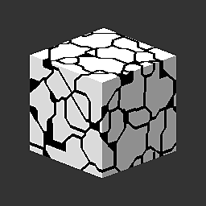

# 3D Worley 노이즈

<table>
<tr style="border: 0;">
<td style="border: 0;" valign="top">

{width="128px"}

## 3D Worley 노이즈

**내부:** *텍스처 생성기**/잡음*

**중간**

</td>
<td style="border: 0;" valign="top">

## 설명

라이브러리에서 가장 다재다능하고 고급 노이즈 중 하나인 이 노이즈는 입력된 위치 맵을 기반으로 3D 공간에서 Worley 노이즈를 생성합니다. 표준 [셀](../../../../../../compositing-graphs/nodes-reference-for-com/node-library/texture-generators/noises/cells-1/cells-1.md)또는 [거리](../../../../../../compositing-graphs/nodes-reference-for-com/atomic-nodes/distance/distance.md)기반 소음보다 훨씬 더 강력한 옵션을 제공합니다.

## 매개변수

* **비율**: *1 - 64*\
  효과의 전체 배율을 설정합니다.
* **크기**: *0.0 - 1.0* X, Y, Z축에 대해 개별적으로 균일하지 않은 크기 조절을 수행합니다.
* **모드**: *유클리드, 맨해튼, 체비셰프, 민코프스키\
  거리 메트릭을 변경합니다. 매우 다른 노이즈 유형을 허용합니다.*
* **민코프스키 수**: *0.0 - 20.0* Minkowski 거리 메트릭만 사용. 서로 다른 유형의 메트릭을 혼합합니다.
* **스타일**: *F1, F2, F2-F1, 테두리, 임의 색상*&#x200B;메트릭 조합 수학 값을 설정합니다. 더 많은 조합을 허용합니다.
* **테두리 너비**: *0.0 - 1.0*&#x200B;테두리 조합 산수가 활성화되면 테두리의 너비를 제어합니다.
* **원형**: *0.0 - 1.0* F1, F2 및 F2-F1 모드에서만 사용할 수 있습니다. 중간 위치의 레벨을 설정합니다.
* **반전**: *False/True*\
  결과를 반전합니다.

## 예제 이미지

| 

 | 

 | 

 | 

 |
| --- | --- | --- | --- |
|  |  |  |  |

</td>
</tr>
</table>
