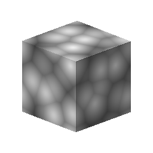

# 3D Worley 노이즈

<table>
<tr style="border: 0;">
<td width="33.33%" style="border: 0;" valign="top">

{width="128px"}

<b>내부:</b> 텍스처 생성기 > 잡음

</td>
<td width="100.00%" style="border: 0;" valign="top">

## 설명

라이브러리에서 가장 다재다능하고 고급 노이즈 중 하나인 이 노이즈는 입력된 위치 맵을 기반으로 3D 공간에서 Worley 노이즈를 생성합니다. 표준 [셀](../../../../../../compositing-graphs/nodes-reference-for-com/node-library/texture-generators/noises/cells-1/cells-1.md)또는 [거리](../../../../../../compositing-graphs/nodes-reference-for-com/atomic-nodes/distance/distance.md)기반 소음보다 훨씬 더 강력한 옵션을 제공합니다.

</td>
</tr>
</table>

## 매개변수

|  |  |
|:---|:---|
| <b>크기 조절</b> <i>1 - 64</i> | 효과의 전체 배율을 설정합니다. |
| <b>크기</b> <i>0.0 - 1.0</i> | X, Y 및 Z 축에 대해 개별적으로 균일하지 않은 배율 조정을 수행합니다. |
| <b>모드</b> <i>유클리드, 맨해튼, 체비쇼프, 민코프스키</i> | 거리 메트릭을 변경합니다. 매우 다양한 노이즈 유형을 허용합니다. |
| <b>민코프스키 수</b> <i>0.0 - 20.0</i> | Minkowski 거리 미터에서만. 다른 유형의 메트릭 간의 혼합. |
| <b>스타일</b> <i>F1, F2, F2-F1, 테두리, 임의 색상</i> | 메트릭 조합 수학 을 설정합니다. 더 많은 조합을 허용합니다. |
| <b>테두리 너비</b> <i>0.0 - 1.0</i> | 테두리 조합 계산이 활성화되면 테두리의 너비를 제어합니다. |
| <b>원형</b> <i>0.0 - 1.0</i> | F1, F2 및 F2-F1 모드에서만 사용할 수 있습니다. 중간 위치의 레벨을 설정합니다. |
| <b>반전</b> <i>거짓/참</i> | 결과를 반전합니다. |

## 예

<table style="margin-top: 32px; margin-bottom: 32px">
    <tr style="border: 0">
        <td style="border: 0; background: transparent">
            
        </td>
        <td style="border: 0; background: transparent">
            
        </td>
        <td style="border: 0; background: transparent">
            
        </td>
        <td style="border: 0; background: transparent">
            
        </td>
    </tr>
</table>
