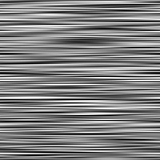

# 비등방성 노이즈

<table>
<tr style="border: 0;">
<td width="33.33%" style="border: 0;" valign="top">

{width="200px"}

<b>내부:</b> 텍스처 생성기 > 노이즈

</td>
<td width="100.00%" style="border: 0;" valign="top">

## 설명

서로 페이드 인 무작위로 색상이 지정된 스트립의 가로 또는 세로 스택입니다.

스트립의 양은 전환의 Smoothness과 마찬가지로 조정할 수 있습니다.

</td>
</tr>
</table>

## 출력

|  |  |
|:---|:---|
| <b>출력</b> <i>회색 음영</i> | 회색 음영 비트맵으로 생성된 노이즈 |

## 매개변수

|  |  |
|:---|:---|
| <b>X 양</b> <i>정수</i> | X축에 있는 스트립의 양입니다. |
| <b>Y 양</b> <i>정수</i> | Y축에 있는 스트립의 양입니다. |
| <b>해상도별 Y양</b> <i>부울</i> | True이면 Y축의 스트립 수가 해당 축의 이미지 크기와 같습니다. |
| <b>회전</b> <i>부울</i> | 노이즈를 90도 회전합니다. |
| <b>Smoothness</b> <i>부동</i> | 스트립들 사이의 페이딩의 양, 여기서 0은 페이딩되지 않고 1은 그들의 전체 길이에 걸쳐 페이딩된다. |
| <b>Smoothness 보간</b> <i>부동</i> | 스트립을 페이드(fade)하기 위해 적용되는 두 가지 보간 방법의 가중치이며, 여기서 0은 선형이고 1은 가우스(Gaussian)이다. |
| <b>장애</b> <i>부동</i> | 소음의 성분을 제거합니다.   이 효과를 사용하면 노이즈에 애니메이션을 적용할 수 있습니다. |
| <b>장애 속도</b> <i>부동</i> | <b>Disorder</b> 매개 변수에 의해 적용된 변위의 거리를 조정합니다.   이 효과는 노이즈에 애니메이션을 적용할 때 변위 속도를 제어하는 데 사용할 수 있습니다. |
| <b>정사각형이 아닌 확장</b> <i>부울</i> | 정사각형이 아닌 이미지에서 생성된 타일 사각형을 유지하고 노이즈 생성을 이미지 경계까지 확장합니다. |

## 예

<table>
<tr style="border: 0;">
<td style="border: 0;" valign="top">

{zoomable="yes"}

</td>
<td style="border: 0;" valign="top">

{zoomable="yes"}

</td>
</tr>
</table>
