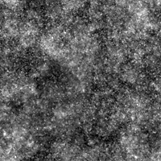

# 흑백 반점 1

<table>
<tr style="border: 0;">
<td width="33.33%" style="border: 0;" valign="top">

{width="200px"}

<b>내부:</b> 텍스처 생성기 > 노이즈

</td>
<td width="100.00%" style="border: 0;" valign="top">

## 설명

거친 <b>흑백(BnW) 스팟</b>의 변형 노이즈입니다.

참고 항목: [BnW 스팟 2](../../../../../../compositing-graphs/nodes-reference-for-com/node-library/texture-generators/noises/bnw-spots-2/bnw-spots-2.md), [BnW 스팟 3](../../../../../../compositing-graphs/nodes-reference-for-com/node-library/texture-generators/noises/bnw-spots-3/bnw-spots-3.md)

</td>
</tr>
</table>

## 출력

|  |  |
|:---|:---|
| <b>출력</b> <i>회색 음영</i> | 회색 음영 비트맵으로 생성된 노이즈 |

## 매개변수

|  |  |
|:---|:---|
| <b>크기 조절</b> <i>정수</i> | 노이즈 타일을 생성하는 데 사용되는 격자의 하위 분할입니다.    값이 높을수록 더 많은 타일이 그려지고 노이즈가 더 많아집니다. |
| <b>장애</b> <i>부동</i> | 소음의 성분을 제거합니다.    이 효과를 사용하면 노이즈에 애니메이션을 적용할 수 있습니다. |
| <b>장애 속도</b> <i>부동</i> | <b>Disorder</b> 매개 변수에 의해 적용된 변위의 거리를 조정합니다.    이 효과는 노이즈에 애니메이션을 적용할 때 변위 속도를 제어하는 데 사용할 수 있습니다. |
| <b>장애 비등방성</b> <i>부동</i> | <b>Disorder</b> 매개 변수에 의해 적용된 변위의 방향 범위를 제어합니다. 값이 높을수록 방향이 더 좁고 정의됩니다.    방향은 <b>장애 비등방성 각도</b> 매개 변수에 의해 제어됩니다. |
| <b>장애 비등방성 각도</b> <i>부동</i> | <b>장애 비등방성</b> 매개 변수가 0이 아닌 경우 <b>장애</b> 매개 변수에 의해 적용된 변위의 방향을 제어합니다. |
| <b>거칠음</b> <i>부동</i> | 노이즈 옥타브의 균형은 값이 높을수록 높은 주파수 옥타브가 더 잘 보입니다. |
| <b>타일 오프셋</b> <i>Float2</i> | 노이즈를 렌더링하는 데 사용되는 무한 평면 부분의 위치를 제어합니다. |
| <b>정사각형이 아닌 확장</b> <i>부울</i> | 정사각형이 아닌 이미지에서 생성된 타일 사각형을 유지하고 노이즈 생성을 이미지 경계까지 확장합니다. |

## 예

<table>
<tr style="border: 0;">
<td style="border: 0;" valign="top">

{zoomable="yes"}

</td>
<td style="border: 0;" valign="top">

{zoomable="yes"}

</td>
</tr>
</table>

<table>
<tr style="border: 0;">
<td style="border: 0;" valign="top">

{zoomable="yes"}

</td>
<td style="border: 0;" valign="top">

{zoomable="yes"}

</td>
</tr>
</table>
