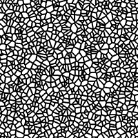
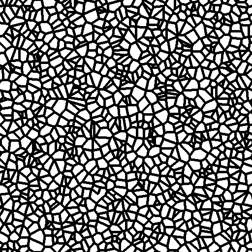

# 셀 2

<table>
<tr style="border: 0;">
<td width="33.33%" style="border: 0;" valign="top">

{width="200px"}

<b>내부:</b> 텍스처 생성기 > 노이즈

</td>
<td width="100.00%" style="border: 0;" valign="top">

## 설명

<b>셀</b> 벽으로 둘러싸인 노이즈의 변형.

조정 가능한 벽 Thickness이 있는 셀의 이진 마스크입니다.

참고 항목: [셀 1](../../../../../../compositing-graphs/nodes-reference-for-com/node-library/texture-generators/noises/cells-1/cells-1.md), [셀 3](../../../../../../compositing-graphs/nodes-reference-for-com/node-library/texture-generators/noises/cells-3/cells-3.md), [셀 4](../../../../../../compositing-graphs/nodes-reference-for-com/node-library/texture-generators/noises/cells-4/cells-4.md)

</td>
</tr>
</table>

## 출력

|  |  |
|:---|:---|
| <b>출력</b> <i>회색 음영</i> | 회색 음영 비트맵으로 생성된 노이즈 |

## 매개변수

|  |  |
|:---|:---|
| <b>크기 조절</b> <i>정수</i> | 노이즈 타일을 생성하는 데 사용되는 격자의 하위 분할입니다.    값이 높을수록 더 많은 타일이 그려지고 노이즈가 더 많아집니다. |
| <b>가장자리 너비</b> <i>부동</i> | 격자 비율로 셀 사이의 벽 Thickness을 조정합니다. (즉, 해상도에 종속되지 않음) |
| <b>반전</b> <i>부울</i> | 출력 이미지에서 검정 계열과 흰색 계열을 전환합니다. |
| <b>장애</b> <i>부동</i> | 소음의 성분을 제거합니다.    이 효과를 사용하면 노이즈에 애니메이션을 적용할 수 있습니다. |
| <b>장애 속도</b> <i>부동</i> | <b>Disorder</b> 매개 변수에 의해 적용된 변위의 거리를 조정합니다.    이 효과는 노이즈에 애니메이션을 적용할 때 변위 속도를 제어하는 데 사용할 수 있습니다. |
| <b>정사각형이 아닌 확장</b> <i>부울</i> | 정사각형이 아닌 이미지에서 생성된 타일 사각형을 유지하고 노이즈 생성을 이미지 경계까지 확장합니다. |

## 예

<table>
<tr style="border: 0;">
<td style="border: 0;" valign="top">

{zoomable="yes"}

</td>
<td style="border: 0;" valign="top">

{zoomable="yes"}

</td>
</tr>
</table>
