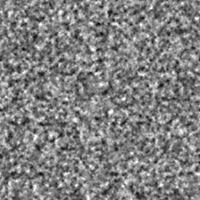

# 프랙탈 합산 3

<table>
<tr style="border: 0;">
<td style="border: 0;" valign="top">

<table>
<tr style="border: 0;">
<td width="33.33%" style="border: 0;" valign="top">

{width="200px"}

<b>내부:</b> 텍스처 생성기 > 노이즈

</td>
<td width="100.00%" style="border: 0;" valign="top">

## 설명

<b>프랙탈 합산</b> 노이즈의 변형입니다.

참고 항목: [프랙탈 합산 기본](../../../../../../compositing-graphs/nodes-reference-for-com/node-library/texture-generators/noises/fractal-sum-base/fractal-sum-base.md), [프랙탈 합산 1](../../../../../../compositing-graphs/nodes-reference-for-com/node-library/texture-generators/noises/fractal-sum-1/fractal-sum-1.md), [프랙탈 합산 2](../../../../../../compositing-graphs/nodes-reference-for-com/node-library/texture-generators/noises/fractal-sum-2/fractal-sum-2.md), [프랙탈 합산 4](../../../../../../compositing-graphs/nodes-reference-for-com/node-library/texture-generators/noises/fractal-sum-4/fractal-sum-4.md)

</td>
</tr>
</table>

## 출력

|  |  |
| --- | --- |
| <b>출력</b> *회색 음영* | 회색 음영 비트맵으로 생성된 노이즈 |

## 매개변수

|  |  |
| --- | --- |
| <b>장애</b> 부동 | 소음의 성분을 제거합니다.    이 효과를 사용하면 노이즈에 애니메이션을 적용할 수 있습니다. |
| <b>장애 속도</b> 부동 | <b>Disorder</b> 매개 변수에 의해 적용된 변위의 거리를 조정합니다.    이 효과는 노이즈에 애니메이션을 적용할 때 변위 속도를 제어하는 데 사용할 수 있습니다. |
| <b>정사각형이 아닌 확장</b> 부울 | 정사각형이 아닌 이미지에서 생성된 타일 사각형을 유지하고 노이즈 생성을 이미지 경계까지 확장합니다. |

## 예

<table>
<tr style="border: 0;">
<td style="border: 0;" valign="top">

{zoomable="yes"}

</td>
<td style="border: 0;" valign="top">

{zoomable="yes"}

</td>
</tr>
</table>

</td>
<td style="border: 0;" valign="top">

</td>
<td style="border: 0;" valign="top">

</td>
</tr>
</table>
