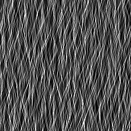
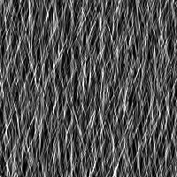

# 모피 1

<table>
<tr style="border: 0;">
<td style="border: 0;" valign="top">

{width="128px"}

## 모피 1

**내부:** *텍스처 생성기**/잡음*

**단순**

</td>
<td style="border: 0;" valign="top">

## 설명

이 경우 직선 유형의 소음이 발생합니다.

## 매개변수

* **비율**: *1 - 8*\
  효과의 전체 배율을 설정합니다.
* **장애**: *0.0 - 1.0*\
  작은 변화를 가져오기 위해 노이즈를 위상 이동합니다.
* **비정사각형 확장**: *False/True*\
  제곱이 아닌 비율로 스쿼시와 스트레치를 보정할 수 있습니다.

## 예제 이미지

</td>
</tr>
</table>
