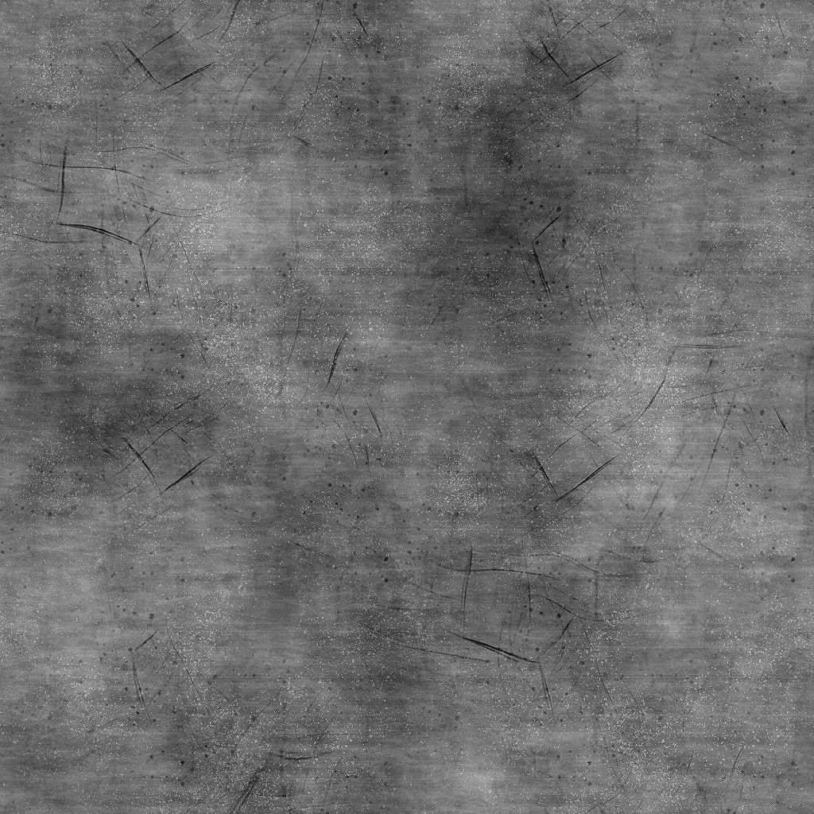

# 그런지 콘크리트

<table>
<tr style="border: 0;">
<td width="33.33%" style="border: 0;" valign="top">

{width="200px"}

<b>내부:</b> 텍스처 생성기 > 노이즈

</td>
<td width="100.00%" style="border: 0;" valign="top">

## 설명

**그런지 콘크리트** 노드는 콘크리트 표면의 Height 맵과 유사한 그런지 맵을 생성합니다.

</td>
</tr>
</table>

## 매개변수

|  |  |
|:---|:---|
| <b>균형</b> <i>부동</i> | 어두운 값과 밝은 값 간의 균형을 조정합니다. |
| <b>대비</b> <i>부동</i> | 이미지의 대비를 조정합니다. |
| <b>반전</b> <i>부울</i> | `1-x` 작업을 사용하여 이미지의 출력을 반전합니다. |
| <b>비정사각형 확장</b> <i>부울</i> | 제곱이 아닌 비율로 스쿼시와 스트레치를 보정할 수 있습니다. |
| <b>고급</b> |  |
| <b>기본 소음</b> <i>부동</i> | 기본 텍스처의 노이즈를 조정합니다. |
| <b>Dirt이 불투명도를 검사합니다</b> <i>부동</i> | Dirt 조각의 불투명도를 조정합니다. |
| <b>Dirt 반전</b> <i>부울</i> | Dirt 스팟의 영향을 반전합니다. |
| <b>Scratches 불투명도</b> <i>부동</i> | 스크래치의 불투명도를 조정합니다. |
| <b>선명 효과</b> <i>부동</i> | 이미지에 적용된 선명하게 하기 효과의 강도를 조정합니다. |
| <b>큰 변형 강도</b> <i>부동</i> | 기본 텍스처에 적용된 큰 비율(낮은 주파수) 변형을 조정합니다. |

## 예

<table style="margin-top: 32px; margin-bottom: 32px">
    <tr style="border: 0">
        <td style="border: 0; background: transparent">
            
        </td>
    </tr>
</table>
