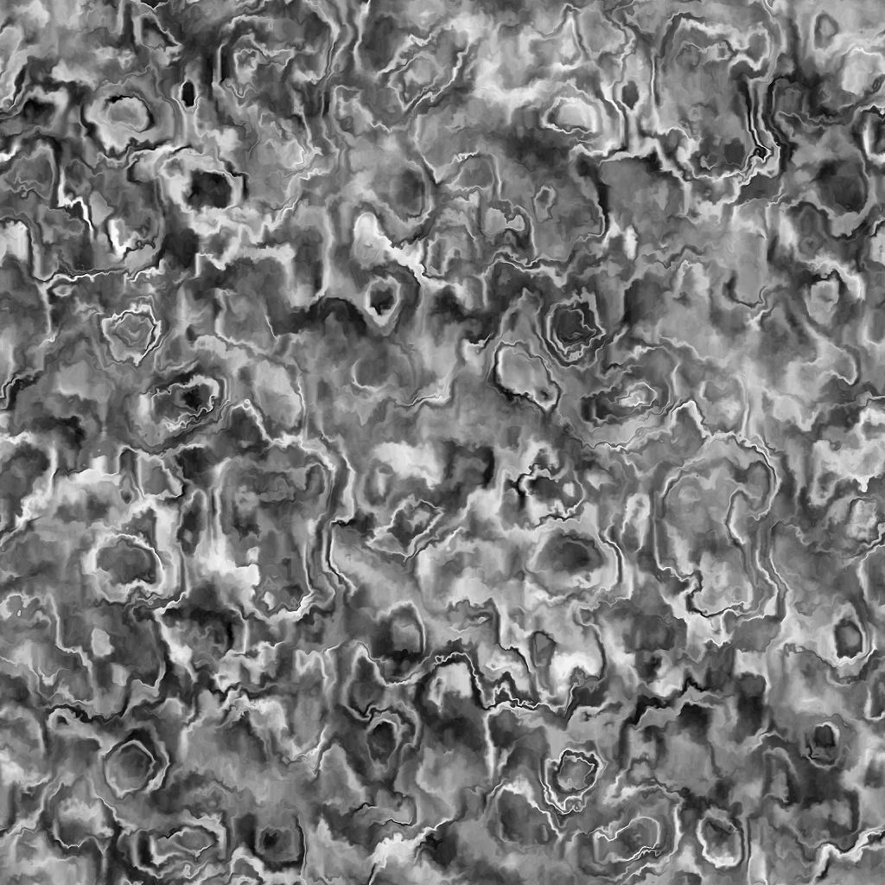
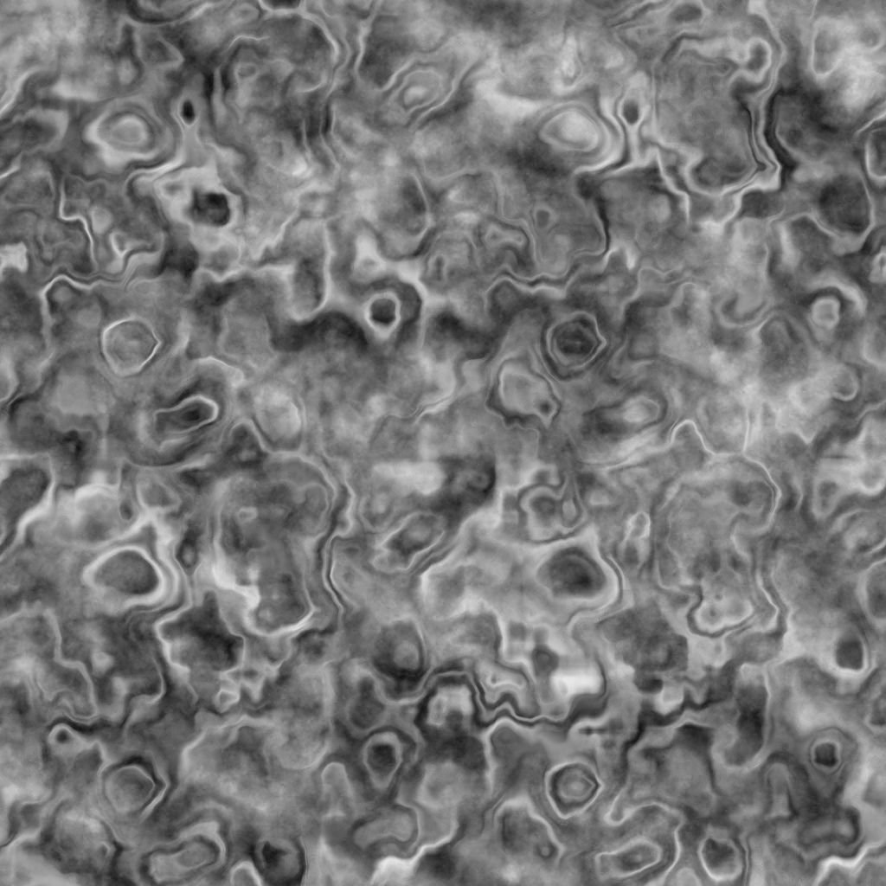

# 그런지 갈바닉 소형

<table>
<tr style="border: 0;">
<td width="41.60%" style="border: 0;" valign="top">

{width="200px"}

**내부:** *텍스처 생성기**/잡음*

**단순**

</td>
<td width="58.30%" style="border: 0;" valign="top">

## 설명

**그런지 갈바닉 스몰** 노드는 촘촘하게 아연도금 강철의 패턴과 유사한 그런지 맵을 생성합니다.

</td>
</tr>
</table>

## 매개변수

* **균형** *부동*&#x200B;어두운 값과 밝은 값 간의 균형을 조정합니다.
* **대비** *부동*&#x200B;이미지의 대비를 조정합니다.
* **반전** *부울*`1-x` 작업을 사용하여 이미지의 출력을 반전합니다.
* **비정사각형 확장** *부울*&#x200B;정사각형이 아닌 비율로 스쿼시와 스트레치를 보정할 수 있습니다.
* 고급
  * **선명도** *부동*&#x200B;아연 도금 모양의 선명도 및 선명도를 조정합니다.
  * **Dirt** *부동* Dirt 오버레이의 불투명도를 조정합니다.
  * **마이크로 왜곡** *부동*&#x200B;고주파 뒤틀기 효과의 강도를 조정합니다.

## 예제 이미지

<table>
<tr style="border: 0;">
<td style="border: 0;" valign="top">

{width="256px"}

</td>
<td style="border: 0;" valign="top">

{width="256px"}

</td>
</tr>
</table>
