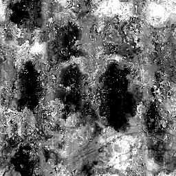

# 그런지 지도 014

<table>
<tr style="border: 0;">
<td width="33.33%" style="border: 0;" valign="top">

{width="128px"}

<b>내부:</b> 텍스처 생성기 > 잡음

</td>
<td width="100.00%" style="border: 0;" valign="top">

## 설명

이렇게 하면 복잡하고 결합된 노이즈맵이 생성됩니다. 이 방법은 세부 절차로서 매우 유용할 수 있지만 성능이 매우 집중되어 생성이 느리다는 점을 명심하십시오.

</td>
</tr>
</table>

## 매개변수

|  |  |
|:---|:---|
| <b>균형</b> <i>0.0 - 1.0</i> |  |
| <b>대비</b> <i>0.0 - 1.0</i> |  |
| <b>반전</b> <i>거짓/참</i> |  |
| <b>브러시 패턴</b> <i>0.0 - 1.0</i> | 브러시 알파로 사용할 경우에 사용하도록 가장자리 주위에 마스크를 추가합니다. |
| <b>비정사각형 확장</b> <i>거짓/참</i> | 제곱이 아닌 비율로 스쿼시와 스트레치를 보정할 수 있습니다. |

## 예

<table style="margin-top: 32px; margin-bottom: 32px">
    <tr style="border: 0">
        <td style="border: 0; background: transparent">
            
        </td>
    </tr>
</table>
