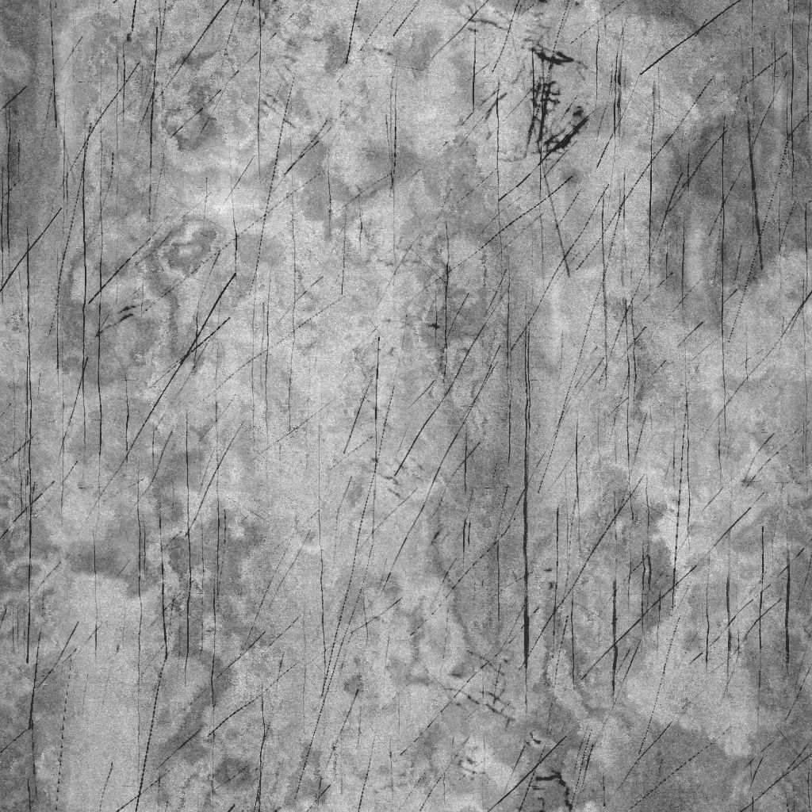

# 그런지 러프 더티

<table>
<tr style="border: 0;">
<td width="33.33%" style="border: 0;" valign="top">

{width="200px"}

<b>내부:</b> 텍스처 생성기 > 잡음

</td>
<td width="100.00%" style="border: 0;" valign="top">

## 설명

**그런지 러프 더티(Rough Dirty)** 노드는 미세한 평행 스크래치가 있는 러프 더티 표면과 유사한 그런지 맵을 생성합니다.

</td>
</tr>
</table>

## 매개변수

|  |  |
|:---|:---|
| <b>균형</b> <i>부동</i> | 어두운 값과 밝은 값 간의 균형을 조정합니다. |
| <b>대비</b> <i>부동</i> | 이미지의 대비를 조정합니다. |
| <b>반전</b> <i>부울</i> | `1-x` 작업을 사용하여 이미지의 출력을 반전합니다. |
| <b>비정사각형 확장</b> <i>부울</i> | 사각형이 아닌 비율로 squash 및 squash를 보정할 수 있습니다. |
| <b>고급</b> |  |
| <b>기본 그런지 강도</b> <i>부동</i> | 표면을 나누는 데 사용되는 기본 그런지 텍스처의 강도를 조정합니다. |
| <b>Scratches 반전</b> <i>부울</i> | 표면의 스크래치 광도를 반전합니다. |
| <b>Scratches 강도</b> <i>부동</i> | 표면의 스크래치 강도를 조정합니다. |
| <b>그레인 강도</b> <i>부동</i> | 전체 그레인 효과의 강도를 조정합니다. |

## 예

<table style="table-layout:fixed">
    <tr style="border: 0;">
        <td style="border: 0;">
            
        </td>
        <td style="border: 0;">
            
        </td>
        <td style="border: 0;"></td>
    </tr>
</table>
