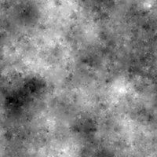

# 습기 소음 1

<table>
<tr style="border: 0;">
<td style="border: 0;" valign="top">

<table>
<tr style="border: 0;">
<td width="33.33%" style="border: 0;" valign="top">

{width="200px"}

<b>내부:</b> 텍스처 생성기 > 노이즈

</td>
<td width="100.00%" style="border: 0;" valign="top">

## 설명

풍부하고 해로운 <b>습기</b> 노이즈의 변형.

다양한 경도와 크기의 원판으로 아래 색상에서 기본 회색부터 더하거나 뺍니다.

참고 항목: [습기 노이즈 2](../../../../../../compositing-graphs/nodes-reference-for-com/node-library/texture-generators/noises/moisture-noise-2/moisture-noise-2.md)

</td>
</tr>
</table>

<table>
<tr style="border: 0;">
<td style="border: 0;" valign="top">

### 출력

</td>
<td style="border: 0;" valign="top">

### 매개변수

</td>
<td style="border: 0;" valign="top">

### 예

</td>
</tr>
</table>

## 출력

|  |  |
| --- | --- |
| <b>출력</b> *회색 음영* | 회색 음영 비트맵으로 생성된 노이즈 |

## 매개변수

|  |  |
| --- | --- |
| <b>비율</b> 정수 | 노이즈 타일을 생성하는 데 사용되는 격자의 하위 분할입니다.    값이 높을수록 더 많은 타일이 그려지고 노이즈가 더 많아집니다. |
| <b>장애</b> 부동 | 소음의 성분을 제거합니다.    이 효과를 사용하면 노이즈에 애니메이션을 적용할 수 있습니다. |
| <b>장애 속도</b> 부동 | <b>Disorder</b> 매개 변수에 의해 적용된 변위의 거리를 조정합니다.    이 효과는 노이즈에 애니메이션을 적용할 때 변위 속도를 제어하는 데 사용할 수 있습니다. |
| <b>장애 비등방성</b> 부동 | <b>Disorder</b> 매개 변수에 의해 적용된 변위의 방향 범위를 제어합니다. 값이 높을수록 방향이 더 좁고 정의됩니다.    방향은 <b>장애 비등방성 각도</b> 매개 변수에 의해 제어됩니다. |
| <b>장애 비등방성 각도</b> 부동 | <b>장애 비등방성</b> 매개 변수가 0이 아닌 경우 <b>장애</b> 매개 변수에 의해 적용된 변위의 방향을 제어합니다. |
| <b>패턴 크기</b> 부동 소수점2 | 분산 패턴 크기에 대한 승수입니다. 여기서 1.0은 원래 분산 크기입니다. |
| <b>패턴 각도</b> 부동 | 흩어져 있는 패턴의 방향을 설정하는 데 사용되는 각도로, 회전 수이며 수평 오른쪽부터 시작합니다. |
| <b>패턴 각도 무작위</b> 부동 | <b>패턴 각도</b> 값에 적용되는 최대 무작위 변형 양(회전 수)입니다. |
| <b>전역 불투명도</b> 부동 | 노이즈의 모든 구성 요소에 대한 불투명도입니다. 여기서 0.0은 기본 회색, 1.0은 구성 요소에 의해 적용된 전체 더하기 또는 빼기의 결과입니다. |
| <b>타일 오프셋</b> Float2 | 노이즈를 렌더링하는 데 사용되는 무한 평면 부분의 위치를 제어합니다. |
| <b>정사각형이 아닌 확장</b> 부울 | 정사각형이 아닌 이미지에서 생성된 타일 사각형을 유지하고 노이즈 생성을 이미지 경계까지 확장합니다. |

## 예

<table>
<tr style="border: 0;">
<td style="border: 0;" valign="top">

{zoomable="yes"}

</td>
<td style="border: 0;" valign="top">

{zoomable="yes"}

</td>
</tr>
</table>

<table>
<tr style="border: 0;">
<td style="border: 0;" valign="top">

{zoomable="yes"}

</td>
<td style="border: 0;" valign="top">

{zoomable="yes"}

</td>
</tr>
</table>

</td>
<td style="border: 0;" valign="top">

</td>
<td style="border: 0;" valign="top">

</td>
</tr>
</table>
