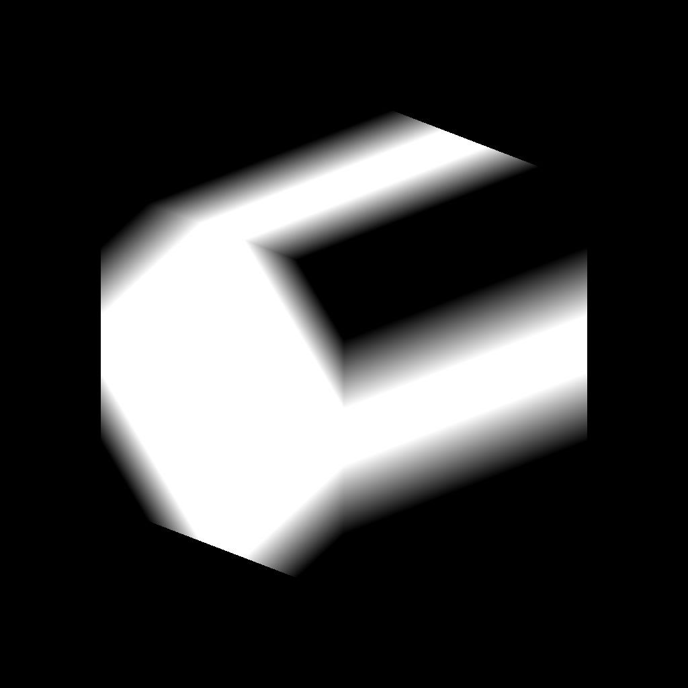

# 3D 볼륨 마스크

<table>
<tr style="border: 0;">
<td width="41.60%" style="border: 0;" valign="top">

{width="256px"}

**인:** 생성기*/패턴*

**단순**

</td>
<td width="58.30%" style="border: 0;" valign="top">

## 설명

**3D 볼륨 마스크** 노드는 **위치** 입력 맵을 기반으로 *기본 모양*&#x200B;의 표현을 생성합니다.

</td>
</tr>
</table>

## 매개변수

### 입력

* **위치** *색상*\
  프리미티브의 *3D 공간 좌표*&#x200B;를 설명하는 맵이 로 표시됩니다.\
  **X/Y/Z** 좌표가 각각 **R/G/B** 채널에 매핑됩니다.

### 매개변수

* **모양** *정수*\
  표시되어야 하는 기본 모양:
  * *큐브*- *실린더*- *구*
* **비율** *부동*\
  모든 축에 *균일하게*&#x200B;을(를) 적용한 프리미티브 *전역* 비율을 정의합니다.
* **크기** *부동 소수점3*\
  각 축에 있는 모양의 크기를 정의합니다.
* **위치 입력** *정수*\
  **위치** 입력을 통해 *스페이스를 나타내는* 방법:
  * *UV 위치*: *UV 맵*&#x200B;을 사용하세요. X/Y(U/V) 좌표는 각각 R/G 채널에 맵핑된다. Z축은 *직교 방향* 벡터로 가정된다.
  * *세계 공간 위치*: *위치 맵*&#x200B;을 사용하여 3D 공간의 기본 위치를 매핑합니다. X/Y/Z 좌표는 각각 R/G/B 채널에 맵핑된다.
* **위치 UV** *부동 소수점2*\
  UV 공간에서 프리미티브 위치의 위치.\
  *참고*: 이 매개 변수는 **위치 입력** 매개 변수가 *UV 위치*(으)로 설정된 경우에만 사용할 수 있습니다.
* **위치** *부동 소수점3*\
  세계 공간에서 프리미티브의 위치입니다.\
  *참고*: 이 매개 변수는 **위치 입력** 매개 변수가 *전역 위치*(으)로 설정된 경우에만 사용할 수 있습니다.
* **회전** *부동 소수점3*\
  월드 공간에서 모양의 회전을 정의합니다.
* **페더 폭** *부동*\
  프리미티브 표면의 안쪽으로 *페이딩 그레이디언트*&#x200B;의 폭을 조정합니다.

## 예제 이미지

<table>
<tr style="border: 0;">
<td style="border: 0;" valign="top">

{width="256px"}

</td>
<td style="border: 0;" valign="top">

{width="256px"}

</td>
<td style="border: 0;" valign="top">

{width="256px"}

</td>
<td style="border: 0;" valign="top">

{width="256px"}

</td>
</tr>
</table>
