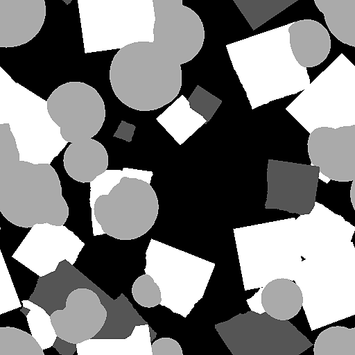

# 마스킹할 모양 튀김

<table>
<tr style="border: 0;">
<td width="33.33%" style="border: 0;" valign="top">

{width="128px"}

<b>내부:</b> 텍스처 생성기 > 패턴

</td>
<td width="100.00%" style="border: 0;" valign="top">

## 설명

패턴 ID를 기반으로 [모양 튄 &#x200B;](../../../../../../compositing-graphs/nodes-reference-for-com/node-library/texture-generators/patterns/shape-splatter/shape-splatter.md) 데이터를 흑백 마스크로 변환합니다. 예를 들어 특정 유형의 패턴만 마스크를 만들 수 있습니다. 패턴 ID 범위를 선택하고 일부 모양을 임의로 숨길 수 있는 추가 옵션이 있습니다.

</td>
</tr>
</table>

## 매개변수

|  |  |
|:---|:---|
| <b>패턴 ID 시작 범위</b> <i>1 - 8</i> | 선택할 범위의 첫 번째 패턴 ID를 설정합니다. |
| <b>패턴 ID 끝 범위</b> <i>1 - 8</i> | 선택할 범위의 마지막 패턴 ID를 설정합니다. |
| <b>무작위 마스크</b> <i>0.0 - 1.0</i> | 무작위로 마스킹할 패턴 비율을 설정합니다. |
| <b>출력</b> <i>이진 마스크, 정수 마스크, 회색 음영 값</i> | 출력 값의 유형을 결정합니다. 이진 마스크는 흑백만 반환하고, 0 또는 1 값을 반환합니다. 정수 마스크 는 HDR 형식의 각 패턴에 대해 최대 8까지의 높은 값을 인코딩하고, 회색 음영 값은 0과 1 사이에 비례적으로 범위를 분산합니다. |
