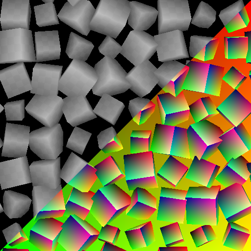

# 모양 스플래터 v2 매퍼 회색 음영

<table>
<tr style="border: 0;">
<td width="33.33%" style="border: 0;" valign="top">

<b>내부:</b> 생성기 > 패턴

</td>
<td width="100.00%" style="border: 0;" valign="top">

## 설명

노드에서 제공한 추가 데이터를 사용하여 [모양 스플래터 v2](../shape-splatter-v2/shape-splatter-v2.md) 노드를 사용하여 생성 및 흩어진 모양에 회색 음영 이미지를 매핑합니다.  이미지는 별도의 패턴 입력으로 제공되거나 그리드 아틀라스에 압축되어 있으며 UV 매핑, 삼면형 투영 또는 사용자 지정 매핑을 사용하여 모양에 적용할 수 있습니다.  모양은 색조가 적용될 수 있으며 모양마다 광도가 균일하게 또는 무작위로 조정됩니다.

[모양 스플래터 v2 매퍼 색상](../shape-splatter-v2-mapper-color/shape-splatter-v2-mapper-color.md)도 참조하세요.

</td>
</tr>
</table>

>[!INFO]
>
> 이 노드에는 [모양 스플래터 v2](../shape-splatter-v2/shape-splatter-v2.md) 노드에서 생성된 입력 데이터가 필요합니다.
> 
> 모양 스플래터 v2 패밀리의 기타 노드:
> * [마스크에 모양 스플래터 v2](../shape-splatter-v2-to-mask/shape-splatter-v2-to-mask.md)
>
> [그리드 아틀라스 회색 음영](../grid-atlas-grayscale/grid-atlas-grayscale.md) 노드를 사용하면 이미지를 4*4 셀에 최대 16개의 패턴으로 사용자 정의 크기의 지도에 압축할 수 있습니다.

>[!TIP]
> 
> [**&#39;Rusty bolt&#39;** 재료 샘플](../../../../../../function-graphs/nodes-reference-for-fun/function-node-library/function-nodes-sdf-functions/working-with-sdf-functions.md#material-sample)을(를) 사용하여 모양 스플래터 v2 노드를 시작할 수 있습니다.
> 
> SDF 함수와 관련된 개념 및 작업 과정에 대해 자세히 알아보려면 전용 페이지로 이동하십시오. [SDF 함수 작업](../../../../../../function-graphs/nodes-reference-for-fun/function-node-library/function-nodes-sdf-functions/working-with-sdf-functions.md)

## 입력

|                                     |                                                                                                                                                                                                                                                                                                                                                                                                                                                                                                                                                                                                                                                                                                                                                                                                                                                                                        |
|:------------------------------------|:---------------------------------------------------------------------------------------------------------------------------------------------------------------------------------------------------------------------------------------------------------------------------------------------------------------------------------------------------------------------------------------------------------------------------------------------------------------------------------------------------------------------------------------------------------------------------------------------------------------------------------------------------------------------------------------------------------------------------------------------------------------------------------------------------------------------------------------------------------------------------------------|
| <b>그리드 아틀라스 입력</b> *회색 음영* | 격자 레이아웃에 압축된 패턴의 회색 음영 이미지  격자 크기는 [모양 스플래터 v2](../shape-splatter-v2/shape-splatter-v2.md) 노드에서 사용하는 크기와 일치해야 합니다.  그리드 아틀라스 회색 음영[&#128279;](../grid-atlas-grayscale/grid-atlas-grayscale.md) 노드를 사용하여 개별 패턴을 그리드 아틀라스로 압축합니다. |
| <b>패턴 입력 1</b> *회색 음영* | 모양에 매핑된 #1 패턴의 회색 음영 이미지입니다.  <i>팁:</i> 패턴이 흩어져 있을 때 가질 수 있는 최대 크기에 가까운 해상도를 사용합니다. |
| <b>패턴 입력 2</b> *회색 음영* | 모양에 매핑된 #2 패턴의 회색 음영 이미지입니다.  <i>팁:</i> 패턴이 흩어져 있을 때 가질 수 있는 최대 크기에 가까운 해상도를 사용합니다. |
| <b>패턴 입력 3</b> *회색 음영* | 모양에 매핑된 #3 패턴의 회색 음영 이미지입니다.  <i>팁:</i> 패턴이 흩어져 있을 때 가질 수 있는 최대 크기에 가까운 해상도를 사용합니다. |
| <b>패턴 입력 4</b> *회색 음영* | 모양에 매핑된 #4 패턴의 회색 음영 이미지입니다.  <i>팁:</i> 패턴이 흩어져 있을 때 가질 수 있는 최대 크기에 가까운 해상도를 사용합니다. |
| <b>패턴 입력 5</b> *회색 음영* | 모양에 매핑된 #5 패턴의 회색 음영 이미지입니다.  <i>팁:</i> 패턴이 흩어져 있을 때 가질 수 있는 최대 크기에 가까운 해상도를 사용합니다. |
| <b>패턴 입력 6</b> *회색 음영* | 모양에 매핑된 #6 패턴의 회색 음영 이미지입니다.  <i>팁:</i> 패턴이 흩어져 있을 때 가질 수 있는 최대 크기에 가까운 해상도를 사용합니다. |
| <b>패턴 입력 7</b> *회색 음영* | 모양에 매핑된 #7 패턴의 회색 음영 이미지입니다.  <i>팁:</i> 패턴이 흩어져 있을 때 가질 수 있는 최대 크기에 가까운 해상도를 사용합니다. |
| <b>패턴 입력 8</b> *회색 음영* | 모양에 매핑된 #8 패턴의 회색 음영 이미지입니다.  <i>팁:</i> 패턴이 흩어져 있을 때 가질 수 있는 최대 크기에 가까운 해상도를 사용합니다. |
| <b>배경 입력</b> *회색 음영* | 매핑된 모양의 배경으로 사용되는 회색 음영 이미지입니다. |
| <b>색상 입력</b> *회색 음영* | 매핑된 모양의 피벗 위치를 지정하는 데 사용되는 회색 음영 이미지입니다.  모양 색상에 대한 해당 색상의 기여도 강도를 조정하려면 <b>색상 입력 불투명도</b> 매개 변수를 사용합니다. |
| <b>표준</b> *색상* | 배경 Height과의 혼합에 따라 마스크된 흩어진 모양에 대해 계산한 정규입니다.   <b>모양 유형</b>이 &#39;그리드 아틀라스&#39;인 경우 <b>그리드 아틀라스 일반</b> 입력에 제공된 정규식이 직접 사용됩니다. |
| <b>Splatter UVW</b> *색상* | <b>R</b> - 모양의 UV 구성 요소 <b>G</b> - 모양의 UV 구성 요소 <b>B</b> - 모양의 Height. (W) <b>A</b> - 압축된 데이터:  - <i>정수 부분:</i> 모양의 고유 식별자입니다. (ID)  - <i>분수 부분:</i>은(는) <b>모양 유형</b>에 따라 다릅니다. 재질 ID(SDF/기본 형식인 경우), 패턴 ID*(패턴 입력/그리드 아틀라스인 경우).  <b>*:</b> 패턴 ID는 목록/아틀라스에 있는 모양의 인덱스입니다. |
| <b>스플래터 데이터 1</b> *색상* | <b>R</b> - 개체 공간에서 모양 표면상의 위치의 X 구성 요소입니다. <b>G</b> - 개체 공간에서 모양 표면상의 위치의 Y 구성 요소입니다. <b>B</b> - 개체 공간에서 모양 표면상의 위치의 Z 구성 요소입니다. <b>A</b> - 압축된 데이터:  - <i>정수 부분:</i> 데이터 2/3 출력에서 모양의 데이터에 대한 UV 좌표의 U 구성 요소입니다.  - <i>분수 부분:</i> 데이터 2/3 출력의 모양 데이터에 대한 UV 좌표의 V 구성 요소입니다.  - <i>서명:</i> 모양을 배경 Height과 혼합하기 위한 이진 마스크입니다. |
| <b>스플래터 데이터 2</b> *색상* | <b>R</b> - 모양의 3D 회전의 X 구성 요소. <b>G</b> - 모양의 3D 회전의 Y 구성 요소. <b>B</b> - 모양의 3D 회전의 Z 구성 요소. <b>A</b> - 모양의 회전이 정상적으로 이루어집니다.  모든 회전은 회전 수로 정의됩니다. |
| <b>스플래터 데이터 3</b> *색상* | <b>R</b> - 모양 위치의 X 구성 요소. <b>G</b> - 모양 위치의 Y 구성 요소. <b>B</b> - 모양을 정상적으로 오프셋합니다. <b>A</b> - 압축된 데이터:  - <i>정수 부분:</i> 모양의 ID.  - <i>분수 부분:</i>원본 아틀라스에 있는 도형 패턴의 인덱스입니다. 그리드 아틀라스 패턴 유형을 사용하는 경우 |
| <b>스플래터 데이터 4</b> *색상* | <i>픽셀 1</i> <b>R</b> - 데이터 2/3 출력 이미지의 X 크기 <b>G</b> - 데이터 2/3 출력 이미지의 Y 크기 <b>B</b> - 데이터 4 출력 이미지의 X 크기 <b>A</b> - 데이터 4 출력 이미지의 Y 크기.  <i>픽셀 2</i> <b>R</b> - 모양 유형입니다. (E.g. 큐브, 원통, ...) <b>G</b> - 압축된 데이터:  - <i>절대 값:</i> 패턴 입력 번호입니다.  - <i>서명:</i> 출력 표준 맵의 표준 형식입니다. (양수: DirectX/음수: OpenGL) <b>B</b> - 그리드 아틀라스의 X 크기. (즉, 열의 양) <b>A</b> - 그리드 아틀라스의 Y 크기입니다. (예: 행의 양) |

## 출력

|               |                     |
|:--------------|:--------------------|
| <b>출력</b> | 색상이 지정된 모양입니다. |

## 매개변수

|                                            |                                                                                                                                                                                                                                                                                                                                                                                                                                                                                                                                                                                                                                                                                                                                                                                                                                                                                                                                                                                                                                                                                                                                                                                                                                                                   |
|:-------------------------------------------|:------------------------------------------------------------------------------------------------------------------------------------------------------------------------------------------------------------------------------------------------------------------------------------------------------------------------------------------------------------------------------------------------------------------------------------------------------------------------------------------------------------------------------------------------------------------------------------------------------------------------------------------------------------------------------------------------------------------------------------------------------------------------------------------------------------------------------------------------------------------------------------------------------------------------------------------------------------------------------------------------------------------------------------------------------------------------------------------------------------------------------------------------------------------------------------------------------------------------------------------------------------------|
| <b>투영 모드</b> *정수* | 입력 이미지를 모양에 투영하는 방법:  - <b>스플래터 UV에서:</b> [모양 스플래터 v2](../shape-splatter-v2/shape-splatter-v2.md) 노드에서 제공하는 UV를 사용합니다. - <b>삼면형:</b> 삼면형 투영을 사용하여 모양의 로컬 XYZ 축에 이미지를 매핑합니다. - <b>사용자 지정 함수:</b> 함수 그래프를 작성하여 모양에 이미지 매핑을 정의합니다. |
| <b>사용자 지정 함수</b> *부동* | 모양의 픽셀당 광도를 플로트로 지정합니다.  다음 변수를 사용할 수 있습니다. - <code>shape.position.os</code> (Float3) 개체 공간에서 모양 표면의 위치입니다. - <code>shape.position.ws</code> (Float3) 월드 공간에서 모양 표면의 위치*. - <code>shape.normal.os</code> (Float3) 개체 공간에서 모양 표면의 표준입니다.  - <code>shape.normal.ws</code> (Float3) world space*. - <code>shape.id에서 모양 표면의 표준</code> (부동) 모양의 고유 식별자입니다. - <code>material.id</code> (Float) [모양 스플래터 v2](../shape-splatter-v2/shape-splatter-v2.md) 노드에 의해 정의된 모양 표면의 재질 ID.  *: 모양의 월드 공간은 피벗을 중심으로 하며 모양의 Height을 고려하지 않습니다. 즉, 개체 공간과의 유일한 차이는 방향입니다.  [모양 스플래터 v2 매퍼 회색 음영](shape-splatter-v2-mapper-grayscale.md) 노드의 입력을 샘플링해야 하는 경우 다음 [샘플 회색 음영](../../../../../../function-graphs/nodes-reference-for-fun/atomic-function-nodes/sampler-nodes/sampler-nodes.md) 노드 입력 슬롯을 사용할 수 있습니다. - 0: 그리드 아틀라스 - 1-8: 패턴 입력 1-8 |
| <b>대비 혼합</b> *부동* | 평면 투영 간의 변환의 선명도입니다. 여기서 1은 페이드 그레이디언트가 없음을 의미합니다. |
| <b>이미지 투영</b> *정수* | 평면 투영에 걸쳐 분포된 <b>패턴 입력 #</b> 이미지의 양으로 삼각 평면 매핑에 기여합니다.  모양의 모든 면을 덮을 수 있도록 각 축에서 앞면(+) 및 뒷면(-) 평면 투영을 수행하여 총 6개의 투영을 수행합니다.  - <b>1 이미지:</b> 패턴 입력 1은 모든 평면 투영에 사용됩니다. - <b>3 이미지:</b> 각 축의 +/- 투영에는 별도의 패턴 입력이 사용됩니다. - <b>6 이미지:</b> 각 투영은 별도의 패턴 입력을 사용합니다. - <b>재료 ID당 이미지:</b> 재료 ID당 별도의 패턴 입력을 사용합니다. 여기서 각 이미지는 모든 평면 투영에 사용됩니다. |
| <b>프로젝션 센터</b> *Float3* | 개체 공간에서 축당 삼평면 투영을 오프셋합니다.  오프셋은 <i>전체 투영 공간</i>에 적용되므로 한 축에 대한 오프셋은 <i>다른 두</i> 축에 투영된 텍스처의 위치에 영향을 줍니다. |
| <b>프로젝션 배율</b> *부동* | 지정된 인수에 따라 <i>모든 축</i>에서 투영된 텍스처의 비율을 조정합니다. |
| <b>선택 모드 입력</b> *정수* | 모양과 매핑할 입력 이미지를 선택하는 방법입니다.  원본 [모양 스플래터 v2](../shape-splatter-v2/shape-splatter-v2.md) 노드에서 선택한 <b>모양 유형</b>이 이미지에 모양을 할당하는 방법을 변경합니다.  - <b>그리드 아틀라스</b>은(는) 격자 인덱스를 일치시켜 이미지를 &#39;그리드 아틀라스 입력&#39;에 가져와야 함을 의미합니다(두 아틀라스가 동일한 격자 크기를 사용해야 함) - <b>패턴 입력</b>은(는) 인덱스를 일치시켜 이미지를 &#39;패턴 입력 #&#39; 입력에 가져와야 함을 의미합니다. - <b>다른 모양 유형:</b> 이미지는 인덱스를 모양의 재질 ID와 일치시켜 할당됩니다.  인덱스를 선택하는 사용 가능한 방법은 다음과 같습니다. - <b>스플래터 데이터에서 </b> [모양 스플래터 v2](../shape-splatter-v2/shape-splatter-v2.md) 노드에서 할당한 모양의 인덱스에 대한 &#39;패턴 입력 #&#39; 또는 &#39;그리드 아틀라스 입력&#39; 이미지를 사용합니다. - <b>수동:</b> &#39;이미지 인덱스&#39; 매개 변수에 지정된 인덱스를 사용합니다. - <b>무작위:</b> &#39;무작위 범위&#39; 매개 변수에 지정된 범위의 무작위 인덱스를 사용합니다. |
| <b>패턴 입력 번호</b> *정수* | 모양에 매핑해야 하는 <b>패턴 입력 #</b> 입력 이미지의 양입니다. |
| <b>이미지 인덱스</b> *정수* | 도형에 매핑해야 하는 <b>패턴 입력 #</b> 또는 <b>그리드 아틀라스 입력</b>의 입력 패턴 인덱스입니다. |
| <b>임의 범위</b> *정수2* | 해당 패턴을 무작위로 선택해야 모양에 매핑할 <b>패턴 입력 #</b> 또는 <b>그리드 아틀라스 입력</b>의 인덱스 범위입니다. |
| <b>광도 조정</b> *부동* | 모든 모양의 광도에 균일하게 적용되는 오프셋입니다. |
| <b>광도 무작위</b> *부동* | 지정한 값까지 모양의 광도에 적용되는 임의의 양수 또는 음수 오프셋입니다. |
| <b>색상 입력 불투명도</b> *부동* | 선택한 <b>색상 입력 혼합 모드</b>에 따라 <b>색상 입력</b>이 모양의 색상에 기여하는 강도입니다. |
| <b>색상 입력 혼합 모드</b> *정수* | 전경 및 배경 이미지를 결합하는 데 사용되는 색상 혼합 작업입니다.  이러한 작업은 [Blend](../../../../atomic-nodes/blend/blend.md) 노드의 작업과 동일합니다.  사용 가능한 모드: - <b>복사</b> - <b>추가(선형 닷지)</b> - <b>빼기</b> - <b>곱하기</b> - <b>오버레이</b> |
| <b>타일링 모드</b> *정수* | 텍스처가 반복되어야 하는 축:  - <b>타일링 없음</b>  - <b>수평 타일링</b>  - <b>수직 타일링</b>  - <b>H 및 V 타일링</b>: 수평 및 수직 타일링을 결합했습니다. |
| <b>UV 타일링</b> *부동* | 모양에 매핑된 이미지의 전역 타일링을 조정합니다  값이 높을수록 반복이 더 많아집니다. |
| <b>UV 비율</b> *Float2* | U 및 V 비율을 위한 별도의 컨트롤을 사용하여 지정된 요소에 따라 모양에 매핑된 이미지의 타일링을 조정합니다. 값이 높을수록 반복이 더 많아집니다. |
| <b>UV 오프셋</b> *Float2* | 모양 전체의 이미지 매핑에 오프셋을 적용하여 모양에서 이미지 위치를 미세하게 조정할 수 있습니다.  이 오프셋은 <b>임의 오프셋</b>에 추가됩니다(있는 경우). |
| <b>임의 오프셋</b> *부동* | 지정된 값까지 모양 간 이미지 매핑에 양수 또는 음수 오프셋 <i>모양당</i>의 양을 임의로 적용합니다.  이 오프셋은 <b>UV 오프셋</b>에 추가됩니다(있는 경우). |

