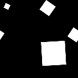

# 스플래터

<table>
<tr style="border: 0;">
<td width="33.33%" style="border: 0;" valign="top">

<b>내부:</b> 텍스처 생성기 > 패턴

</td>
<td width="100.00%" style="border: 0;" valign="top">

## 설명

스플래터 는 지도 입력을 무작위로 배치하기 위한 패턴 생성기입니다. 기하학적 패턴 배치를 위한 많은 컨트롤이 있으며 [Tile Generator](../../../../../../compositing-graphs/nodes-reference-for-com/node-library/texture-generators/patterns/tile-generator/tile-generator.md)보다 사용이 간단합니다. 후자도 비슷한 결과를 얻을 수 있지만 훨씬 복잡하다.

스플래터는 모양을 너무 수정하지 않고도 빠르게 찍어낼 수 있는 작업에 적합합니다.

기본 스플래터 매개 변수는 전혀 무작위로 보이지 않는다는 점을 기억하십시오. 임의화를 위해서는 이러한 매개 변수 중 일부를 수정해야 합니다(주로 장애 매개 변수). 또한 스플래터가 작동하려면 지도 입력이 필요합니다.

</td>
</tr>
</table>

## 매개변수

|  |  |
|:---|:---|
| <b>패턴 크기 너비</b> <i>0.0 - 1000.0</i> | X축에 사용할 패턴의 수입니다. |
| <b>패턴 크기 Height</b> <i>0.0 - 1000.0</i> | Y축에서 사용할 패턴의 수입니다. |
| <b>회전</b> <i>-360.0 - 360.0</i> | 설정된 양만큼 모든 패턴을 회전합니다. |
| <b>회전 변형</b> <i>0.0 - 360.0</i> | 모든 개별 모양에 대해 임의 회전을 도입합니다. |
| <b>확대/축소</b> <i>100.0 - 10000.0</i> | 최종 결과의 크기를 조절합니다. 이렇게 하면 타일링이 풀린다는 것을 명심해라! |
| <b>게인</b> <i>0.0 - 10.0</i> | 모든 패턴의 혼합 게인을 조정합니다. 더 돋보이게 합니다. |
| <b>팬 X</b> <i>-100.0 - 100.0</i> | X축에서 전체 결과를 팬합니다. |
| <b>Y 이동</b> <i>-100.0 - 100.0</i> | Y축에 전체 결과를 팬합니다. |
| <b>장애</b> <i>0.0 - 100.0</i> | 모양을 임의로 이동합니다. |
| <b>그리드 번호</b> <i>0 - 8</i> | 다양한 격자 크기를 이동하여 결과 비율을 조정합니다. 타일링을 유지합니다. |
| <b>장애 각도</b> <i>0.0 - 360.0</i> | 장애 이동 각도를 제어합니다. |
| <b>무작위 장애</b> <i>거짓/참</i> | 무질서 각도를 무작위화하여 훨씬 더 많은 혼란을 추가합니다. |
| <b>패턴 크기</b> <i>5 - 12</i> |  |
| <b>크기 변형</b> <i>0.0 - 100.0</i> | 모든 모양에 대해 무작위 크기 조정을 도입합니다. |
| <b>이미지 입력 필터링(엔진 > v4만 해당)</b> <i>쌍선형 + 밉맵, 쌍선형, 최근접</i> | 입력 이미지에 적용할 필터링입니다. |
| <b>출력 수준 최소</b> <i>0.0 - 1.0</i> | 최소 레벨 조정입니다. |
| <b>출력 수준 최대</b> <i>0.0 - 1.0</i> | 최대 레벨 조정입니다. |
| <b>배경색</b> <i>(회색 음영 값)</i> | 단색 배경색을 설정합니다. |
| <b>광도 변형</b> <i>0.0 - 1.0(회색 음영 버전만)</i> | 광도 변형이 도입됩니다. |
| <b>색상 변형</b> <i>0.0 - 1.0(색상 버전만)</i> | 색상 변형이 도입됩니다. |

## 예

<table style="margin-top: 32px; margin-bottom: 32px">
    <tr style="border: 0">
        <td style="border: 0; background: transparent">
            
        </td>
    </tr>
</table>
