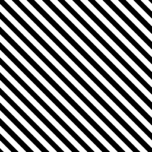

# 줄무늬

<table>
<tr style="border: 0;">
<td width="33.33%" style="border: 0;" valign="top">

{width="128px"}

<b>내부:</b> 텍스처 생성기 > 패턴

</td>
<td width="100.00%" style="border: 0;" valign="top">

## 설명

타일링 각진 스트라이프 패턴을 생성합니다. 패턴은 항상 연속성을 보장하기 위해 자체적으로 조정됩니다.

</td>
</tr>
</table>

## 매개변수

|  |  |
|:---|:---|
| <b>Stripe</b> <i>1 - 100</i> | 줄무늬의 양을 설정합니다. 타일링을 보장하기 위해 결과를 자동으로 이동합니다. |
| <b>너비</b> <i>0.0 - 1.0</i> | Stripe 너비를 설정합니다. |
| <b>부드러움</b> <i>0.0 - 1.0</i> | 스트라이프 가장자리의 전환을 설정합니다. |
| <b>Shift</b> <i>0 - 20</i> | 줄무늬를 기울입니다. 자동으로 더 많은 줄무늬를 추가하여 타일링을 확인합니다. |
| <b>맞춤</b> <i>가장자리, 가운데</i> | 이동을 위한 피벗을 설정합니다. |
| <b>필터링</b> <i>거짓/참</i> | 필터링을 사용합니다. |
| <b>비정사각형 확장</b> <i>거짓/참</i> | 제곱이 아닌 비율로 스쿼시와 스트레치를 보정할 수 있습니다. |

## 예

<table style="margin-top: 32px; margin-bottom: 32px">
    <tr style="border: 0">
        <td style="border: 0; background: transparent">
            
        </td>
    </tr>
</table>
