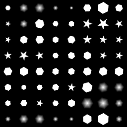

# 타일 Sampler

<table>
<tr style="border: 0;">
<td style="border: 0;" valign="top">

{width="128px"}

## 타일 Sampler(색상)

**인:** *텍스처 생성기**/패턴*

**복합**

</td>
<td style="border: 0;" valign="top">

## 설명

타일 Sampler은 타일 패턴의 궁극적인 생성 노드입니다. [Tile Generator](../../../../../../compositing-graphs/nodes-reference-for-com/node-library/texture-generators/patterns/tile-generator/tile-generator.md)의 발전된 복잡한 버전입니다. 2017 2.1년을 기준으로 하면 타일 Sampler과 [생성기](../../../../../../compositing-graphs/nodes-reference-for-com/node-library/texture-generators/patterns/tile-generator/tile-generator.md)의 차이가 훨씬 줄어듭니다. 주요 차이점은 크기 조절, 위치, 회전, 크기, 색상 및 마스크 생성에 사용할 수 있는 7개의 다른 맵 슬롯에서만 있습니다. 효과는 개별적으로 혼합할 수 있습니다.

타일 Sampler은 외부 입력 맵으로 제어되는 특정 매개 변수에 대한 추가 제어와 함께 인공 절차 패턴을 만드는 데 유용합니다.

타일 Sampler으로 넘어가기 전에 [Tile Generator](../../../../../../compositing-graphs/nodes-reference-for-com/node-library/texture-generators/patterns/tile-generator/tile-generator.md)에 익숙한지 확인하세요. 대부분의 경우 [Tile Generator](../../../../../../compositing-graphs/nodes-reference-for-com/node-library/texture-generators/patterns/tile-generator/tile-generator.md)이면 충분하며 타일 Sampler의 복잡성을 추가할 필요가 없습니다.

## 매개변수

### 입력

* **패턴 입력 1-6**: *회색 음영 입력/색상 입력*\
  &quot;Pattern&quot; 매개 변수를 &quot;Image Input&quot;으로 설정한 경우 사용되는 사용자 정의 패턴 이미지입니다.\
  사용 가능한 입력 양은 **패턴 입력 번호** 매개 변수에 의해 결정됩니다.
* **맵 입력 크기 조절**: *회색 음영 입력*&#x200B;타일 크기 조절을 구동하는 회색 음영 맵
* **변위 맵 입력**: *회색 음영 입력*&#x200B;타일 변위를 구동하기 위한 회색 음영 맵
* **회전 맵 입력**: *회색 음영 입력*\
  타일 회전을 구동하는 회색 음영 맵
* **벡터 맵 입력**: *색상 입력*\
  균일하지 않은 비율을 구동하기 위한 색상 벡터 맵.
* **색상 맵 입력**: *회색 음영 입력/색상 입력*&#x200B;타일당 드라이브 색조 매핑.
* **마스크 맵 입력**: *회색 음영 입력*\
  특정 타일을 숨기는 데 사용되는 마스크 슬롯입니다.
* **패턴 분포 맵 입력**: *회색 음영 입력*\
  여러 사용자 정의 패턴 입력을 구동하는 데 사용되는 마스크 슬롯입니다.
* **배경 입력**: *회색 음영 입력/색상 입력*&#x200B;선택적 배경 이미지.

### 매개변수

* **X 양**: *0 - 64*\
  패턴의 X-반복의 양입니다.
* **Y 양**: *0 - 64*\
  패턴의 Y-반복의 양입니다.
* **비정사각형 확장**: *False/True*\
  제곱이 아닌 비율로 스쿼시와 스트레치를 보정할 수 있습니다.
* **패턴**
  * **패턴**: *패턴 입력, 정사각형, 디스크, 포물면, 벨, 가우스, 가시, 피라미드, 벽돌, 그라데이션, 파도, 하프 벨, 융기된 벨, 초승달, 캡슐, 원뿔*\
    사용할 패턴 모양을 선택합니다.
  * **패턴 입력 번호**: *1 - 6*&#x200B;임의로 선택할 사용자 지정 패턴의 양입니다.
  * **패턴 입력 분포**: *임의, 패턴 번호, 분포 맵*&#x200B;여러 패턴 입력을 선택하는 방법을 설정합니다. 무작위란 임의의 것이 선택된 것을 의미하고, 패턴 숫자는 그것들이 단지 반복되는 시퀀스 내에 배치됨을 의미한다. 분포 맵은 회색 음영 맵 입력을 사용하여 배치를 제어합니다.
  * **패턴 입력 필터링(엔진 > v4)**: *쌍선형 + 밉맵, 쌍선형, 최근접*
  * **패턴별**: *0.0 - 1.0*\
    선택한 패턴의 모양을 변경할 수 있습니다. 효과는 선택한 패턴에 따라 달라집니다.
  * **패턴별 무작위**: *0.0 - 1.0*&#x200B;임의화 효과는 선택한 패턴에 따라 달라집니다.
  * **회전**: *0, 90, 180, 270*&#x200B;단계 회전(90도)
  * **회전 무작위**: *0.0 - 1.0*&#x200B;타일당 무작위 자유 회전.
  * **대칭 무작위**: *0.0 - 1.0*&#x200B;아래 동작에 따라 무작위로 뒤집거나 미러링해야 하는 타일의 수를 설정합니다.
  * **대칭 무작위 모드**: *수평 + 수직, 수평, 수직*&#x200B;대칭 미러링 동작을 결정합니다.
* **크기**
  * **크기 모드**: *표준, 유지 비율, 절대, 픽셀*&#x200B;패턴 크기의 일반적인 동작을 설정합니다.\
    표준(Normal) - 패턴 요소의 크기를 정의할 수 있습니다. X와 Y의 양에 영향을 받습니다.\
    [비율 유지]를 사용하면 X 및 Y 양의 영향을 받는 크기를 설정할 수 있지만 이 두 크기 사이의 X 및 Y 비율은 그대로 유지됩니다.\
    절대 크기 를 사용하면 X 및 Y 크기의 영향을 받지 않는 절대 크기를 설정할 수 있습니다.\
    픽셀 을 사용하면 X 및 Y 양에 영향을 받지 않고 절대 크기를 픽셀 단위로 설정할 수 있습니다. 해상도를 변경하면 요소의 크기에 영향을 줍니다.
  * **크기(절대/픽셀)**: *0.0 - 1.0*&#x200B;타일의 비균일 비율을 변경합니다. 정확한 동작은 [크기 모드]에 따라 다릅니다.
  * **크기 무작위**: *0.0 - 1.0*&#x200B;타일당 비율을 임의화합니다.
  * **크기 조절**: *0.0 - 10.0*&#x200B;전체 타일 크기를 설정합니다.
  * **무작위 크기 조정**: *0.0 - 1.0*&#x200B;타일당 크기를 임의로 조정합니다.
  * **비율 맵 승수**: *0.0 - 1.0*&#x200B;비율 맵의 효과에 혼합.
  * **벡터 맵 배율 조정**: *0.0 - 1.0*&#x200B;벡터 맵을 혼합하여 균일하지 않은 배율을 적용합니다.
  * **크기 조정 매개 변수화 영향**: *X 및 Y, X, Y*&#x200B;크기 조정 매개 변수화가 영향을 미치는 축을 설정합니다. 비율 맵을 사용하여 요소의 X 또는 Y에만 영향을 줄 수 있습니다.
* **위치**
  * **위치 무작위**: *0.0 - 10.0*&#x200B;두 축에 걸쳐 타일 위치를 임의화합니다.
  * **오프셋**: *0.0 - 1.0*\
    오프셋 유형에 따라 타일을 이동합니다.
  * **오프셋 유형**: *가로 퀸큐스, 세로 퀸큐스, 가로 전역, 세로 전역*&#x200B;오프셋이 작동하는 방향을 변경합니다.
  * **전역 오프셋**: *0.0 - 1.0* X축 또는 Y축의 모든 타일을 전역적으로 오프셋합니다.
  * **변위 맵 강도**: *0.0 - 1.0*&#x200B;오프셋에서 변위 맵 강도를 혼합합니다.
  * **변위 각도**: *0.0 - 1.0*&#x200B;이동할 각도를 설정합니다.
  * **벡터 맵 변위**: *0.0 - 1.0*&#x200B;벡터 맵을 사용하여 변위와 각도를 조정합니다.
* **회전**
  * **회전**: *0.0 - 1.0*&#x200B;모든 타일을 전역적으로 회전합니다.
  * **회전 무작위**: *0.0 - 1.0*&#x200B;타일당 무작위 회전.
  * **회전 맵 배율**: *0.0 - 1.0*&#x200B;타일별 회전에 대한 회전 맵 효과의 혼합입니다.
  * **벡터 맵 멀티플라이어**: *0.0 - 1.0*&#x200B;벡터 맵을 사용하여 타일별 회전을 실행합니다.
* **색상**
  * **마스크 맵 임계값**: *0.0 - 1.0*&#x200B;타일 숨기기를 시작할 때 마스크 맵의 임계값.
  * **마스크 맵 반전**: *False/True*&#x200B;마스크 맵 효과를 반전합니다.
  * **마스크 맵 샘플링 기법**: *패턴 중심, 패턴 테두리 상자(느림)*숨기기가 단일 지점 또는 테두리 상자에 의해 결정되어야 하는지 여부. 흩어진 픽셀로 인해 이상한 효과가 발생하는 것을 방지합니다.
  * **무작위 마스크**: *0.0 - 1.0*&#x200B;무작위 마스킹은 마스크 맵과 병행하여 작동합니다.
  * **마스크 반전**: *False/True*&#x200B;무작위 마스킹을 반전합니다.
  * **혼합 모드**: *Add/Sub, Max(타일 Sampler) /* Add/Sub, Alpha 혼합*(타일 Sampler 색상)*타일을 배경과 다른 배경에 혼합하는 혼합 모드.
  * **색상**: *(회색 음영 값) / (색상 값)*단색, 전체 타일 색상.
  * **색상/광도 무작위**: *0.0 - 1.0*&#x200B;타일당 색상의 임의화.
  * **색상 매개 변수화 모드**: *색상 입력, 비율, 선 색인, 행 색인, 패턴 색인(타일 Sampler)*\
    */ *색상 맵, 비율, 선 색인, 행 색인, 패턴 색인, 패턴 중심 위치, 패턴 중심 위치(RG) Bsphere 크기(B)(타일 Sampler 색상)**색상 임의화가 정확하게 매개 변수화되는 방법을 설정합니다.
  * **색상 매개 변수화 승수**: *0.0 - 1.0*&#x200B;위의 매개 변수화 효과에 혼합.
  * **색상 매개 변수화 영향(색상만):** **RGB+Alpha, RGB 전용, Alpha 전용**&#x200B;매개 변수화가 색상에 미치는 영향을 설정합니다.
  * **전체 불투명도(회색 음영만)**: *0.0 - 1.0*&#x200B;전체 타일 불투명도를 설정합니다.
  * **배경색**: *(회색 음영 값) / (색상 값)*단색 배경색을 설정합니다.
  * **렌더링 순서 되돌리기**: *False/True*&#x200B;렌더링 순서를 되돌려서 맨 앞으로 이동합니다.

## 예제 이미지

| 

 |
| --- |
|  |

*예는 입력 맵(패턴 분포, 크기 조절, 회전)에 의해 매개 변수가 제어되는 방법을 보여 줍니다.*

</td>
</tr>
</table>
