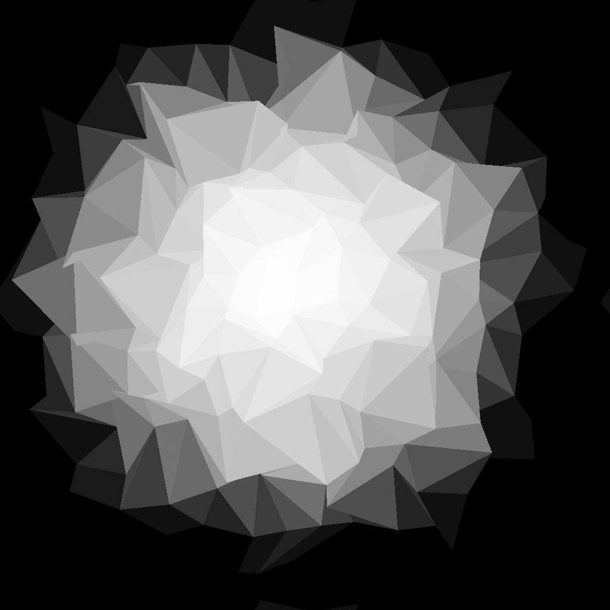

# Triangle Grid

<table>
<tr style="border: 0;">
<td width="41.60%" style="border: 0;" valign="top">

{width="200px"}

{width="200px"}

<b>내부:</b> 텍스처 생성기 > 패턴

</td>
<td width="58.30%" style="border: 0;" valign="top">

## 설명

**Triangle Grid** 노드는 Z-down 직교 투영을 사용하여 3D 공간에서 *정점*&#x200B;개 중 *삼각측정 표면*&#x200B;의 회색 음영 표현을 생성합니다.

**색상 출력** 매개 변수를 사용하면 표현에 사용되는 데이터를 선택할 수 있으므로 다양한 시각적 스타일을 만들 수 있습니다.\
정점의 *위치*&#x200B;가 조정될 수 있는데, 이는 생성된 메쉬에 영향을 미친다.

</td>
</tr>
</table>

## 입력

|  |  |
|:---|:---|
| <b>Height</b> <i>회색 음영</i> 기본 | 정점의 *Height*(예: Z 위치)을 매핑하는 데 사용되는 회색 음영 이미지 입력입니다.    이 투입의 영향력은 &#39;Height 투입승수&#39; 매개변수에 의해 통제된다. |
| <b>벡터 맵</b> <i>색상</i> | X축과 Y축에 정점의 *변위*&#x200B;을(를) 매핑하는 데 사용되는 색상 이미지 입력입니다.    X/Y 오프셋은 각각 이미지의 R/G 채널에 매핑됩니다.    이 입력의 영향은 &#39;벡터 맵 변위&#39; 매개 변수에 의해 제어됩니다. |
| <b>색상 입력</b> <i>색상</i> | 정점, 선분 또는 삼각형의 *색상*&#x200B;을 매핑하는 데 사용되는 색상 이미지 입력입니다.    이 입력은 &#39;색상 소스&#39; 매개 변수를 &#39;색상 입력&#39;으로 설정할 때 사용됩니다. |

## 출력

|  |  |
|:---|:---|
| <b>출력</b> <i>색상</i> | 출력 이미지입니다. |

## 매개변수

|  |  |
|:---|:---|
| <b>색상 출력</b> *정수* | 삼각측정 서피스를 나타내는 방법:<ul data-preserve-html="true"> <li data-preserve-html="true"><b>정점당:</b> 각 정점에 색상이 할당되고 삼각형 표면에 보간됩니다.</li> <li data-preserve-html="true"><b>삼각형당:</b> 각 삼각형에 단색이 할당됨</li> <li data-preserve-html="true"><b>가는 선</b><b>:</b>은 꼭짓점 사이의 선분에 윤곽선을 적용합니다</li> <li data-preserve-html="true"><b>가장자리까지의 거리</b><b>:</b>는 각 삼각형에서 가장 가까운 세그먼트에 거리를 렌더링합니다</li> <li data-preserve-html="true"><b>중앙</b><b>:</b>은 각 삼각형의 무게 중심에 대해 정규화된 거리를 렌더링합니다</li> </ul> |
| <b>삼각 측량</b> *정수* | 서피스에 대한 삼각 측량 방법, 즉 쿼드의 *상대 정점 쌍*&#x200B;을 연결합니다.<ul data-preserve-html="true"> <li data-preserve-html="true"><b>자동:</b>은 자동으로 두 정점을 선택하여 카메라에서 <i>가장 멀리 보이는 삼각형</i>을 만듭니다  <b>45°:</b> X-오른쪽 축을 기준으로 선 <i>45도 돌린</i>을(를) 만드는 반대 정점을 연결합니다</li> <li data-preserve-html="true"><b>-45°:</b> X-오른쪽 축을 기준으로 줄 <i>방향을 -45도</i>로 돌린 반대 정점을 연결합니다</li> <li data-preserve-html="true"><b>Quinux 가로:</b> 정점의 삼각측량 방향을 <i>한 행마다</i> 바꿉니다.</li> <li data-preserve-html="true"><b>Quinux 수직:</b> 정점의 삼각측량 방향을 <i>모든 다른 열</i> 대체  </li> </ul> |
| <b>X 양</b> *정수* | X축에 생성된 정점의 양입니다. |
| <b>Y 양</b> *정수* | Y축에 생성된 정점의 양입니다. |
| <b>무작위 위치 승수</b> *부동* | 기본 뒤틀기 효과의 강도를 조정합니다. |
| <b>무작위 위치</b> *Float2* | 각 정점의 X 및 Y 위치에 적용된 임의 오프셋의 강도를 눈금의 *셀 크기*&#x200B;에 상대적으로 조정합니다.   이 오프셋은 <b>Quinux 오프셋</b> 및 <b>벡터 맵 변위</b> 매개 변수를 사용하여 *스택*&#x200B;입니다. |
| <b>벡터 맵 변위</b> *부동* | <b>벡터 맵</b> 입력의 *샘플링* 값을 사용하여 각 정점에 적용되는 *전역* 변위 양을 조정합니다.    이 오프셋은 <b>무작위 위치</b> 및 <b>Quinux 오프셋</b> 매개 변수를 사용하여 *스택*&#x200B;입니다. |
| <b>Quinux 오프셋 X</b> *부동* | 격자의 *셀 크기*&#x200B;에 상대적으로 정점의 *모든 다른 행*&#x200B;에 지정된 양의 오프셋을 적용합니다.   이 오프셋은 <b>임의 위치</b> 및 <b>벡터 맵 변위</b> 매개 변수를 사용하여 *스택*&#x200B;입니다. |
| <b>Quincux 오프셋 Y</b> *부동* | 격자의 *셀 크기*&#x200B;와 상대적으로 정점의 *모든 다른 열*&#x200B;에 지정된 양의 오프셋을 적용합니다.    이 오프셋은 <b>임의 위치</b> 및 <b>벡터 맵 변위</b> 매개 변수를 사용하여 *스택*&#x200B;입니다. |
| <b>회전</b> *부동* | *지정된* 회전 양을 *기본 위치*&#x200B;를 중심으로 각 정점에 적용합니다(즉, 임의 오프셋 및 변위가 적용되기 *전* 위치).    이 회전 *스택*&#x200B;은 <b>회전 장애</b> 매개 변수와 함께 사용됩니다. |
| <b>회전 장애</b> *부동* | *기본 위치*&#x200B;를 중심으로 각 정점에 *임의* 회전량을 적용합니다(즉, 임의 오프셋 및 변위가 적용되기 *전* 위치).    이 순환은 <b>회전</b> 매개 변수와 함께 *스택*&#x200B;입니다. |
| <b>Height 입력 승수</b> *부동* | <b>Height</b> 입력의 *샘플링* 값을 사용하여 각 정점의 Z 위치를 조정합니다.    이 오프셋은 <b>Height 무작위</b> 매개 변수를 사용하여 *스택*&#x200B;입니다. |
| <b>무작위 Height</b> *부동* | 각 정점의 Z 위치에 임의의 오프셋을 적용합니다.  이 오프셋은 <b>Height 입력 승수</b> 매개 변수를 사용하여 *스택*&#x200B;입니다. |
| <b>혼합 모드</b> *정수* | *겹쳐진 삼각형*&#x200B;의 값을 혼합하는 방법을 설정합니다. 모드를 사용하면 표시할 삼각형 중 *어떤*&#x200B;개를 효과적으로 선택할 수 있습니다. <ul data-preserve-html="true"> <li data-preserve-html="true"><b>분:</b> 텍스트</li> <li data-preserve-html="true"><b>최대:</b> 텍스트</li> <li data-preserve-html="true"><b>깊이 테스트</b>: 텍스트</li> <li data-preserve-html="true"><b>Alpha 혼합:</b> 텍스트</li> </ul>참고: 사용 가능한 혼합 모드는 <b>색상 출력</b> 매개 변수의 값에 따라 다릅니다. |
| <b>색상 소스</b> *정수* *&#39;색상 출력&#39; 매개 변수가 &#39;정점당&#39;, &#39;삼각형당&#39; 또는 &#39;가는 선&#39;으로 설정된 경우 사용할 수 있습니다.* | 선택한 <b>색상 출력</b> 모드에 따라 꼭지점, 삼각형 또는 선분에 할당되어야 하는 *색상 획득* 방법(예: 광도)을 설정합니다.<ul data-preserve-html="true"> <li data-preserve-html="true"><b>Height</b><b>:</b> 정점의 Height을 광도로 사용</li> <li data-preserve-html="true"><b>무작위</b><b>:</b> 무작위 광도 값 사용</li> <li data-preserve-html="true"><b>색상 입력</b><b>:</b> <b style="">색상 입력</b> 입력에서 샘플링된 값을 사용합니다.</li> </ul> |
| <b>색상 소스 불투명도</b> *부동* *&#39;색 출력&#39; 매개 변수가 &#39;가는 선&#39;으로 설정되어 있을 때 사용할 수 있습니다.* | 선택한 <b>색상 소스</b>에서 생성된 값으로 <b>선 색상</b> 값의 *재정의*&#x200B;를 제어합니다.   참고: 이 값을 1로 설정하면 <b>선 색상</b> 매개 변수는 영향을 주지 않습니다. |
| <b>가장자리까지의 거리 Thickness</b> *부동* *&#39;Color Output&#39; 매개 변수가 &#39;Distance to Edge&#39;로 설정되어 있을 때 사용할 수 있습니다.* | 거리 그레이디언트의 Thickness을 설정합니다. 값이 낮을수록 *더 짧아집니다*. |
| <b>선 색상</b> *부동/부동4* *&#39;색 출력&#39; 매개 변수가 &#39;가는 선&#39;으로 설정되어 있을 때 사용할 수 있습니다.* | 선분의 광도 값입니다.   참고: <b>색상 소스 불투명도</b> 값을 1로 설정하면 이 매개 변수는 영향을 주지 않습니다. |
| <b>배경색</b> *부동/부동4* *&#39;색 출력&#39; 매개 변수가 &#39;가는 선&#39;으로 설정되어 있을 때 사용할 수 있습니다.* | 세그먼트 사이에 표시되는 배경의 광도 값입니다.   참고: <b>혼합 모드</b>가 *최대*(으)로 설정되면 배경은 예상대로 *더 밝음*&#x200B;인 세그먼트를 재정의합니다. |
| <b>임의 색상 시드 모드</b> *정수* *&#39;색상 출력&#39; 매개 변수가 &#39;정점당&#39;, &#39;삼각형당&#39; 또는 &#39;가는 선&#39;으로 설정되고 &#39;색상 소스&#39; 매개 변수가 &#39;임의&#39;로 설정된 경우 사용할 수 있습니다.* | 의사 랜덤 색상 분포에 사용된 시드를 획득하는 방법은 다음과 같습니다.<ul data-preserve-html="true"> <li data-preserve-html="true"><b>전역 임의 시드</b><b>:</b>는 노드의 그래프에서 시드를 상속합니다.</li> <li data-preserve-html="true"><b>수동 시드</b><b>:</b> 사용자 지정 개별 시드 사용</li> </ul> |
| <b>임의 색상 시드</b> *정수* *&#39;Random Color Seed Mode&#39; 매개 변수가 &#39;Manual Seed&#39;로 설정되고 &#39;Color Source&#39; 매개 변수가 &#39;Random&#39;으로 설정된 경우 사용할 수 있습니다.* | 의사 난수 색상 분포에 사용되는 이산 시드 값입니다. |
| <b>비정사각형 확장</b> *부울* | 제곱이 아닌 비율로 스쿼시와 스트레치를 보정할 수 있습니다. |

## 예

<table>
<tr style="border: 0;">
<td style="border: 0;" valign="top">

{zoomable="yes"}

</td>
<td style="border: 0;" valign="top">

{zoomable="yes"}

</td>
<td style="border: 0;" valign="top">

{zoomable="yes"}

</td>
</tr>
</table>

<table>
<tr style="border: 0;">
<td style="border: 0;" valign="top">

{zoomable="yes"}

</td>
<td style="border: 0;" valign="top">

{zoomable="yes"}

</td>
<td style="border: 0;" valign="top">

{zoomable="yes"}

</td>
</tr>
</table>

<table>
<tr style="border: 0;">
<td style="border: 0;" valign="top">

{zoomable="yes"}

</td>
<td style="border: 0;" valign="top">

{zoomable="yes"}

</td>
</tr>
</table>
