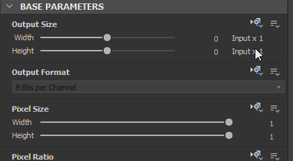

# 출력 크기

그래프의 <b>기본 매개 변수</b> 중 첫 번째이며 <b>출력 형식</b>(또는 비트 심도)과 함께 [게시된 Substance 3D 에셋(SBSAR)](../publishing-asset-files/publishing-substance-3d-asset-files-sbsar.md) 파일로서 Designer 및 다른 응용 프로그램 모두에서 그래프의 출력에 큰 영향을 미치므로 잘 이해하는 것이 중요합니다.

>[!TIP]
>
> [출력 크기] 속성을 효율적으로 사용하기 위한 기초로 [Substance 그래프의 상속](../../compositing-graphs/inheritance-compositing/inheritance-in-substance-compositing-graphs.md)을 숙지하는 것이 좋습니다.

>[!NOTE]
>
>  잠금 단추를 사용하여 Height 값이 너비 값과 *일치*&#x200B;하도록 합니다.

<table>
<tr style="border: 0;">
<td width="100.00%" style="border: 0;" valign="top">

## 2개 값의 거듭제곱

[출력 크기] 매개 변수는 그래프 또는 노드에서 *텍스처* 출력의 해상도를 결정합니다.

그래픽 처리 하드웨어가 계산을 수행하는 방식에 따라 일부 제한 사항이 적용되는 그래픽 컴퓨팅의 개체인 텍스처. 이러한 제한 중 하나는 텍스처가 X와 Y의 픽셀 수가 *2의 제곱*&#x200B;인 이미지를 나타내야 한다는 것입니다.

</td>
<td width="33.33%" style="border: 0;" valign="top">

| Power of 2 | 픽셀 |
| --- | --- |
| 7 | 128 |
| 8 | 256 |
| 9 | 512 |
| 10 | 1024 |
| 11 | 2048 |
| 12 | 4096 |
| 13 | 8192 |

</td>
</tr>
</table>

Output size 속성은 *로그 단계*&#x200B;를 사용하여 두 개의 거듭제곱의 증가를 쉽게 매핑합니다(예: 256, 512, 1024, ...) *선형 배율*(예: 8, 9, 10, ...)로. 즉, X 또는 Y의 [출력 크기] 값을 1씩 늘리거나 줄이는 것은 현재 해상도를 2로 곱하거나 나누는 것과 같습니다.

이는 출력 크기 값이 [함수](../../function-graphs/function-graphs.md)에 의해 제어되는 경우에도 적용되며, 함수에서는 대상 해상도 대신 대상 로그 값(상대 또는 절대)을 출력해야 합니다.

>[!IMPORTANT]
>
> X와 Y 모두에서 해상도를 늘리거나 줄이면 픽셀 수가 *4*&#x200B;씩 곱해지거나 나뉩니다. 이는 그래프의 *성능* 및 *메모리 풋프린트*&#x200B;에 상당한 영향을 미칩니다.\
> 따라서 원하는 결과를 얻는 데 실제로 필요한 *가장 낮은 해상도*&#x200B;를 사용하는 것이 좋습니다. 해상도를 제어하지 않는 것은 [성능 최적화 지침](../../best-practices/performance-optimization/performance-optimization-guidelines.md)의 많은 항목 중 하나입니다.

>[!NOTE]
>
> [함수 그래프](../../function-graphs/function-graphs.md)에서 `$size` 및 `$sizelog2` [시스템 변수](../../function-graphs/variables/system-variables/system-variables.md)는 노드 또는 그래프의 현재 해상도와 일치하는 Float2 값을 각각 원시 픽셀 수 또는 2의 거듭제곱으로 반환합니다.\
> 예를 들어 1024\*512 이미지의 경우 `$size`은(는) `(1024,512)`을(를) 반환하고 `$sizelog2`은(는) `(10,9)`을(를) 반환합니다.

## 상대 크기

Output Size 속성이 *Relative to...* [inheritance 메서드](../../compositing-graphs/inheritance-compositing/inheritance-in-substance-compositing-graphs.md)를 사용하는 경우 해당 값은 상속된 로그 값&#x200B;*에 상대적으로*&#x200B;한정자로 표시됩니다.

상속된 해상도 범위를 기준으로 하는 한정자는 로그 눈금 범위에서 -12에서 +12까지이며 기본값은 0입니다. 이는 해상도의 위쪽 또는 아래쪽의 각 단계가 두 배 또는 절반으로 줄어든다는 것을 의미합니다. 오른쪽 테이블은 상속된 값 9(예: 512 = 2^9) 및 11(예: 2048 = 2^11)에 대해 1차원에서 상대 해상도가 어떻게 변경되는지의 예를 제공합니다.

8196보다 크고 크기는 *대문자*&#x200B;입니다. 이 모양은 [환경 설정](../../interface/preferences-window/preferences-window.md)의 <b>일반</b> 섹션에 있는 <b>조리 크기 제한</b> 설정에 따라 제어됩니다. 매우 큰 해상도로 작업하면 비례 성능 비용과 기하급수적인 메모리 설치 공간이 제공됩니다. 또한 그래픽 처리의 한계는 텍스처의 최대 크기에 엄격한 제한을 둡니다.

| -5 | -4 | -3 | -2 | -1 | 0 | +1 | +2 | +3 | +4 | +5 |
| --- | --- | --- | --- | --- | --- | --- | --- | --- | --- | --- |
| 16 | 32 | 64 | 128 | 256 | <b>512</b> | 1024 | 2048 | 4096 | 8196 | 8196 |
| 64 | 128 | 256 | 512 | 1024 | <b>2048</b> | 4096 | 8196 | 8196 | 8196 | 8196 |

>[!NOTE]
>
> 16 미만의 해상도는 *제한*&#x200B;이지만 해당 임계값 미만의 성능 향상이 없으므로 더 낮게 설정하는 것은 권장되지 않습니다. 반대로 <b>Substance 엔진</b>의 특정 구현으로 인해 실제로 성능이 *저하*&#x200B;됩니다. 따라서 Substance 그래프에서 16x16을 일반적인 최소 해상도로 사용합니다.

## 상속 방법 변경

대부분의 경우 출력 크기 속성의 기본 [상속 메서드](../../compositing-graphs/inheritance-compositing/inheritance-in-substance-compositing-graphs.md)는 항목에 따라 다음과 같습니다.

* 그래프: *부모에 대한 상대*
* 노드: *입력 기준* - 이 경우 노드의 [기본 입력](../../compositing-graphs/inheritance-compositing/inheritance-in-substance-compositing-graphs.md)에서 상속된 값이 사용됩니다.
* [비트맵](../../compositing-graphs/nodes-reference-for-com/atomic-nodes/bitmap/bitmap.md) 노드: *절대* - 이유를 알려면 [비트맵 리소스](../../resources/bitmap-resource/bitmap-resource.md) 페이지와 [성능 최적화 지침](../../best-practices/performance-optimization/performance-optimization-guidelines.md)을 참조하세요

해당 항목을 클릭하여 노드 또는 그래프의 속성을 표시한 다음 [속성](../../interface/properties/properties.md) 패널에서 <b>기본 매개 변수</b> 섹션의 <b>출력 크기</b> 속성을 찾습니다. 상속 방법 드롭다운 메뉴를 클릭하고 원하는 상속 방법을 선택합니다.

{width="512px"}

## 예제 문제

새로운 [Adobe Substance 3D Designer](https://www.adobe.com/kr/products/substance3d-designer.html) 사용자인 경우 몇 가지 일반적인 문제가 발생할 수 있습니다. 다음은 해결 방법과 함께 몇 가지 예입니다.

+++문제 1
** 문제**

**부모 크기** 설정은 *회색으로 표시됨*&#x200B;이며, 그래프는 원치 않는 256\*256 해상도에서 사용됩니다.

그래프의 속성에서 Output Size 속성의 상속 메서드가 *Absolute*(으)로 설정되어 임의 값으로 상속을 중지합니다.

** 솔루션**

그래프의 출력 크기에 대한 상속 메서드를 *부모를 기준으로*(으)로 설정합니다.

+++

+++문제 2
** 문제**

위의 경우 그래프가 *부모를 기준으로*&#x200B;로 설정되었음에도 불구하고 그래프의 출력으로 부모(1024\*1024)에 설정된 해상도와 다른 해상도(512\*512)가 발생하는 경우가 표시됩니다.

[비트맵](../../compositing-graphs/nodes-reference-for-com/atomic-nodes/bitmap/bitmap.md) 노드에서 문제가 발생했습니다. 기본적으로 *Absolute* 상속 메서드가 사용되며 [비트맵 리소스](../../resources/bitmap-resource/bitmap-resource.md)을 기반으로 512\*512가 해상도로 선택되었습니다. 연결된 노드는 *입력 관련*(으)로 설정되어 있으므로 비트맵 노드에서 출력 크기를 상속합니다.

** 솔루션**

비트맵 노드의 출력 크기 상속 메서드를 *부모에 비례하여*(으)로 설정하여 문제를 체인 아래에서 해결합니다.

+++

+++문제 3
** 문제**

위에서 해상도가 체인의 중간에서 훨씬 더 높게 이동하여 마스터에 의해 정의된 것보다 훨씬 더 높은 출력 해상도를 얻는 문제가 표시됩니다.

이 문제는 [변환 2D](../../compositing-graphs/nodes-reference-for-com/atomic-nodes/transformation-2d/transformation-2d.md) 노드에서 상대 수정자 3으로 인해 발생하여 출력이 8배 큽니다.

** 솔루션**

[폭] 및 [Height]에 대한 상대 수정자를 0으로 설정하여 업스케일링을 수행하지 않도록 합니다.

+++
