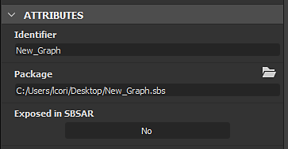

# Substance 3D 자산 파일(SBSAR) 게시

이 페이지에서는 Substance 3D Designer이 Substance 에코시스템 및 이를 지원하는 다른 응용 프로그램에서 사용되는 <b>SBSAR</b> 확장명을 가진 특수 파일 형식인 <b>Substance 3D asset</b> 파일로 패키지를 게시하는 방법에 대해 설명합니다.

일반적으로 비트맵 대신 Substance 3D 에셋을 사용하는 것이 좋습니다. 보다 유연하고 용량이 적기 때문입니다. Substance 3D [Painter](https://experienceleague.adobe.com/ko/docs/substance-3d-painter/using/home), [Sampler](https://helpx.adobe.com/kr/substance-3d-sampler.html) 또는 [플레이어](https://helpx.adobe.com/substance-3d-player/home.html)에서 사용하는 경우 [&#39;보내기...&#39; 기능](../../interface/the-explorer-window/send-to-interoperability/send-to-interoperability.md)을 사용하는 것이 더 빠릅니다.

## 개념 게시

Substance 그래프를 게시할 때는 다음 사항에 유의하는 것이 좋습니다.

* 개별 [Substance 그래프](../../compositing-graphs/substance-compositing-graphs.md)가 아닌 모든 콘텐츠가 포함된 <b> 패키지를 게시</b>합니다. 그런 다음 Substance 3D 에셋을 사용하면 이 패키지 내의 모든 Substance 그래프에서 콘텐츠를 생성할 수 있습니다.
* 게시된 패키지는 <b>완전히 독립 실행형</b>입니다. 필요한 모든 리소스가 파일에 포함됩니다. 즉, SBS 파일보다 공유하기가 훨씬 쉽습니다.
* Substance 3D 에셋의 출력은 <b>완전 동적</b>일 수 있습니다. [해상도가 설정되지 않았습니다. 노출된 매개 변수를 수정할 수 있습니다.](../../compositing-graphs/compositing-graph-key-con/substance-compositing-graph-key-concepts.md) 그러나 그래프 편집은 더 이상 불가능합니다.
* Substance 3D 에셋은 Designer 외부, 모든 Adobe Substance 3D 제품, Adobe Dimension 및 [Substance 통합](https://experienceleague.adobe.com/ko/docs/substance-3d/ecosystem/home)이 포함된 다른 모든 애플리케이션에서 사용할 수 있습니다.
* 게시가 [내보내기](../../compositing-graphs/exporting-bitmaps/exporting-bitmaps.md)와 다릅니다. 차이점을 잘 이해했는지 확인하세요.

## 게시 준비 중

게시하는 것은 비트맵 내보내는 것보다 더 많은 준비가 소요됩니다. 게시된 Substance 3D 에셋이 텍스처의 현재 상태에 대한 정적 스냅샷뿐만 아니라 동적 도구이기 때문입니다. 특히 다음 사항에 유의해야 합니다.

* 그래프 해상도([출력 크기](../../compositing-graphs/output-size/output-size.md))가 *부모에 대한 상대* [상속 메서드](../../compositing-graphs/inheritance-compositing/inheritance-in-substance-compositing-graphs.md)로 설정되어 있는지 확인하십시오. 즉, 이 메서드는 동적이며 즉시 변경할 수 있습니다.
* 이름, 레이블 및 사용 태그로 [그래프 출력](../../compositing-graphs/nodes-reference-for-com/atomic-nodes/output/output.md)이 올바르게 설정되었는지 확인하십시오.
* 필요한 경우 [매개 변수가 올바르게 구성되고 이름이 지정되었는지 확인하십시오](../../compositing-graphs/manage-parameters/exposing-a-parameter/exposing-a-parameter.md).
* 그래프에서 재질을 설명하는 경우 해당 [재질 모델](../graph-parameters/graph-parameters.md) 특성을 해당 재질의 모델로 설정합니다.
* 모든 [비트맵](../../compositing-graphs/nodes-reference-for-com/atomic-nodes/bitmap/bitmap.md) 노드의 [출력 크기](../../compositing-graphs/output-size/output-size.md) 속성이 *절대* [상속 메서드](../../compositing-graphs/inheritance-compositing/inheritance-in-substance-compositing-graphs.md)(으)로 설정되어 있는지 확인하십시오. 그렇지 않은 경우 참조된 [비트맵 리소스](../../resources/bitmap-resource/bitmap-resource.md)가 게시된 Substance 3D 에셋 파일에 기본 <b>256\*256</b> 해상도로 저장되며 이는 하나 이상의 출력의*&#x200B;품질에 영향을 줍니다*.
* Designer 외부에서 사용할 수 없는 그래프(예: 특정 컨텍스트에서만 작동하는 도우미 또는 &quot;도구&quot; 하위 그래프)가 패키지에 있는 경우 속성에서 숨기도록 설정합니다. 아래에서 자세히 알아보십시오.

## 게시 방법

게시할 준비가 되면 게시 대화 상자에 액세스하는 두 가지 방법이 있으며, 두 방법 모두 [탐색기](../../interface/the-explorer-window/the-explorer-window.md)를 통해 진행됩니다.

<table>
<tr style="border: 0;">
<td style="border: 0;" valign="top">

탐색기에서 패키지를 마우스 오른쪽 단추로 클릭하고  **Publish .sbsar 파일...**, 대체 핫키 Ctrl+P를 선택합니다.

대화 상자로 한 번 게시한 후  **Publish .sbsar 파일을 이전 버전으로**&#x200B;을 사용하여 대화 상자를 보지 않고 게시 프로세스를 반복하고 동일한 설정으로 즉시 게시할 수도 있습니다.

</td>
<td style="border: 0;" valign="top">

</td>
</tr>
</table>

<table>
<tr style="border: 0;">
<td style="border: 0;" valign="top">

탐색기의 상단 도구 모음에서 Publish 단추 을(를) 클릭합니다.

대화 상자를 사용하여 게시한 후 Publish을 이전 버튼으로 사용 하여 대화 상자를 보지 않고 게시 프로세스를 반복할 수 있으며, 동일한 설정으로 즉시 게시할 수 있습니다.

</td>
<td style="border: 0;" valign="top">

</td>
</tr>
</table>

<table>
<tr style="border: 0;">
<td style="border: 0;" valign="top">

## 에셋 게시 옵션

에셋 Publish 옵션이 나타나기 전에 Substance 3D 파일(SBS)을 저장하라는 메시지가 표시되고 Substance 3D 에셋을 저장할 위치를 묻는 메시지가 표시됩니다. 파일 프롬프트 및 대화 상자가 표시되지 않고 파일이 더 빨리 빠져나가지 않도록 하려면 위에 설명된 <b>이전</b> 방법으로 Publish을 사용하세요.

</td>
<td style="border: 0;" valign="top">

</td>
</tr>
</table>

다음과 같은 옵션을 사용할 수 있습니다.

<b>파일 경로</b>에서 Substance 3D 에셋 파일을 저장할 위치를 선택할 수 있는 파일 대화 상자가 열립니다. 기본 경로는 시스템의 사용자 문서입니다. 패키지가 저장된 경우 경로가 패키지 위치입니다. 패키지가 세션 중에 게시되었으면 경로가 마지막 게시 위치입니다.

<b>보관 압축</b>은 보관에 대한 압축 옵션을 설정하며 파일 크기에 영향을 줍니다.

<b>누락된 아이콘 생성</b>은 기본 제공[PBR 렌더링](../../compositing-graphs/nodes-reference-for-com/node-library/material-filters/pbr-utilities/pbr-render/pbr-render.md) 기술을 사용하여 각 그래프의 특성에 대한 축소판을 만듭니다.

<b>표시된 그래프 </b>은(는) 이 패키지에 표시될 모든 그래프를 나열합니다. 그래프 제외는 아래를 참조하십시오.

>[!NOTE]
>
> **임의화 노출**
> 
> [임의화] 노출 설정은 Publish 대화 상자에서 더 이상 사용할 수 없습니다. 대신 [그래프의 임의 시드 특성을 상대 대신 절대 특성으로 설정하여 사용할 수 없게 합니다.](../../compositing-graphs/graph-parameters/graph-parameters.md)

## 게시된 에셋에서 그래프 제외

패키지의 일부 그래프는 외부에서 사용하기 위한 것이 아닐 수 있습니다. 이러한 서브 그래프는 일반적으로 큰 전체의 부분으로서, 마스터 자료의 서브 루틴을 의미한다.

<table>
<tr style="border: 0;">
<td style="border: 0;" valign="top">

그래프가 Substance 3D 에셋 파일 내에서 표시되거나 사용할 수 없게 되는 것을 제외하려면 해당 그래프의 속성에 액세스한 다음([그래프 보기]에서 빈 영역을 두 번 클릭하거나 [탐색기]에서 그래프를 한 번 클릭) <b>특성</b> 롤아웃을 엽니다. 게시할 때 숨기려면 <b>SBSAR에서 노출됨</b>을 <b>아니요</b>(으)로 설정합니다.

</td>
<td style="border: 0;" valign="top">

</td>
</tr>
</table>

### Publish 대화 상자 경고

Publish 대화 상자에서 가끔씩 노란색으로 된 경고가 표시됩니다. 일반적인 사항은 설명 및 솔루션과 함께 아래에 나열되어 있습니다.

* 하나 이상의 그래프에 출력이 없습니다\
  이 경고는 출력 노드가 없는 하나 이상의 그래프가 있는 패키지를 게시하려고 함을 의미합니다. 해결 방법은 노란색 경고 삼각형이 있는 그래프에 [출력 노드](../../compositing-graphs/nodes-reference-for-com/atomic-nodes/output/output.md)를 추가하는 것입니다.
* 하나 이상의 그래프가 상위 출력 크기 파라미터와 관련이 없습니다\
  이 경고는 하나 이상의 그래프가 잘못된 출력 크기로 설정되었음을 의미합니다. 일반적으로 그래프 자체의 속성입니다. 이 경고는 게시 시 이 그래프에 대한 동적 해상도 제어 권한이 없음을 의미합니다. 해결책은 노란색 삼각형을 가진 사용자의 그래프 속성으로 이동하여 출력 크기의 [상속 메서드](../../compositing-graphs/inheritance-compositing/inheritance-in-substance-compositing-graphs.md)를 *부모 기준*&#x200B;으로 설정하는 것입니다.

## Substance 3D 에셋 제한 사항

Substance 3D 에셋이 Substance 에코시스템에서 가장 강력하고 역동적인 형식이지만 일부 기술적으로 고려해야 할 사항이 있습니다.

* 게시된 Substance 3D 에셋 패키지는 단방향 파일 포맷입니다. Substance 3D 에셋을 Substance 3D 파일(SBS)로 다시 &quot;디컴파일&quot;할 수 없습니다. Substance 3D 에셋을 &quot;편집&quot;하는 유일한 방법은 원본 Substance 3D 파일을 편집하는 것입니다. 새로운 Substance 그래프(열기 및 끌어서 놓기) 내에서 Substance 3D 에셋 패키지 콘텐츠를 노드로 계속 사용할 수 있으므로 그리 큰 제한은 없습니다.
* Substance 3D 에셋 파일의 호환성이 추론되는 버전이 있습니다. 핵심 Substance 엔진은 새로운 기능으로 수시로 업데이트됩니다. 이러한 기능을 사용하는 패키지는 새로운 기능을 지원하는 애플리케이션에서 읽어야 합니다. 동시에 모두 업데이트되므로 모든 Substance 응용 프로그램에 대해서는 문제가 되지 않지만 플러그인 및 통합의 호환성 지연이 더 길어질 수 있습니다.\
  [프로젝트 환경 설정](../../interface/preferences-window/project-settings/project-settings.md)에서 Substance 엔진 호환성 표시 옵션을 사용하여 잠재적인 문제를 추적하세요.
* 그래프가 Substance 3D 에셋의 일부로 게시되면 *정적* 매개 변수와 같은 일부 노출된 매개 변수는 *숨겨짐*&#x200B;입니다. 이러한 매개 변수 목록을 확인하고 일반적인 정적 매개 변수에 대해 자세히 알아보려면 [매개 변수 노출](../../compositing-graphs/manage-parameters/exposing-a-parameter/exposing-a-parameter.md) 페이지의 [제한](../../compositing-graphs/manage-parameters/exposing-a-parameter/exposing-a-parameter.md) 섹션을 참조하십시오.
