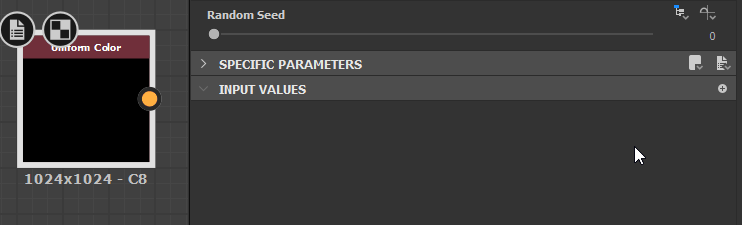

# Substance 그래프 값

버전 2019.1.0에서 [Substance 3D Designer](https://www.adobe.com/kr/products/substance3d-designer.html) 엔진 v7이 도입되었기 때문에 이제 함수에서만[&#128279;](../../function-graphs/function-graphs.md)이 아니라Substance 그래프에서 값을 처리할 수 있습니다. 값 데이터는 함수에 사용되는 동일한 데이터(정수, 부동, 부울어 등)이며 전체 이미지의 픽셀 값을 나타내는 색상 또는 회색 음영 이미지 데이터와 확연히 다릅니다. 특히 값 데이터를 언급할 때, 이것은 *정수 1, 정수 2, 정수 3과 정수 4, 부동 소수점 1, 부동 소수점 2, 부동 소수점 3과 부동 소수점 4 및 부울*&#x200B;을 의미합니다. 각각 고유한 색상 코딩이 있으며 대부분 서로 바뀌지 않습니다.

다음과 같은 몇 가지 사용 사례가 있습니다.

* 단일 값 재질 속성 또는 추가 메타데이터와 같이 이미지가 아닌 데이터를 반환하고 처리합니다. 예를 들어 재료의 IOR 값입니다.
* 픽셀당 계산할 필요가 없는 그래프 계산 최적화([픽셀 프로세서](../../compositing-graphs/nodes-reference-for-com/atomic-nodes/pixel-processor/pixel-processor.md)의 대체). 예를 들어, 임의의 단색입니다.
* 이미지 데이터를 값으로 처리하여 한 노드의 속성을 다른 노드에 연결합니다. 예를 들어, 레벨을 조정할 수 있는 이미지의 [최소값] 및 [최대값]을 입력합니다.

## 새 값 노드 및 입력

두 개의 새로운 Atomic Nodes가 Values와 함께 작동합니다.

|  |  |
| --- | --- |
| 

  <b>[값 프로세서](../../compositing-graphs/nodes-reference-for-com/atomic-nodes/value-processor/value-processor.md)</b> | [값 프로세서](../../compositing-graphs/nodes-reference-for-com/atomic-nodes/value-processor/value-processor.md)를 사용하면 원하는 수의 회색 음영 또는 색상 입력을 사용하고 이러한 입력을 기반으로 계산에서 단일 값을 반환할 수 있습니다. |
| 

  **[값 입력](../../compositing-graphs/nodes-reference-for-com/atomic-nodes/input/input.md)** | [값 입력](../../compositing-graphs/nodes-reference-for-com/atomic-nodes/input/input.md)을 사용하면 명시적으로 값으로 정의된 하위 그래프에 입력 슬롯을 만들 수 있습니다. |

또한 다른 노드에서는 특정 방식으로 이러한 문제를 처리합니다.

[회색 음영] 및 [색상]에서 수행했던 것처럼 [값] 연결을 연결하면 [출력 노드](../../compositing-graphs/nodes-reference-for-com/atomic-nodes/output/output.md)가 자동으로 [값] 출력이 되도록 조정됩니다.

{width="512px"}

모든 단일 노드([Atomic](../../compositing-graphs/nodes-reference-for-com/atomic-nodes/atomic-nodes.md) 및 [라이브러리](../../compositing-graphs/nodes-reference-for-com/node-library/node-library.md)/인스턴스)에 값 입력을 정의할 수 있는 새 탭이 있습니다.

## 값을 사용한 작업

[값]을 사용하는 것은 일반 Substance 그래프 작업과 약간 다릅니다.

값 연결은 [값 프로세서](../../compositing-graphs/nodes-reference-for-com/atomic-nodes/value-processor/value-processor.md), [값 입력](../../compositing-graphs/nodes-reference-for-com/atomic-nodes/input/input.md) 또는 [하위 그래프](../../compositing-graphs/creating-compositing-gra/graph-instances-sub-gra/graph-instances-sub-graphs.md)에서만 수행할 수 있습니다. 즉, Value Processor는 Value 연결을 처음부터 만들 수 있는 유일한 방법이며 &quot;Static Value&quot; 노드 또는 이와 유사한 노드가 없습니다. 대신 값 프로세서를 만들고 정적 값을 배치하고 동일한 결과를 얻도록 출력으로 설정합니다.

값 프로세서는 단일 값만 반환할 수 있습니다. 여러 값을 반환하거나 값 집합 또는 그룹을 반환하려면 [하위 그래프](../../compositing-graphs/creating-compositing-gra/graph-instances-sub-gra/graph-instances-sub-graphs.md)를 만들어야 합니다.

값이 표시되거나 사용 중인 위치를 강조 표시하려면 값 입력 또는 값 출력이 있는 노드를 굵은 노란색 테두리로 강조 표시합니다.

