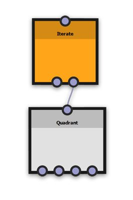

# 반복 노드

반복 노드를 사용하면 사분면 노드의 이미지를 곱할 수 있으며 기본적으로 &quot;반복&quot; 노드입니다. 깊이 1의 사분면 노드는 4개의 사분면을 출력할 것이다. 반복 노드를 사용하면 각 반복 세트를 개별적으로 처리하여 원하는 만큼 출력 이미지를 반복할 수 있습니다.

반복 노드에는 &quot;원하는 반복 방법&quot; 매개변수 외에는 다른 속성이 없습니다. 그 결과 새로운 이미지는 기본적으로 Quadrant 노드에서 생성한 이미지 위에 간단히 겹쳐서 혼합됩니다.

반복 노드는 수신된 입력 이미지를 반복한다. 반복 횟수는 해당 반복 등록 정보에 의해 정의됩니다.

반복 노드를 사용하기 위한 핵심은 각각의 반복되는 이미지에 첨부된 임의의 동적 함수가 또한 처리된다는 것이다. 즉, 각 반복에는 고유한 조정 세트가 있을 수 있습니다. 반복 노드의 [임의화] 속성을 사용하여 이 작동 방식을 수정할 수 있습니다. 동적 함수 내의 *$number* 시스템 변수에 액세스하여 현재 렌더링되고 있는 반복을 확인하고 그에 따라 함수의 결과를 수정할 수도 있습니다.

예를 들어, 사분면 노드의 각 이미지에 임의 회전을 적용한 다음 해당 사분면 노드의 출력을 반복 노드의 활성 입력에 공급하면 반복되는 각 이미지도 자체 임의 회전이 됩니다.

Quadrant 노드에서 사용할 수 있는 모든 동적 기능은 반복 노드에서 생성되는 반복 이미지에도 적용됩니다. 마치 노드가 다른 깊이 레벨을 추가하지 않고 동일한 레벨에서 Quadrant 노드를 복제하는 것과 같습니다.

## 통과 커넥터

각 반복 노드에는 베이스를 따라 두 개의 커넥터가 있습니다. 왼쪽 커넥터는 통과 커넥터입니다. 받은 이미지는 노드의 출력 커넥터로 전달되며, 여기서 반복되는 이미지와 혼합됩니다.

통과 이미지는 반복 매개 변수의 설정과 관계없이 항상 그대로 통과됩니다.

