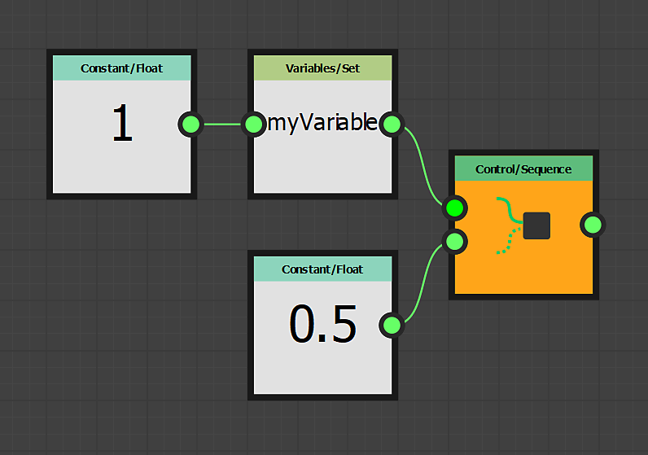

# 세트/시퀀스 노드 사용

이 페이지에서는 **Set** 및 **Sequence** 노드에 대해 설명하고 **FX-Maps**&#x200B;의 컨텍스트에서 사용 사례 예를 제공합니다.

<table>
<tr style="border: 0;">
<td style="border: 0;" valign="top">

## 개요

<b>FX-Maps</b>에서 함수를 사용하는 동안 매개 변수의 *[Substance 함수 그래프](../../../../function-graphs/the-function-graph/the-function-graph.md)*&#x200B;에서 값을 출력해야 하는 경우가 있으므로 *다른 함수에 사용할 수 있습니다.* 그러나 기본적으로 Substance 함수 그래프는 *one* 값만 출력합니다. one 값은 관련 매개 변수를 구동하는 값입니다.

</td>
<td style="border: 0;" valign="top">

</td>
</tr>
</table>

이 경우 <b>Set</b> 및 <b>Sequence</b> 노드의 조합을 사용할 수 있으므로 단일 또는 여러 함수에 걸쳐 변수를 제어할 수 있습니다.

이 프로세스에는 다음 두 단계가 포함됩니다.

1. <b>Set</b> 노드를 사용하면 새 변수를 만들 수 있으므로 다른 위치에서 호출하고 값을 할당할 수 있습니다.
1. <b>시퀀스</b> 노드는 그래프의 다른 분기&#x200B;*을(를) 실행하기 전에*&#x200B;단계 1의 논리를 실행하는 데 사용됩니다. 예를 들어 논리는 현재 그래프의 예상 값을 출력하는 데 실제로 사용됩니다

<table>
<tr style="border: 0;">
<td width="100.00%" style="border: 0;" valign="top">

## Set 노드

<b>Set</b> 노드를 사용하면 새 변수를 설정하고 이 변수에 노드의 *입력*&#x200B;에 연결된 유형과 값을 할당할 수 있습니다.

노드의 속성에서 사용자가 변수의 *이름*&#x200B;을(를) 입력합니다.

기본적으로 이 노드에 의해 설정된 변수는 이 Substance 함수 그래프의 *부모* 범위(예: 함수에 의해 정의된 매개 변수를 호스트하는 노드) 내에서 액세스할 수 있는 *전용*&#x200B;입니다.

</td>
<td width="25.00%" style="border: 0;" valign="top">

</td>
</tr>
</table>

<table>
<tr style="border: 0;">
<td style="border: 0;" valign="top">

이 예제에서 변수 이름은 **`myVariable`**(으)로 설정되었으며 값은 **1**&#x200B;입니다.

</td>
<td style="border: 0;" valign="top">

</td>
</tr>
</table>

<table>
<tr style="border: 0;">
<td width="100.00%" style="border: 0;" valign="top">

## 시퀀스 노드

<b>시퀀스</b> 노드를 사용하면 *첫 번째 분기가 두 번째 분기* 전에 완전히 실행되는지 확인하여 Substance 함수 그래프의 *실행 흐름*&#x200B;을 제어할 수 있습니다.

그런 다음 *두 번째 분기*&#x200B;의 출력이 노드의 출력으로 전달됩니다.

</td>
<td width="25.00%" style="border: 0;" valign="top">

</td>
</tr>
</table>

<table>
<tr style="border: 0;">
<td style="border: 0;" valign="top">

이 예제에서는 <b>시퀀스</b> 노드를 그래프의 출력으로 설정합니다. 따라서 함수의 출력은 <b>Float</b> 노드에서 출력하는 <b>0.5</b> 값입니다.

그러나 그 전에 `<b>myVariable</b>` 변수가 부동 소수점 값으로 <b>1.0</b>으로 설정됩니다. 그러면 이 변수는 노드의 컨텍스트에서 *다른 곳*&#x200B;에서 사용할 수 있습니다.

</td>
<td style="border: 0;" valign="top">

</td>
</tr>
</table>

그래프의 실행 흐름을 제어하기 위해 **시퀀스** 노드를 *연결*&#x200B;할 수 있습니다.

예를 들어, 먼저 변수를 *설정*&#x200B;하고, 나중에 값을 *업데이트*&#x200B;한 다음 최종 값을 *읽기*&#x200B;할 수 있으며, 이러한 동작이 *특정 순서로 발생하는지 확인합니다*.

## 가변 가시성

선언된 변수는 어디에서나 액세스할 수 *없습니다*.\
부모 수준에서 선언된 변수는 자식 수준에서 액세스할 수 있지만 *참*&#x200B;이 아닙니다.

따라서 노드에 설정된 변수는 그래프 수준에서 액세스할 수 *없는*&#x200B;인 반면, 그래프의 수준에 설정된 변수는 해당 노드의 매개 변수 함수에서 액세스할 수 *있는*&#x200B;입니다.

예를 들어, 이 규칙은 실제로 다음 단계를 포함하여 *매개 변수 노출*&#x200B;의 핵심에 있습니다.

1. 그래프 입력 매개 변수 만들기
1. 매개변수의 Substance 함수 그래프에서 액세스
1. 해당 값을 함수의 출력으로 설정

작은 예를 만들어 보겠습니다. <b>Quadrant</b> 노드의 <b>회전</b> 값이 <b>색상/광도</b> 값에 영향을 받기를 원한다고 가정해 봅시다. 광도가 밝을수록 회전량이 많아집니다.

<table>
<tr style="border: 0;">
<td style="border: 0;" valign="top">

<b>색상/광도</b> 매개 변수 함수에서 모든 계산을 수행할 수 있습니다. 이 매개 변수는 *first*&#x200B;로 계산되므로 이 매개 변수에 설정된 모든 변수를 다른 노드 매개 변수에서 사용할 수 있습니다.

</td>
<td style="border: 0;" valign="top">

</td>
</tr>
</table>

<table>
<tr style="border: 0;">
<td style="border: 0;" valign="top">

이 함수는 간단합니다. 광도는 **0**&#x200B;에서 **1** 사이의 임의의 값이 되며, 이 값은 `myRotation` 변수에 저장되며, 이 값을 함수의 출력으로 설정합니다.

즉, **색상/광도** 매개 변수의 값이 무작위로 *되며*&#x200B;이(가) `myRotation` 변수에 저장됩니다.

**Position** 속성은 이미 임의 값으로 정의되었으며, **Iterate** 노드는 임의로 배치된 여러 패턴을 가져오는 데 사용됩니다.

</td>
<td style="border: 0;" valign="top">

</td>
</tr>
</table>

<table>
<tr style="border: 0;">
<td style="border: 0;" valign="top">

이제 `myRotation` 변수가 있고 값이 있으므로 <b>패턴 회전</b> 속성의 Substance 함수 그래프에 액세스해 보겠습니다.

</td>
<td style="border: 0;" valign="top">

</td>
</tr>
</table>

<table>
<tr style="border: 0;">
<td width="100.00%" style="border: 0;" valign="top">

함수에서 **Get Float** 노드를 사용하여 `myRotation` 매개 변수의 값을 읽습니다. 변수에 float 값이 포함되어 있다는 것을 알고 있으며 이를 함수의 출력으로 설정합니다.

</td>
<td width="25.00%" style="border: 0;" valign="top">

</td>
</tr>
</table>

이제 광도도 회전을 제어합니다.

