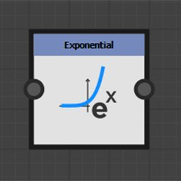
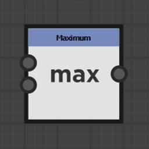

# 함수 노드

함수 노드는 입력 값을 자신이 나타내는 수학적 함수에 따라 변형한다.

입력 커넥터는 일반적으로 유형이 지정되지 않았지만 모든 값 유형을 지원하지는 않습니다.

## 노드 목록

+++Pow

첫 번째 입력 값을 두 번째 입력 값 <b>X^Y</b>의 값으로 반환합니다.

+++

+++2Pow

입력 값의 제곱으로 2를 반환합니다. <b>2^X</b>.

+++

+++제곱근

입력 값의 제곱근을 반환합니다. <b>√X</b>.

+++

+++지수

해당 입력 값의 지수 값을 반환합니다. <b>e^X</b>

<b>e</b>은(는) 대략 2.7182818과 같습니다.

+++

+++대수

해당 입력 값의 자연 로그를 반환합니다. <b>ln(X)</b>.

+++

+++밑이 2인 로그

해당 입력 값의 밑이 2인 로그를 반환합니다. <b>log2(X)</b>.

+++

+++절대치

해당 입력의 절대값을 반환합니다. <b>abs(X)</b>.

+++

+++상한

입력 값을 올림합니다. X보다 작지 않은 가장 작은 정수 값을 반환합니다. <b>ceil(X)</b>.

+++

+++내림

입력 값을 내림합니다. X보다 크지 않은 가장 큰 정수 값을 반환합니다. <b>floor(X)</b>.

+++

+++선형 보간

부동 값의 함수인 <b>(1 - X)\*A + X\*B</b> 값 사이의 선형 보간을 반환합니다.

+++

+++최소

두 입력 값 중 가장 낮은 값을 반환합니다. <b>min(A, B)</b>.

+++

+++최대

두 입력 값 중 가장 높은 값 <b>max(A, B)</b>을(를) 반환합니다.

+++

+++코사인

입력 값의 코사인을 라디안 단위로 반환합니다. <b>cos(X)</b>.

+++

+++사인

입력 값의 사인을 라디안 단위로 반환합니다. <b>sin(X)</b>.

+++

+++탄젠트

입력 값의 접선을 라디안 단위로 반환합니다. <b>tan(X)</b>.

+++

+++아크탄젠트 2

입력 2D 벡터와 가로 사이의 각도를 반환합니다.

<b>카티시안</b> 함수의 역수입니다.

일반적인 <b>atan2</b> 함수와 같이 입력 벡터의 X 및 Y 구성 요소를 전환할 필요는 없습니다.

+++

+++데카르트식

극좌표를 직교좌표로 변환합니다.

<b>Arc tangent 2 </b>함수의 역수입니다. <b>Length \* Float2(cos(Angle), sin(Angle).</b>

극좌표는 원점으로부터의 거리와 수평으로부터의 라디안 각도입니다.

+++

+++임의

0에서 입력 값 <b>X</b> 사이의 임의의 값을 반환합니다.

+++
