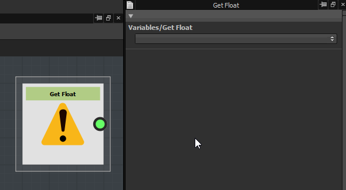
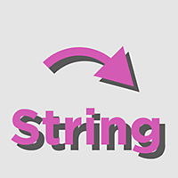

# 변수

변수는 <b>값을 저장</b>하여 나중에 가져오기(<b>가져오기</b>) 및/또는 수정(<b>설정</b>)하는 방법입니다.

{zoomable="yes"}

Get 노드가 기본적으로 수행하는 작업은 동적 변수를 가져와 함수에 사용하기 위해 Get Nodes의 출력에서 반환하는 것입니다. 이러한 Get 노드는 [그래프 속성](https://helpx.adobe.com/substance-3d/unlisted/documentation/sddoc/parameters-ui-129368153.html)에 정의된 입력 매개 변수와 [매개 변수 함수](../../../../compositing-graphs/manage-parameters/exposing-a-parameter/exposing-a-parameter.md) 사이의 링크를 형성합니다.

Get 노드를 사용할 때마다 드롭다운 메뉴에서 사용 가능한 값을 선택해야 합니다. Get 노드는 <b>해당 형식의 값을 가져옵니다</b>. 즉, Get 노드의 메뉴에만 유효한 옵션이 표시되며 유효하지 않은 옵션은 선택할 수 없습니다. 변수를 사용할 수 없는 경우 유형 불일치가 있음을 의미합니다

많은 <b>&quot;System&quot; 변수</b>이(가) 있습니다. 사전 정의된 특수 변수로서 자신을 선언할 수 없습니다. 이는 매우 중요하며, 아래에 있는 노드에 대해서는 사용할 수 있는 시스템 변수가 나열되어 있습니다.

매개 변수가 [노출](../../../../compositing-graphs/manage-parameters/exposing-a-parameter/exposing-a-parameter.md)인 경우 올바른 형식의 Get 노드만 포함하는 매개 변수 함수를 적용하는 것으로 구성됩니다.

<table>
<tr style="border: 0;">
<td style="border: 0;" valign="top">

## 가져오기

</td>
<td style="border: 0;" valign="top">

### 설정

</td>
<td style="border: 0;" valign="top">

### Is defined

</td>
</tr>
</table>

## 가져오기

<table>
<tr style="border: 0;">
<td width="25.00%" style="border: 0;" valign="top">

{width="200px"}

</td>
<td width="100.00%" style="border: 0;" valign="top">

이러한 노드를 사용하면 *현재 범위*&#x200B;에 있는 변수 값을 가져올 수 있습니다.

가져올 변수의 이름은 속성 도크에서 설정됩니다.

</td>
</tr>
</table>

&#39;Get&#39; 노드에는 유의해야 하는 몇 가지 제한 사항이 있습니다.

* <b>형식이 지정되었습니다</b>. 따라서 변수가 노드와 동일한 형식의 값을 보유하는지 확인해야 합니다. 유형 불일치가 콘솔에 보고됩니다.
* <b>현재 범위에 변수</b>이(가) 있는지 확인하지 않습니다. Console에 찾을 수 없는 변수가 보고됩니다.
* Sequence와 같은 컨트롤 흐름 노드를 사용하는 복잡한 함수에서는 변수를 설정하고 가져오는 <b>순서</b>에 주의해야 합니다. Designer에서 &#39;설정하기 전에 받기&#39;의 사례를 감지하면 Console에 보고됩니다.

>[!NOTE]
>
> 기본 제공 변수
> 
> 여러 &#39;Get&#39; 노드는 현재 컨텍스트에 따라 기존 값에 액세스할 수 있는 내장 변수를 제공합니다(예: 픽셀 프로세서의 현재 픽셀 위치, 노드의 현재 타일링 모드 등).
> 
> 모든 기본 제공 변수는 [이 전용 페이지](../../../../function-graphs/variables/system-variables/system-variables.md)에 나열됩니다.

### 노드 가져오기

+++부동
{width="200px"}

부동 소수점 얻기

{width="200px"}

부동 소수점2 얻기

{width="200px"}

부동 소수점3 얻기

{width="200px"}

부동 소수점4 얻기

+++

+++정수
{width="200px"}

정수 얻기

{width="200px"}

정수2 얻기

{width="200px"}

정수3 얻기

{width="200px"}

정수4 얻기

+++

+++기타
{width="200px"}

부울 얻기

{width="200px"}

Get String

+++

## 설정

<table>
<tr style="border: 0;">
<td width="25.00%" style="border: 0;" valign="top">

{width="200px"}

</td>
<td width="100.00%" style="border: 0;" valign="top">

텍스트

</td>
</tr>
</table>

## Is defined

<table>
<tr style="border: 0;">
<td width="25.00%" style="border: 0;" valign="top">

{width="200px"}

</td>
<td width="100.00%" style="border: 0;" valign="top">

텍스트

</td>
</tr>
</table>
