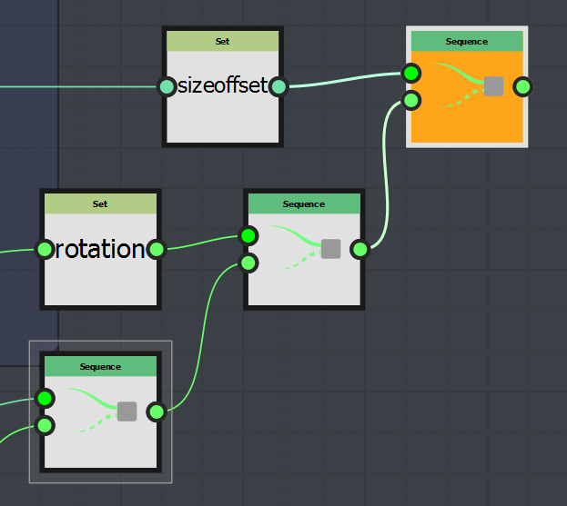

# 변수 만들기

Substance 3D Designer에서 변수를 만드는 다양한 방법이 있습니다.

* 입력 매개 변수 사용
* Set 노드를 사용합니다.

## 입력 매개 변수 사용

입력 매개변수를 생성하면 변수가 생성되고 이 변수와 연관됩니다. 그런 다음 그래프의 모든 함수에서 이 변수를 다시 사용할 수 있습니다.

따라서 하나의 노출 매개 변수가 그래프의 여러 부분에 영향을 줄 수 있습니다.

## 세트 노드 사용

세트 노드는 함수 그래프에서만 사용할 수 있는 노드입니다.

이렇게 하면 사용자가 다음과 같이 사용자 정의 변수를 만들 수 있습니다.

* 매개 변수에 이름이 선언됩니다.
* 값은 입력에 의해 정의됩니다.

### *Set* 노드를 사용하는 방법

Set 노드 사용은 다음과 같습니다.

선언할 때는 그래프 내에서만 사용할 수 있으며, 이 경우 기본적으로 해당 값을 링크와 함께 출력할 수 있으므로 유용하지는 않습니다.

따라서 이 그래프 외부에서 이 새 변수를 선언해야 합니다.

이렇게 하려면 시퀀스 노드를 사용하여 다음 단계를 수행해야 합니다.

* 실제 출력 노드를 시퀀스 노드의 &quot;마지막&quot; 입력에 연결합니다.
* Set 노드를 시퀀스 노드의 &quot;In&quot; 입력에 연결합니다.
* 시퀀스를 출력 노드로 설정합니다

이 작업을 수행하면 동일한 노드의 다른 함수 그래프에서 변수를 사용할 수 있습니다.

>[!WARNING]
>
> 노드가 Substance Engine에서 처리되면 해당 매개 변수(및 해당 매개 변수를 제어할 수 있는 함수)가 위에서 아래로 읽힙니다. 따라서 Set 노드는 노드 매개 변수 스택에서 그 아래에 있는 매개 변수로만 액세스할 수 있습니다.

>[!NOTE]
>
> 만들 변수가 여러 개인 경우 *Set* 및 *Sequence* 노드 만들기 작업을 반복하고 마지막 시퀀스 노드를 출력 노드로 설정하십시오.
> 
> 
