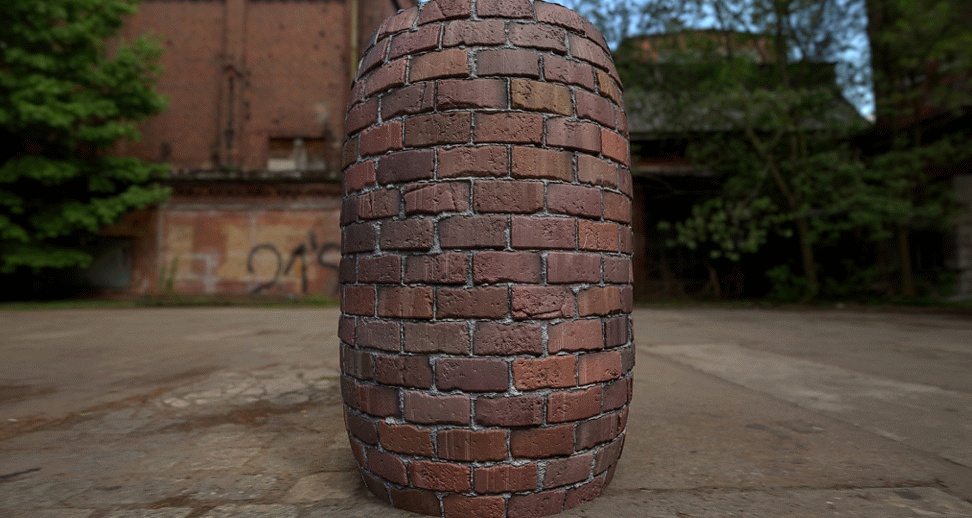

# Substance 3D 파일이란?

**패키지**&#x200B;라고도 하는 Substance 3D 파일(`*.sbs`)은 여러 응용 프로그램에서 사용하도록 내보낼 수 있는 텍스처의 동적 생성기인 Substance 그래프와 같은 리소스의 컨테이너입니다.

Substance 그래프는 클래식 비트맵 파일과 달리 그래프에서 생성된 결과를 제어하기 위해 Substance 그래프를 만드는 사람이 **매개 변수를 노출**&#x200B;하도록 선택할 수 있으므로 동적입니다.

예를 들어, 물체에 Dust이 얼마나 있는지, 축구팀 져지의 색깔이나 잘린 돌바닥 패턴 등을 즉석에서 바꿀 수 있다. 당신의 상상력은 사실상 유일한 한계입니다.

패키지는 컴파일되고 자체 포함된 **Substance 3D 보관 파일**(`*.sbsar`)에 *게시*&#x200B;될 수 있으므로 여기에 포함된 그래프를 [Substance 통합](https://www.adobe.com/products/substance3d/plugins.html)이 있는 외부 응용 프로그램에서 사용할 수 있습니다.

Substance 그래프는 **100% 프로시저**&#x200B;의 텍스처를 만들어 매우 가벼운 패키지 파일 크기를 만들 수 있습니다.

*Käy Vriend가 만든 벽돌 벽 재질의 예시.\
매개 변수를 변경하여 재료의 모양을 동적으로 제어할 수 있습니다.*
