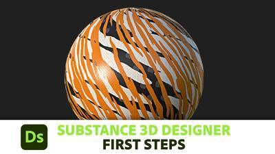

# Tutorials 및 학습

그 서류는 주로 철저하고 기술적인 참조에 쓰인다. 비디오 및 기타 더 집중적인 학습 자료를 사용하여 연습하는 것을 선호한다면 이 튜토리얼은 시작하는 데 유용합니다.

## 튜토리얼

|                                                                                                                                                                                                                                      |                                  |                                                                                                                                                                                                                                                                                                                                |
|:-------------------------------------------------------------------------------------------------------------------------------------------------------------------------------------------------------------------------------------|:---------------------------------|:-------------------------------------------------------------------------------------------------------------------------------------------------------------------------------------------------------------------------------------------------------------------------------------------------------------------------------|
| {width="200px"} | **첫 단계** | 초급 수준의 시리즈는 Designer으로 바로 시작하는 데 중점을 두었습니다. UI와 기본 개념을 도입한 다음 핵심 기술로 이동하고 마지막으로 매개변수를 표시하고 전체 재질을 만드는 방법을 설명합니다.  짧고 집중적이지만 가벼운 상태로 유지하여 절대 초보자에게 가장 적합한 시작입니다. |
| {width="200px"} | **첫 번째 재질 만들기** | 광범위한 프로시저 자료를 만드는 전체 과정을 안내하는 대형 스타터 비디오 시리즈입니다.  프로세스의 모든 단계가 다루어지고 설명되므로 완료 시 많은 내용을 배울 수 있지만, 절대 초보자에게는 집중력이 높을 수 있습니다. |
| {width="200px"} | **빠른 팁** | 각각의 퀵팁 비디오는 바이트 크기의 노드 및 기법 세트에 초점을 맞춥니다.  결과, 노드 및 가장 중요한 매개 변수에 대해 설명한 다음 아이디어를 확장하는 몇 가지 방법을 보여 줍니다. |

## 문서

|                                                                                                                                                                                                                                                                             |                                           |                                                                                                                                                                                                                   |
|:----------------------------------------------------------------------------------------------------------------------------------------------------------------------------------------------------------------------------------------------------------------------------|:------------------------------------------|:------------------------------------------------------------------------------------------------------------------------------------------------------------------------------------------------------------------|
| {width="200px"} | **스마트폰이 재질 스캐너**&#x200B;입니다. | Designer을 사용하여 사진을 찍고 처리하는 전체 프로세스를 보여 주는 깊이 내 문서입니다.  Substance 3D Designer을 사용하여 특정 작업을 자동화하는 방법의 사용 사례로 사용됩니다. |
