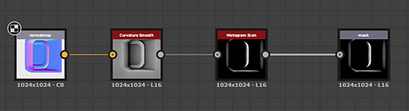

# 워크플로우 개요

Substance 3D Designer은 노드 기반의 편집기입니다. 즉, 거의 모든 유형의 프로젝트 또는 자원에는 노드(빌딩 블록)를 배치하고 연결하여 작업 체인(그래프)을 생성하는 작업이 포함됩니다. 이 페이지에서는 노드 기반 워크플로우의 개념을 설명하고 Designer에서 작성할 수 있는 3가지 주요 그래프 유형에 대한 요약을 제공합니다.

## 목차

[노드 기반 워크플로우](#node-workflow)

[그래프 인스턴스 작업 과정](#instance-workflow)

[사용자 정의 매개 변수](#custom-parameters)

[그래프 유형](#graph-types)

## 노드 기반 워크플로우

Designer에서 작업하는 것은 Photoshop과 같은 다른 2D 이미지 편집 소프트웨어와 다릅니다. 메뉴 옵션으로 이동하고 슬라이더를 변경하여 채도를 조정하는 등의 작업을 수동으로 수행하는 대신 <b>이미지를 편집하거나 만드는 논리적 단계를 구성</b>합니다. 이것은 &#39;노드&#39;라고 불리는 작은 빌딩 블록의 네트워크를 구축하는 것에 의해 발생한다. 이미지 데이터는 정보의 경로를 결정하는 링크로 연결된 빌딩 블록을 통해 <b>에서 왼쪽</b>으로 이동합니다. 모든 노드가 연결된 경우 최종 결과에 기여합니다.

주요 이점은 작업 과정이 <b>비선형</b>이 된다는 것입니다. 기록 스택으로 이동하는 수동으로 수행되는 작업과 달리, 언제든지 노드를 교체하거나 수정할 수 있습니다. 이미지의 결과에 영향을 주는 첫 번째 [대비] 조정이 끝까지 너무 많았다고 판단되면 나중에 수행한 모든 작업을 잃지 않고 뒤로 돌아가 조정하거나 완전히 잘라낼 수 있습니다.

## 그래프 인스턴스 작업 과정

그래프 인스턴스 지정은 Designer의 주요 프로세스입니다. Graph의 크기나 유형을 취하여 새로운 노드 구성 블록으로 패키징함으로써 나만의 노드를 구축할 수 있습니다. 이러한 유형의 노드를 &quot;그래프 인스턴스&quot;라고 합니다. 이렇게 하면 훨씬 효율적이고 시간을 절약하며 다른 사용자와 작업을 공유할 수 있습니다. 예를 들어, 가장자리 마모를 위한 훌륭한 기술을 개발했습니까? 이 Graph 인스턴스를 만들어 직접 다시 사용하고 커뮤니티 또는 팀과 공유하세요!

[Substance 그래프](../../compositing-graphs/substance-compositing-graphs.md)의 그래프 인스턴스에 대한 자세한 내용은 설명서에 [전용 섹션](../../compositing-graphs/creating-compositing-gra/graph-instances-sub-gra/graph-instances-sub-graphs.md)이 있습니다.

## 사용자 정의 매개 변수

작업 체인의 모든 노드에는 최종 결과에 영향을 미치면서 조정할 수 있는 버튼, 슬라이더, 설정 등의 제어 형태가 있습니다. 하위 그래프를 만들거나 Substance 파일을 다른 애플리케이션으로 내보내려는 경우, 파일을 위한 자신만의 &quot;제어판&quot;을 빌드할 수 있으므로, 그래프를 사용하는 모든 사용자가 완전히 고유한 제어판으로 그래프를 조정하고 수정할 수 있으므로 무한한 가능성이 표시됩니다. [여기서 사용자 지정 매개 변수의 일반적인 개념에 대해 알아보거나](../../compositing-graphs/compositing-graph-key-con/substance-compositing-graph-key-concepts.md) 깊이에서 자세히 알아보고 [매개 변수 노출을 시작하십시오](../../compositing-graphs/manage-parameters/exposing-a-parameter/exposing-a-parameter.md).

## 그래프 유형

아래에는 Substance 3D Designer에서 편집할 수 있는 세 가지 유형의 그래프에 대한 요약과 함께 설명서의 관련 섹션에 대한 링크가 있습니다.

<table>
<tr style="border: 0;">
<td width="16.67%" style="border: 0;" valign="top">

[{width="120px"}](https://substance3d.adobe.com/)

</td>
<td width="100.00%" style="border: 0;" valign="top">

### Substance 그래프

[Substance 그래프](https://substance3d.adobe.com/)는 Substance 3D Designer에서 만든 주요 그래프 유형입니다. 그 목적은 설정된 해상도, 색상 또는 모양에 제한되지 않는 <b>2D 이미지 데이터를 생성하고 처리하는 것</b>입니다. 이 제품은 정적인 사전 설정 결과뿐만 아니라 매우 다양한 이미지 처리 및 생성 도구입니다.

단순한 흑백 패턴, 다른 이미지에서만 실행되며 콘텐츠를 자체 생성하지 않는 필터 또는 여러 채널이 있는 완전한 절차 자료 형태로 결과를 얻을 수 있습니다.

Substance 그래프는 [가장 널리 지원되는 그래프 유형](../../getting-started/overview/overview.md)이며 다양한 작업 과정에서 내보내고 사용할 수 있습니다.

</td>
</tr>
</table>

#### 예

아래에서 일반적인 사용 사례의 몇 가지 예를 확인할 수 있습니다.

+++단순 도형
{width="512px"}

데칼에 대한 간단한 마스크 모양은 [텍스트 조각](../../compositing-graphs/nodes-reference-for-com/atomic-nodes/text/text.md)과 [디스크 모양](../../compositing-graphs/nodes-reference-for-com/node-library/texture-generators/patterns/shape/shape.md)을 생성하고, 디스크에서 [가장자리를 추출](../../compositing-graphs/nodes-reference-for-com/node-library/filters/effects/edge-detect/edge-detect.md)한 다음 최종적으로 [함께 혼합](../../compositing-graphs/nodes-reference-for-com/atomic-nodes/blend/blend.md)한 다음 최종 [출력](../../compositing-graphs/nodes-reference-for-com/atomic-nodes/output/output.md)으로 설정하여 만듭니다.

숫자가 있는 텍스트 또는 가장자리의 Thickness을 외부로 노출하여 보다 역동적인 그래프를 만들 수 있습니다.

+++

+++조정 필터
{width="512px"}

필터 그래프는 일반 맵을 [입력](../../compositing-graphs/nodes-reference-for-com/atomic-nodes/input/input.md)(사용자 지정 미리 보기 포함)으로 가져와서 [곡률을 변환](../../compositing-graphs/nodes-reference-for-com/node-library/filters/effects/curvature-smooth/curvature-smooth.md)한 다음 [대비를 조정](../../compositing-graphs/nodes-reference-for-com/node-library/filters/adjustments/histogram-scan/histogram-scan.md)하여 최종 [출력](../../compositing-graphs/nodes-reference-for-com/atomic-nodes/output/output.md)으로 볼록 가장자리 마스크를 만듭니다.

[막대 그래프]에 설정된 대비 값을 표시할 수 있으므로 동적 입력 슬롯과 결합하여 간단하지만 유용한 필터가 됩니다.

+++

+++완전 재질
{width="512px"}

더 복잡한 그래프[두 기본 재질을 혼합](../../compositing-graphs/nodes-reference-for-com/node-library/material-filters/blending-material/material-blend/material-blend.md)합니다. 하나[기본 재질](../../compositing-graphs/nodes-reference-for-com/node-library/material-filters/pbr-utilities/base-material/base-material.md)은(는) 간단하게 유지되며 다른 하나는 일부 사용자 지정 입력을 사용하여 관심을 추가합니다. 마스크는 최종 [출력](../../compositing-graphs/nodes-reference-for-com/atomic-nodes/output/output.md)(으)로 설정되기 전에 두 재질 중 표시할 재질을 결정하는 데 사용됩니다.

이 예제에서는 [링크 만들기 모드](../../interface/the-graph-view/link-creation-modes/link-creation-modes.md)를 사용하여 여러 링크 사용을 단순화합니다.

+++

<table>
<tr style="border: 0;">
<td width="16.67%" style="border: 0;" valign="top">

[{width="120px"}](https://substance3d.adobe.com/)

</td>
<td width="100.00%" style="border: 0;" valign="top">

### Substance 함수 그래프

함수 <b>이미지 데이터(전체 픽셀 집합) 대신 단일 값 </b>(정수, 부동 소수점, 벡터)을 처리합니다. 함수도 노드 네트워크가 있는 그래프이지만 [사용된 노드](../../function-graphs/nodes-reference-for-fun/function-nodes-overview/function-nodes-overview.md)와 인터페이스는 [일반 Substance 그래프](../../compositing-graphs/substance-compositing-graphs.md)와 다릅니다. 작업 과정은 완전히 <b>수학적 작업</b>을 기반으로 하며 이미지 미리 보기 축소판을 표시하지 않으므로 Substance 3D Designer에서 <b>훨씬 더 고급 작업 방법</b>이 됩니다.

함수는 다양한 컨텍스트에서 사용할 수 있으며, 주로 [노출된 매개 변수](../../compositing-graphs/manage-parameters/exposing-a-parameter/exposing-a-parameter.md)의 동작을 수정하고, [픽셀 프로세서](../../compositing-graphs/nodes-reference-for-com/atomic-nodes/pixel-processor/pixel-processor.md) 또는 [FX-맵](../../compositing-graphs/nodes-reference-for-com/atomic-nodes/fx-map/fx-map.md)의 동작을 작성하고, Substance 그래프에서 [값](../../compositing-graphs/values-compositing-graphs/values-in-substance-compositing-graphs.md)을 사용하는 것입니다.

</td>
</tr>
</table>

#### 예

다음은 Substance 함수 그래프에 대한 일반적인 사용 사례의 몇 가지 예입니다.

+++단순 함수
{width="256px"}

노출된 매개 변수 컨텍스트의 단순 함수입니다. 0에서 1(이해하기 쉬운 범위)까지 지정되는 &quot;강도&quot;라는 입력 부동 소수점 값을 가져와서 0.1 - 0.8의 설정된 범위로 다시 매핑합니다. 즉, 사용자가 [강도]를 0으로 설정하면 내부 0.1이 사용되고, Ui를 1로 설정하면 0.8이 사용되며, 그 사이의 값은 선형적으로 보간됩니다. 이 유형의 함수는 [매개 변수를 노출](../../compositing-graphs/manage-parameters/exposing-a-parameter/exposing-a-parameter.md)할 때 일반적으로 사용되지만 사용자 지정 함수를 사용할 때 사용됩니다.

이 함수는 HLSL 또는 GLSL과 유사한 의사 코드로 *lerp(0.1, 0.8, Intensity)*&#x200B;로 기록될 수도 있습니다.

+++

+++고급 기능
{width="512px"}

이 고급 기능은 두 번째 회색 음영 마스크 입력의 강도를 기반으로 색상 맵 입력의 색조를 조정하는 [픽셀 프로세서](../../compositing-graphs/nodes-reference-for-com/atomic-nodes/pixel-processor/pixel-processor.md)의 내부 작업을 보여 줍니다.

시스템 &quot;$pos&quot; 변수로 두 입력을 모두 샘플링한 다음 Alpha을 제거하고, 색상 값을 HSL로 변환하고, 샘플링된 회색 음영 값과 곱하여 색조 구성 요소를 수정합니다. 그런 다음 벡터를 다시 어셈블하고 HSL을 다시 RGB으로 변환한 다음 최종 출력을 위해 Alpha을 다시 추가합니다.

의사 코드에서는 이 함수가 한 줄에 맞지 않는 훨씬 더 복잡한 함수일 것이다.

+++

### MDL 그래프

이 페이지에는 Substance 3D Designer에 MDL 그래프가 표시되므로 MDL 재질을 작성하고 실시간으로 비헤이비어를 미리 볼 수 있습니다.
