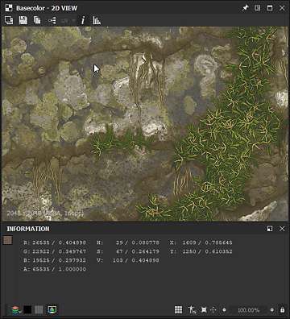
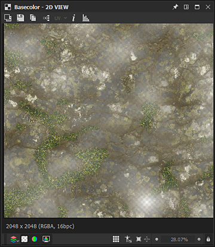

# 2D 보기

이 페이지에서는 Substance 3D Designer **2D 보기** 패널의 사용자 인터페이스 및 기능에 대해 설명합니다.

## 개요

[2D 보기](https://substance3d.adobe.com/)은(는) Designer 사용자 인터페이스의 기본 패널 중 하나입니다. 그 주요 목적은 다음과 같습니다.

* 지정된 *노드*&#x200B;에서 *값* 또는 *이미지* 출력을 표시하거나 지정된 *노드 커넥터*&#x200B;를 거칩니다.
* [비트맵](../../resources/bitmap-resource/bitmap-resource.md) 및 [벡터 그래픽](../../resources/vector-graphics-svg-res/vector-graphics-svg-resource.md) [리소스](../../resources/resources.md) 표시
* 색상 채널 또는 정확한 색상 값 등 현재 보유 중인 콘텐츠에 대한 *추가 정보*&#x200B;를 표시하는 중
* 매개 변수 *gizmos* 제어

표시된 이미지 또는 값이 수정되면 2D 보기 *이(가) 자동으로 업데이트*&#x200B;되어 데이터의 현재 상태와 동기화됩니다.\
*여러* 2D 보기 패널은 언제든지 활성화할 수 있으며 각각 다른 이미지나 값을 표시할 수 있습니다. 사용자 인터페이스 패널의  <b>핀</b> 기능을 사용하여 새 패널을 사용해야 하는 시기를 제어할 수 있습니다.

### 2D 보기에 컨텐츠 표시

>[!WARNING]
>
> 이 섹션의 *노드*&#x200B;에 대한 모든 언급은 [Substance 그래프](../../compositing-graphs/substance-compositing-graphs.md)에만 적용됩니다.

2D 보기에서 이미지를 표시하는 가장 간단한 방법은 *LMB*&#x200B;을 두 번 클릭하는 것입니다.

* [탐색기](../../interface/the-explorer-window/the-explorer-window.md)의 [비트맵](../../resources/bitmap-resource/bitmap-resource.md) 또는 [벡터 그래픽](../../resources/vector-graphics-svg-res/vector-graphics-svg-resource.md) 리소스에서
* [그래프 보기](../../interface/the-graph-view/the-graph-view.md)의 노드 또는 노드 커넥터에서

[탐색기](../../interface/the-explorer-window/the-explorer-window.md) 패널의 [리소스](../../resources/resources.md)에서 *LMB*&#x200B;를, 그래프 보기의 노드에서 *RMB*&#x200B;를 눌러 이미지를 뷰포트로 직접 *끌어다 놓을*&#x200B;수도 있습니다.

그래프 보기에서 *RMB*&#x200B;을 클릭하여 액세스하는 <b>2D 보기에서 출력 보기</b> 컨텍스트 메뉴 옵션을 사용하여 2D 보기에 이미지를 보낼 수 있습니다.

* *노드*&#x200B;에서 *해당 노드의 출력*&#x200B;을 표시합니다. 노드에 둘 이상의 출력이 있는 경우 하위 메뉴에서 원하는 출력을 선택합니다
* 그래프 보기의 *빈 공간*&#x200B;에서 *해당 그래프의 출력*&#x200B;을 표시합니다. 그래프에 출력이 두 개 이상 있는 경우 하위 메뉴에서 원하는 출력을 선택합니다

그래프를 로드하면 기본적으로 *첫 번째 출력*&#x200B;이 2D 보기에 자동으로 표시됩니다. [환경 설정](../../interface/preferences-window/preferences-window.md)에서 이 동작을 사용하지 않도록 설정할 수 있습니다. <b>편집 > 환경 설정 > 그래프 > 합성 그래프 Substance</b>로 이동하고 그래프를 열 때 <b>2D 보기에서 출력 보기</b> 옵션을 *선택 해제*&#x200B;합니다.

## 뷰포트

뷰포트는 <b>2D 보기</b>의 *표시 영역*&#x200B;이며 다음 마우스 및 키보드 단축키를 사용하여 표시된 이미지를 *탐색*&#x200B;할 수 있습니다.

<table>
<tr style="border: 0;">
<td style="border: 0;" valign="top">

* <b>이동:</b> Ctrl+RMB/MMB
* <b>확대/축소:</b> Alt+RMB/마우스 휠/&#39;디스플레이 비율&#39; 도구:\
  
* <b>뷰포트에 맞게 조정:</b> F / &#39;보기에 맞춤&#39; 버튼 
* <b>1:1 배율에 조정:</b> Z / &#39;배율에 맞추기&#39; 단추 

</td>
<td style="border: 0;" valign="top">

</td>
</tr>
</table>

트랙패드 사용(macOS 전용)

* <b>이동: </b>두 손가락 스와이프
* <b>확대/축소:</b> Cmd를 누른 상태에서 두 손가락 핀치/두 손가락 스와이프

>[!IMPORTANT]
>
> 사용할 수 없는 작업
> 
> 이미지의 현재 표시 크기가 뷰포트의 크기보다 *작을 경우* 이미지를 패닝할 수 *없습니다*.
> 
> 표시된 내용 *이(가) 더 이상 존재하지 않는 경우* 이미지를 확대/축소할 수 없습니다(예: 이미지의 참조 노드 또는 리소스가 삭제된 경우&#x200B;*축소*).

>[!NOTE]
>
> 확대/축소 방향
> 
> 각 확대/축소 방법은 다른 방법과 함께 반전됩니다.
> 
> * 이미지를 *더 가까이 당깁니다*
> * Alt+RMB를 누르고 이미지를 위로 *밀어내기* 드래그
> 
> [환경 설정](../../interface/preferences-window/preferences-window.md)에서 확대/축소 방향을 반전할 수 있습니다.

이미지 기본 *해상도*, *색상 형식* 및 *비트 심도*&#x200B;이(가) 뷰포트의 왼쪽 아래 영역에 나타납니다.

뷰포트는 탐색 기능 외에도 다음과 같은 기능을 제공합니다.

* 바둑판식 표시: *바둑판식 패턴으로 뷰포트에서 이미지를 반복합니다*. 이 옵션은 패턴 또는 텍스처가 어떻게 반복되는지 확인할 때 유용합니다. **스페이스바** 또는  **타일식 표시** 단추를 사용하여 사용할 수 있습니다.
* 물리적 크기 표시: 그래프의 [물리적 크기](../../compositing-graphs/graph-parameters/graph-parameters.md) 속성과 일치하는 *비율*&#x200B;로 이미지를 표시합니다.  **물리적 크기 비율** 단추를 사용하여 활성화됩니다.
* 보기 크기 유지: 이 옵션은 다른 이미지 전체에서 일관성을 유지하도록 표시 크기를 *잠급니다*. 기본적으로 *활성화됨*&#x200B;이며  **보기 크기 유지** 단추를 사용하여 비활성화할 수 있습니다.

## 기본 툴바

<b>2D 보기</b> 패널의 기본 도구 모음을 사용하면 표시된 이미지로 더 많은 작업을 수행할 수 있으며 다음과 같은 기능을 제공합니다.

+++배경 이미지
{width="360px"}

현재 표시된 이미지 위에 *다른 이미지를 오버레이*&#x200B;할 수 있습니다.  <b>배경 이미지</b> 단추를 누르면 오버레이로 사용할 이미지 파일을 선택하라는 메시지가 표시됩니다.

파일이 선택되면 이미지 오버레이에 대한 다음 컨트롤과 함께 새 도구 모음이 나타납니다.

<b> 닫기:</b> 오버레이 컨트롤 도구 모음을 *닫기*&#x200B;하고 배경 이미지 오버레이를 *비활성화*&#x200B;합니다.

<b> 이미지 불러오기:</b> 오버레이로 사용할 *다른 이미지 파일*&#x200B;을 선택합니다.

<b> 소스 이미지:</b> 오버레이 이미지를 *0%* 불투명도로 설정합니다.

<b> 배경 이미지:</b> 오버레이 이미지를 *100%* 불투명도로 설정합니다.

<b> 재설정:</b> 오버레이 이미지를 *50%* 불투명도로 설정합니다.

슬라이더를 사용하면 오버레이 이미지의 불투명도를 *수동 제어*&#x200B;할 수 있습니다.

+++

+++이미지 내보내기
{width="360px"}

현재 표시된 이미지는 *이미지 파일로 내보내기*&#x200B;할 수 있습니다.  <b>이미지 저장...</b> 단추를 누르면 내보낸 파일에 대한 *위치*, *이름* 및 *파일 형식*&#x200B;을 선택하라는 메시지가 표시됩니다.

이미지를 *기본 해상도*(뷰포트의 왼쪽 아래 영역에 표시됨)로 내보내는 동안 *비트 심도* 및 *색상 형식*&#x200B;은 선택한 이미지 형식에 따라 *달라집니다*. 예를 들어 32비트 부동 소수점 정밀도 이미지는 TIFF, EXR 및 HDR과 같이 이러한 정밀도를 지원하는 이미지 형식을 사용하여 전체 데이터 범위로만 내보낼 수 있습니다. 이미지 형식이 데이터를 지원하지 않는 경우 내보낸 이미지에 클램핑 및/또는 색상 밴딩이 발생할 수 있습니다.\
일반적으로 부동 소수점 지원, ICC 프로필 등 사용하려는 이미지 형식에 따라 어느 정밀도와 기능이 제공되는지 염두에 두어야 합니다.

<b>OCIO</b> 또는 <b>Adobe ACE</b>인 경우 현재 [색상 관리 모드](../../color-management/color-management.md)가 사용되고 있으며, 내보낸 이미지의 *색상 공간*&#x200B;을 선택하는 추가 옵션을 사용할 수 있습니다.

+++

+++클립보드로 복사
{width="360px"}

현재 표시된 이미지는 *클립보드에 복사*&#x200B;할 수 있습니다.  <b>이미지를 클립보드에 복사</b> 단추를 누르면 이미지를 Adobe Photoshop과 같은 타사 소프트웨어에 붙여넣을 준비가 됩니다.

이미지는 뷰포트의 왼쪽 아래 영역에 표시되는 *기본 해상도*&#x200B;에서 *8비트* 정밀도 이미지로 복사됩니다.

+++

+++그래프 출력 전환
{width="360px"}

현재 표시된 이미지가 *그래프 출력*&#x200B;인 경우  <b>출력 선택</b> 단추를 사용하여 *다른 그래프 출력으로 빠르게 전환*&#x200B;할 수 있습니다.

이 기능은 출력이 두 개 이상인 노드를 포함하여 다른 노드에서 사용할 수 있는 *없습니다*.

+++

+++UV 오버레이
{width="357px"}

[2D 보기](../../interface/3d-view/3d-view.md) 도크의 <b>장면</b> 메뉴에서 <b>3D 보기에 UV 표시</b> 옵션이 활성화된 경우 2D 보기에서 UV 오버레이 기능을 사용할 수 있습니다.

<b>UV</b> 단추를 사용하여 활성화할 수 있습니다. 

그러면 3D 보기 ](../../interface/3d-view/3d-view.md)에서 현재 선택된 [메시의 UV가 색상이 적용된 와이어프레임으로 표시됩니다.

메시 파일에서 재질 색상 정보를 사용할 수 있으면 재질 색상이 UV 오버레이의 색상으로 사용됩니다.

메시에 <b>여러 UV 세트</b>가 있는 경우 단추의 &#39;UV&#39; 레이블 옆에 있는 화살표를 클릭하여 열 수 있는 드롭다운 검사 목록에서 원하는 UV를 선택할 수 있습니다.

+++

+++이미지 정보
{width="360px"}

 <b>이미지 정보</b> 단추를 사용하여 활성화된 <b>정보</b> 패널을 사용하여 이미지에 *정확한 픽셀 값* *과(와) 좌표*&#x200B;를 표시할 수 있습니다. 예를 들어 HDR 이미지를 검사하거나 픽셀 사이의 단계가 의도한 진행률을 따르는지 확인할 때 매우 유용합니다.

색상은 <b>RGBA</b> 및 <b>HSV</b> 값으로 표시되며 다음과 같이 이미지의 *정밀도*&#x200B;에 따라 표시됩니다.

* <b>8비트</b>: 0-255 정수 / 0.0-1.0 부동 소수점

* <b>16비트</b>: 0-65532 정수 / 0.0-1.0 부동 소수점

* <b>16F</b>(16비트 부동 소수점): 원시 부동 소수점 값

* <b>32F</b>(32비트 부동 소수점): 원시 부동 소수점 값

픽셀 좌표는 <b>X</b> 및 <b>Y</b> 값으로 표시됩니다.

+++

+++히스토그램
{width="360px"}

 <b>막대 그래프 표시</b> 단추를 사용하여 활성화된 <b>막대 그래프</b> 패널을 사용하여 이미지의 *막대 그래프*&#x200B;를 표시할 수 있습니다.

다음 *막대 그래프 모드*&#x200B;를 사용할 수 있습니다.

* <b>광도</b>

* <b>빨강</b>

* <b>녹색</b>

* <b>파랑</b>

* <b>RGB</b>

* <b>Alpha</b>

다음 정보는 모드 아래에 나열되어 있습니다.

* <b>픽셀</b>: 이미지의 픽셀 수

* <b>범위</b>: 사용 가능한 전체 값 범위

* <b>사용된 범위</b>: 값 범위는 가장 낮은 값 픽셀에서 가장 높은 값 픽셀까지입니다.

또한 히스토그램에서 **LMB**&#x200B;를 클릭하거나 히스토그램에서 *홀드* **LMB** 및 *드래그*&#x200B;하여 *데이터의 특정 부분을 선택*&#x200B;할 수 있습니다. 그러면 이 선택 항목에 대해 다음 정보가 표시됩니다.

* **선택한 픽셀**: 선택한 값이 있는 픽셀 수

* **선택한 범위**: 선택한 부분의 값 범위

* **선택한 최대**: 선택한 부분에 값이 포함된 최대 픽셀 수

히스토그램에서 **RMB**&#x200B;을 클릭하여 *선택 취소*&#x200B;할 수 있습니다.

위의 일부 값을 나타내는 방법은 다음과 같이 패널의 아랫부분에서 선택한 정밀도에 따라 달라집니다.

* **8비트**: 0-255 정수

* **16비트**: 0-65532비트 정수

* **32비트**: 원시 부동 소수점 값

히스토그램의 일부 부분들은 매우 낮은 픽셀 카운트 값들을 포함할 수 있고, 따라서 판독하기가 어렵다. 이 경우 **Sqrt** 버튼을 사용하여 **제곱근** 모드를 사용하도록 설정할 수 있습니다. 이 버튼은 *실제 값의 제곱근*&#x200B;을 사용하여 막대 그래프를 그립니다.

+++

## 도구 모음 표시

기본적으로 **2D 보기** 패널의 *아래쪽*&#x200B;에 있는 **디스플레이** 도구 모음을 사용하면 뷰포트에서 이미지를 표시하는 방법을 제어할 수 있습니다.

*맨 왼쪽* 섹션에는 *색상* 및 *투명도*&#x200B;에 대한 컨트롤이 포함되어 있고, *맨 오른쪽* 섹션에는 이 페이지의 뷰포트 섹션에 자세히 설명된 *뷰포트* 컨트롤이 포함되어 있습니다.

>[!NOTE]
>
> 도구 모음은 세 개의 평행선으로 표시된 가장 왼쪽의 *핸들*&#x200B;을 사용하여 **2D 보기** 패널 주위에 *위치 변경*&#x200B;할 수 있습니다.

{width="360px"}

### 색상 채널

 <b>색상 채널</b> 단추를 사용하여 이미지의 단일 채널을 표시할 수 있습니다. 그러면 <b>빨강</b>, <b>녹색</b>, <b>파랑</b> 및 <b>Alpha</b> 채널 중 표시할 채널을 선택할 수 있는 콤보 상자가 열립니다. <b>RGB</b> 옵션을 선택하면 모든 채널이 있는 이미지의 일반적인 모습이 복원됩니다.

다음 *키보드 단축키*&#x200B;를 사용하여 다른 색상 채널로 빠르게 전환할 수 있습니다.

* RGB: <b>C</b>
* 빨강: <b>R</b>
* 녹색: <b>G</b>
* 파란색: <b>B</b>
* Alpha: <b>A</b>

<b>색상 채널</b> 단추의 *아이콘*&#x200B;은(는) 현재 표시된 채널에 따라 *변경*&#x200B;됩니다.

>[!NOTE]
>
> 키보드 단축키는 2D 보기 패널에 포커스가 있는 경우에만 사용할 수 있습니다. 이러한 경우 확인을 위해 이 패널을 한 번 이상 클릭할 수 있습니다.
> 
> 패널에 포커스가 필요하므로 이러한 단축키는 그래프에 노드를 만들기 위해 설정한 *사용자 지정 단축키*&#x200B;와 *간섭하지 않습니다*. 이 기능에 대해 자세히 알아보세요[여기](../../interface/preferences-window/preferences-window.md).

{width="360px"}

### 투명도 토글

/ <b>바둑판 표시</b> 단추를 사용하여 투명도 표시를 켜거나 끌 수 있습니다. 이 옵션을 활성화하면 바둑판 패턴을 사용하여 투명도가 표시됩니다.

투명도를 해석하는 방법에는 두 가지가 있으며 / <b>투명도 모드</b> 단추를 사용하여 선택할 수 있습니다.

<b> 직선:</b> 투명도 정보는 알파 채널에만 저장되며 이미지의 다른 측면에는 영향을 주지 않습니다

<b> 미리 곱하기:</b> 투명도 정보는 알파 채널에 저장되며 알파 채널에 대해 효과적으로 곱하기 때문에 RGB 채널에도 영향을 줍니다

*올바른 색상*&#x200B;을 표시하려면 <b>2D 보기</b> 패널에서 이미지가 *생성*&#x200B;될 때 적용된 투명도 방법과 일치하도록 적절한 투명도 모드를 선택해야 합니다.

{width="360px"}

### 색상 공간

가장 정확한 색상 표현을 위해 이미지는 기본적으로 *모니터*&#x200B;에서 사용하는 것과 일치하는 *색상 공간*&#x200B;에 표시됩니다.

사용 가능한 컨트롤 및 / <b>색상 공간</b> 단추의 효과는 [프로젝트 설정](../../interface/preferences-window/project-settings/project-settings.md)에서 설정한 [색상 관리 모드](../../color-management/color-management.md)에 따라 달라집니다. 이 페이지의 색상 관리 섹션에서 이러한 컨트롤에 대해 자세히 알아보십시오.

<table>
<tr style="border: 0;">
<td style="border: 0;" valign="top">

## 비트맵 페인팅 도구

다음 조건과 일치하는 [비트맵 리소스](../../resources/bitmap-resource/bitmap-resource.md)에 대해 <b>비트맵 페인팅 도구</b>를 사용할 수 있습니다.

* 비트맵은 *8비트* 정밀도를 사용합니다.
* 비트맵 리소스가 패키지로 *가져오기*&#x200B;되고, 연결된 이미지는 *지원되지 않습니다*

>[!NOTE]
>
> Substance 3D Designer에서 만든 *새* 비트맵 리소스는 *자동으로 일치*&#x200B;됩니다.

</td>
<td style="border: 0;" valign="top">

</td>
</tr>
</table>

>[!TIP]
>
> 설명서의 [비트맵 페인팅 도구](../../resources/bitmap-resource/bitmap-painting-tools/bitmap-painting-tools.md) 페이지에서 자세히 알아볼 수 있습니다.

<table>
<tr style="border: 0;">
<td style="border: 0;" valign="top">

## 벡터 그래픽 편집기

<b>벡터 그래픽 편집기</b>를 *가져오기* [SVG 리소스](../../resources/vector-graphics-svg-res/vector-graphics-svg-resource.md)에 사용할 수 있습니다. 연결된 리소스는 *지원되지 않습니다*.

>[!NOTE]
>
> Substance 3D Designer에서 만든 *새* SVG 리소스는 이 기준에 *자동으로 일치*&#x200B;합니다.

</td>
<td style="border: 0;" valign="top">

</td>
</tr>
</table>

>[!TIP]
>
> 설명서의 [벡터 편집 도구](../../resources/vector-graphics-svg-res/vector-editing-tools/vector-editing-tools.md)(더 이상 사용되지 않음) 페이지에서 자세히 알아볼 수 있습니다.

{width="360px"}

## 색상 관리

<b>2D 보기</b>는 이미지를 표시할 때 사용해야 하는 *표시 색상 공간*&#x200B;을 선택할 수 있도록 간단한 *색상 관리* 컨트롤을 제공합니다.

이러한 컨트롤은 다음과 같이 [프로젝트 설정](../../interface/preferences-window/project-settings/project-settings.md)에 설정된 현재 [색상 관리 모드](../../color-management/color-management.md)에 맞게 조정됩니다.

* <b>레거시:</b>  sRGB 또는  선형 sRGB 색상 공간에서 이미지를 디스프.레이할 수 있습니다.
* <b>Adobe ACE:</b> 색상 관리를  *사용*&#x200B;하고 Adobe ACE 엔진에서 감지한 *현재 모니터*&#x200B;에 가장 적절한 색상 공간을 설정하거나  *사용 안 함* 색상 관리를 설정하고 Raw 색상 값을 사용하여 이미지를 표시할 수 있습니다.
* <b>OCIO:</b>  *사용* 색상 관리를 설정하고 OCIO 엔진에서 감지한 대로 *현재 모니터*&#x200B;에 가장 적합한 색상 관리를 설정할 수 있습니다. 콤보 상자를 사용하고 현재 사용된 [OCIO 구성 파일](../../color-management/color-management.md)에서 사용 가능한 *표시 색상 공간* 또는  *사용 안 함* 색상 관리를 선택하고 Raw 색상 값을 사용하여 이미지를 표시합니다.

>[!WARNING]
>
> 이러한 *전용* 컨트롤은 *디스플레이 색상 공간*&#x200B;에 영향을 줍니다. **2D 보기**&#x200B;에서 색상이 정확하게 표시되도록 이미지의 *원본 색상 공간*&#x200B;과 *작업 색상 공간*&#x200B;도 고려해야 합니다.

>[!TIP]
>
> 이 기능과 Designer에서의 광범위한 구현에 대해 자세히 알아보려면 이 문서의 [색상 관리](../../color-management/color-management.md) 섹션으로 이동하십시오.
