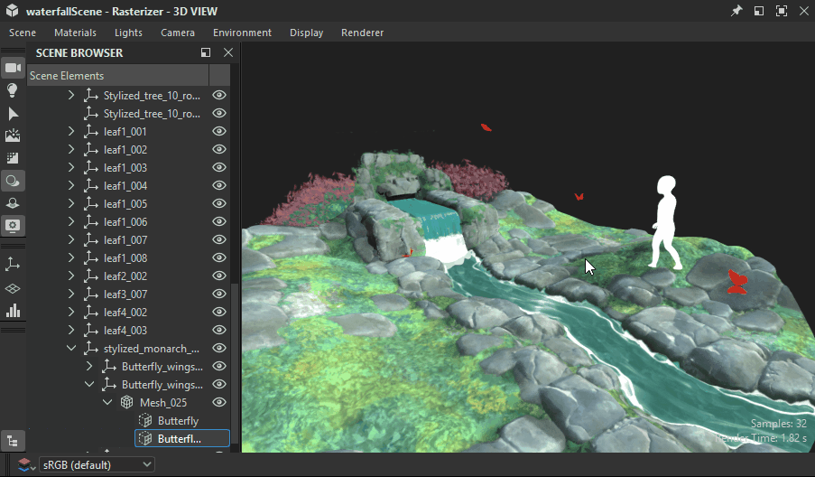
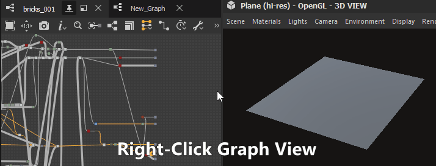
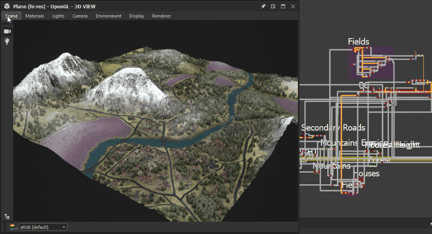
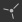

# 3D 보기

3D 보기를 사용하면 사용자 정의 메시 및 렌더링된 PBR 재질을 사용하여 재질을 보고 이해하는 데 도움이 됩니다. 모든 Substance 3D Designer Windows와 마찬가지로 마우스 오른쪽 단추 클릭 메뉴 옵션과 끌어서 놓기 작업을 통해 다른 Windows와 함께 사용할 수 있습니다.

3D 보기는 3D 장면에서 재질을 렌더링하는 두 가지 기본 방법도 제공합니다.
* **래스터라이저** 및 **OpenGL** 렌더러를 사용한 빠른 실시간 시각화
* 고품질의 광선 추적형 렌더러는 **GPU 패스트레이서** 렌더러를 사용합니다.

자세한 내용은 여기를 참조하세요. [3D 렌더러](3d-renderers/3d-renderers.md)

+++ 3D 뷰 도킹

+++

## 뷰포트 인터랙션

아래 섹션에서는 프로세스를 설명하기 위해 애니메이션 GIF와 함께 일반적인 작업을 간단히 수행하는 방법에 대해 설명합니다.

### 탐색

3D 뷰 카메라 및 환경은 다음 세 가지 방법으로 조작될 수 있습니다.

* <b>궤도:</b> LMB+드래그
* <b>이동</b>: MMB+드래그 / Ctrl+RMB+드래그
* <b>확대/축소</b>: 마우스 휠/RMB+드래그를 사용하여 스크롤
* <b>환경 회전:</b> ⇧+RMB+드래그
* <b>선택한 메시에 초점 맞추기:</b> F(선택 영역이 없는 경우 전체 장면에 초점 맞추기)
* <b>궤도 지점 조명 1:</b> Ctrl+⇧+LMB+드래그
* <b>점 광원 1을 원점에 가깝게/원점에서 멀리 이동:</b> Ctrl+⇧+RMB+드래그
* <b>카메라 궤도 위치 다시 설정:</b> R
* <b>카메라 궤도 위치 및 속성 다시 설정:</b> ⇧+R

트랙패드 사용(macOS 전용)

* <b>궤도:</b> 두 손가락 스와이프
* <b>이동:</b> ⇧+두 손가락 스와이프
* <b>확대/축소: </b>두 손가락 핀치 / ⌘+두 손가락 스와이프
* <b>환경 회전:</b> ⇧+두 손가락 스와이프

>[!NOTE]
>
> 확대/축소 방향
> 
> 각 확대/축소 방법은 다른 방법과 함께 반전됩니다.
> 
> * 장면을 *더 가까이 당깁니다*
> * RMB를 사용해 장면을 *밀어내기*&#x200B;합니다.
> 
> [환경 설정](../../interface/preferences-window/preferences-window.md)에서 확대/축소 방향을 반전할 수 있습니다.

### 선택 및 초점

뷰포트에서 직접 망과 상호 작용할 수 있습니다.

<b>⇧을 누른 상태에서 메시의 LMB를 클릭하여 메시를 선택합니다.</b> 선택한 메쉬에 파란색 윤곽선이 표시됩니다.

<b>선택한 메시에 집중하려면 F를 누르세요</b>. 메시에 초점을 맞추면 카메라가 프레임 주위로 이동하고 주변을 선회합니다.

<b>메시를 선택한 상태에서 RMB를 클릭</b>하여 상황에 맞는 메뉴에서 [재질 작업](#material-actions)에 액세스합니다.

<b>선택을 취소하려면 Esc 키를 누르세요.</b> 커서가 메시 위에 있을 필요는 없습니다.

{zoomable="yes"}

*선택, 초점, 선택 해제*

{zoomable="yes"}

*선택, 상황에 맞는 메뉴*

>[!NOTE]
>
> 더 이상 사용되지 않는 [OpenGL](../../interface/3d-view/3d-renderers/3d-renderers.md) 렌더러에서는 이 작업을 사용할 수 없습니다.

### 환경 조명 변경(IBL)

Designer은 기본적으로 이미지 기반 조명(IBL)과 함께 작동합니다. HDR(High-Dynamic Range) 비트맵은 환경 조명을 렌더링하는 데 사용됩니다.

3D 개체를 중심으로 이 환경을 회전하거나 사전 설정 또는 사용자 정의 HDR 조명 환경을 불러올 수 있습니다. HDR 이미지는 정방형 투영을 사용해야 하고 32비트 부동 소수점의 정밀도를 사용해야 합니다.

⇧+RMB+드래그 <b>환경을 3D 보기에서 회전</b>합니다.

정확한 회전을 설정하려면 상단 3D 보기 도구 모음에서 <b>환경 > 편집</b>을 사용하고 속성 창에서 <b>회전 각도</b> 슬라이더를 변경하십시오.

사전 설정된 HDR 조명 환경을 사용하려면 [라이브러리](../../interface/the-library/the-library.md)에서 <b>3D 보기 범주 </b>의 <b> HDRI 환경</b> 섹션을 클릭한 다음, 아이콘을 3D 보기로 드래그하여 놓습니다.

사용자 정의 HDR 조명 환경을 사용하려면 탐색기 창에서 파일을 패키지에 끌어다 놓아 HDR 이미지를 가져옵니다(메시지가 표시되면 파일 <b>링크</b>). 그런 다음 리소스를 끌어서 놓고 대상으로 <b>위도/경도 파노라마</b>를 선택합니다.

### 점 조명

<b>조명 > 속성 편집</b>으로 이동하여 장면의 포인트 조명을 토글합니다.

포인트 라이트 1은 LMB 또는 RMB를 누른 상태에서 조명 모드의 뷰포트에서 드래그하여 장면의 원점을 중심으로 이동할 수 있습니다. 

카메라 모드에 있는 동안  , 마우스 버튼과 함께 Ctrl+⇧ 키를 눌러 일시적으로 조명 모드로 전환할 수도 있습니다.

## 3D 보기에서 데이터 보기

### Substance 그래프

3D 뷰에서 전체 재질을 전체 재질로 볼 수 있습니다. 이 방법은 가장 일반적인 작업 방법이며 [출력 노드의 사용 특성](../../compositing-graphs/nodes-reference-for-com/atomic-nodes/output/output.md) 을 3D 보기 재질의 관련 텍스처 슬롯과 일치시킵니다. 즉, 출력이 올바르게 설정되어야 하고(템플릿을 사용하면 이러한 경우가 있는지 확인) 재료/뷰포트 셰이더가 지원하도록 선택했음을 의미합니다

[그래프 보기](../../interface/the-graph-view/the-graph-view.md)에서 빈 영역 *RMB*&#x200B;을(를) 클릭하고 컨텍스트 메뉴에서 **3D 보기에서 출력 보기** 옵션을 선택하여 그래프의 모든 출력을 볼 수 있습니다.

[탐색기](../the-explorer-window/the-explorer-window.md) 도크에서 그래프 리소스에 RMB를 클릭하고 컨텍스트 메뉴에서 **3D 보기에서 출력 보기** 옵션을 선택하여 그래프를 열지 않고도 그래프의 출력을 볼 수도 있습니다.

그래프의 상황별 메뉴에 대한 대안으로, [탐색기](../the-explorer-window/the-explorer-window.md) 도크에서 3D 보기로 그래프를 드래그하여 동일한 결과를 얻을 수 있습니다.

*그래프 불러오기*&#x200B;를 수행하면 기본적으로 해당 출력이 3D 보기에 자동으로 적용됩니다. [환경 설정](../../interface/preferences-window/preferences-window.md)에서 이 동작을 사용하지 않도록 설정할 수 있습니다. **편집 > 환경 설정 > 그래프 > 일반**&#x200B;으로 이동하고 그래프를 열 때 **3D 보기에서 출력 보기** 옵션을 선택 해제합니다.

>[!NOTE]
>
> **여러 재질 슬롯**
> 
> 둘 이상의 단일 재질에 사용자 정의 메시를 사용하는 경우 재질을 할당할 재질 슬롯을 선택하라는 메시지가 표시됩니다. 위의 방법 중 하나를 사용하여 슬롯을 클릭하여 선택 사항을 확인합니다. 재질 및 할당에 대한 자세한 내용은 아래의 세부 섹션을 참조하십시오.

### 개별 노드/그래프 출력

[3D 보기](https://substance3d.adobe.com/)에서 사용 가능한 재질 채널에서 하나의 출력만 볼 수 있습니다. 이 기능은 덜 일반적으로 사용되지만 빠른 테스트 또는 출력이 없는 개별 노드를 미리 보는 데 유용합니다.

[그래프 보기](../../interface/the-graph-view/the-graph-view.md)에서 노드를 마우스 오른쪽 단추로 클릭하고 <b>3D 보기에서 보기</b>를 선택하면 출력 노드뿐만 아니라 모든 노드를 볼 수 있습니다. 노드를 할당할 수 있는 채널이 있는 목록이 표시됩니다. 아무 것이나 클릭하여 확인합니다.

*RMB*&#x200B;을 사용하여 그래프 보기에서 노드를 3D 보기로 끌어 놓을 수도 있습니다. 노드를 할당할 수 있는 채널이 있는 목록이 표시됩니다. 아무 것이나 클릭하여 확인합니다.

[탐색기](../the-explorer-window/the-explorer-window.md) 도크에서 그래프 리소스를 확장하고 *LMB*&#x200B;를 사용하여 해당 출력을 3D 보기로 드래그하여 개별 그래프 출력을 볼 수 있습니다. 노드를 할당할 수 있는 채널이 있는 목록이 표시됩니다. 아무 것이나 클릭하여 확인합니다.

## (사용자 정의) 3D 장면 보기

Designer은 12개의 사전 설정 망을 제공합니다. 이러한 메시는 균일하고 사용 가능한 UV 좌표를 가지며 타일링 텍스처에 대한 대부분의 시나리오를 제공합니다. 자신의 3D 메시를 가져와 보는 것도 가능합니다.\
상단 표시줄의 <b>장면</b> 드롭다운 메뉴를 통해 기본 메시 중 하나를 선택합니다.

사용자 지정 3D 장면의 경우 [3D 장면 작업](../../working-with-3d-scenes/working-with-3d-scenes.md) 섹션으로 이동합니다.

## 셰이더 속성 변경

Designer에는 기본적으로 사용할 수 있는 몇 가지 다른 [셰이더들](../../glossary/glossary.md)이 있으며 각 셰이더에는 텍스처 채널 이외의 옵션이 있습니다. 개별적으로 구성할 수 있습니다.

셰이더는 Designer의 [3D 렌더러](../../interface/3d-view/3d-renderers/3d-renderers.md)마다 다르며 렌더러를 전환할 때는 &#39;공통&#39; 레이블로 표시된 설정만 이월됩니다.

현재 셰이더를 변경하려면 <b>(으)로 이동하십시오. 그런 다음 &#39;</b>재질&#39; 메뉴를 사용하여 편집할 재질에 대한 하위 메뉴를 엽니다.

예를 들어, &#39;평면(고해상도)&#39; 장면에서 &#39;기본&#39; 재질에 대한 &#39;Height 비율&#39; 속성을 조정하려면 &#39;재질 > 기본 > 속성 편집&#39;으로 이동합니다. 그런 다음 속성 도크에서 &#39;Height 비율&#39; 속성을 찾습니다.

하위 메뉴의 &#39;재질 재설정&#39; 또는 &#39;장면 상태로 재설정&#39; 작업을 사용하여 셰이더를 재설정할 수 있습니다. 3D 보기에서 Substance 그래프 출력을 보고 있는 경우 다시 적용해야 합니다.

>[!NOTE]
>
> 테셀레이션 정보
> 
> &#39;쪽맞춤 요소&#39; 속성은 선택한 3D 렌더러에 따라 달라집니다.
> 
> * <b>렌더러/GPU 패스트레이서:</b> 렌더러 설정(렌더러 > 설정 편집)에 있으며 *전체 장면*&#x200B;에 영향을 줍니다.
> * <b>OpenGL:</b> 재질 속성에 있으면 재질에 영향을 줍니다.

## 장면 내보내기

[이 페이지](../../working-with-3d-scenes/exporting-scenes/exporting-scenes.md)에서 3D 장면 내보내기에 대해 알아보세요.

### 쪽맞춤 메시 내보내기(OpenGL 렌더러만 해당)

<b>3D 보기</b>에서 <b>OBJ</b>, <b>FBX</b> 또는 <b>PLY</b> 형식의 파일로 메시를 내보낼 수 있습니다. *테셀레이션* 변위를 사용하도록 설정하면 기하학의 하위 분할이 내보낸 메쉬에 적용됩니다.

그러나 원래 메쉬의 정점 법선이 새로 바뀐 모양과 일치하지 않을 수 있습니다. 즉, 바뀐 메쉬가 올바르게 렌더링되지 않을 수 있습니다. 다음 두 가지 방법으로 이를 관리할 수 있습니다.

* 올바른 표준을 제공하는 메시 *표준 맵*&#x200B;을 사용하십시오.
* 메시 표준 맵을 사용하여 내보낼 때 *메시 표준*&#x200B;을 다시 계산하십시오. 즉, 내보낸 메시에 표준 맵이 구워지며 표준 맵은 더 이상 필요하지 않습니다

3D 보기 메시를 내보내려면 <b>장면 > 쪽맞춤 메시 내보내기...</b>(으)로 이동하여 표준 재계산에 대해 선택 사항을 설정한 다음 내보낸 메시의 위치, 이름 및 파일 형식을 선택합니다.

>[!NOTE]
>
> 이 기능은 **macOS**&#x200B;에서 *사용할 수 없음*&#x200B;입니다.

>[!IMPORTANT]
>
> 주의 사항
> 
> 원본 메시에 여러 재질 및/또는 UV 세트가 있는 경우 *하나로 병합*&#x200B;됩니다.
> 
> 내보내기 프로세스의 지속 시간과 결과 파일 크기는 메시 삼각형 개수 및 *테셀레이션 요소*&#x200B;에 따라 달라집니다. 테셀레이션 계수 값이 높으면 GPU의 온보드 메모리 풀에 따라 불안정해질 수 있습니다.
> 
> 즉, 쪽맞춤 메쉬의 정점 수는 *Height* 맵의 픽셀 수와 *동일한 범위*&#x200B;에 있어야 합니다.
> 
> <b>퐁</b> 테셀레이션을 사용할 때 Height 맵보다 메쉬가 촘촘하면 메쉬가 조금 더 매끄러워질 수 있지만, 필요한 Height 맵 세부 사항으로 내보낸 메쉬를 먼저 안정적으로 얻은 다음 필요한 경우 다른 소프트웨어에서 내보낸 메쉬를 미세 조정하는 것을 목표로 해야 합니다.

>[!WARNING]
>
> **TDR(Windows만 해당)**
> 
> 이 기능을 사용하려면 Designer의 [기술 요구 사항](../../getting-started/system-requirements/system-requirements.md)에 명시된 대로 <b>TDR(Timeout Detection and Recovery)</b>이 설명서의 [이 페이지](https://experienceleague.adobe.com/en/docs/substance-3d-painter/using/technical-support/technical-issues/gpu-issues/gpu-drivers-crash-with-long-computations-tdr-crash)의 권장 값과 일치해야 합니다.

## 메뉴 막대

메뉴 모음에는 3D 보기와 관련된 옵션이 있는 7개의 메뉴가 있습니다. 다음은 사용 가능한 모든 옵션에 대한 개요입니다.

+++장면
<b>장면</b> 메뉴는 표시된 모양(3D 리소스)과 3D 보기 상태를 다룹니다. 3D 리소스는 메시만 공유하고 장면 상태는 조명, 카메라 및 관련 설정이며 메시를 나란히 포함할 수도 있습니다.

<b>편집: </b>장면 옵션을 [속성](../../interface/properties/properties.md) 패널에 로드합니다. 3D 메쉬의 가시성을 전환할 수 있습니다.

<b>표준 기본 요소:</b> 아래의 간단한 3D 메시를 3D 보기에 표시합니다.

* 큐브

* 원통

* 빈 상자

* 내부 상자

* 평면

* 평면(고해상도)

* 구

<b>확장된 프리미티브:</b> 아래의 3D 메시를 3D 보기에 표시합니다.

* 천

* 매트 볼

* 둥근 육면체

* 둥근 원통

* 구 2개 타일

* 토러스

<b>2D 보기에 UV 표시:</b> 현재 선택한 메시에 대한 UV를 [2D 보기](../2d-view/2d-view.md)에 오버레이로 표시할 수 있습니다.

<b>현재 장면에서 3D 리소스 만들기...:</b> 현재 장면에서 패키지에 새 [3D 장면 리소스](../../resources/3d-scene-resource/3d-scene-resource.md)를 만듭니다.

<b>상태 파일 불러오기...: </b>외부에 저장된 [장면 상태 파일](../../working-with-3d-scenes/working-with-3d-scenes.md)(\*.sbsscn)을 불러옵니다. 3D 메시를 바꾸지 않고 3D 렌더러, 카메라 및 조명에 대한 설정만 로드합니다.

<b>메시가 있는 상태 파일 로드...:</b> 외부에 저장된 [장면 상태 파일](../../working-with-3d-scenes/working-with-3d-scenes.md)(\*.sbsscn)을 로드합니다. 3D 렌더러, 카메라, 조명 및 해당 참조의 3D 장면에 대한 설정을 로드합니다. .

<b>상태 파일 저장...: </b>3D 보기의 현재 상태를 [장면 상태 파일](../../working-with-3d-scenes/working-with-3d-scenes.md)(\*.sbsscn)에 저장합니다.

<b>현재 상태를 기본값으로 저장: </b>3D 보기의 현재 상태를 새 3D 보기를 만들 때 기본적으로 사용할 [장면 상태 파일](../../working-with-3d-scenes/working-with-3d-scenes.md)(으)로 설정합니다. 이 파일은 3D 보기를 다시 설정하거나 초기화할 때마다 로드되며 [프로젝트 설정](../../interface/preferences-window/project-settings/project-settings.md)에서 설정할 수 있습니다.

<b>내보내기 장면:</b> *(래스터라이저/GPU 패스트레이서 렌더러만 해당)* 현재 장면을 [병합된 장면](../../working-with-3d-scenes/exporting-scenes/exporting-scenes.md)으로 내보냅니다. 여기서 결과 장면만 기록되고 원래 장면에 대한 모든 참조는 손실됩니다. 내보낸 장면의 내용은 선택한 내보내기 형식에서 지원하는 기능에 따라 달라집니다.\
사용 가능한 형식: STL, FBX, GLB, GLTF, PLY, USDC, USD, USDA, USDZ, OBJ.

<b>레이어가 있는 장면 내보내기:</b> *(래스터화/GPU 패스트레이서 렌더러만 해당)*현재 장면을 [레이어가 있는 장면](../../working-with-3d-scenes/exporting-scenes/exporting-scenes.md)으로 내보냅니다. 원본 장면에 대한 모든 편집 내용은 비파괴적 워크플로의 개별 파일에 저장됩니다. USD 파일 형식에만 사용할 수 있습니다.\
사용 가능한 형식은 USDC, USD, USDA입니다.

<b>쪽맞춤 도형 내보내기:</b> *(OpenGL 렌더러만 해당)* 쪽맞춤을 사용하여 현재 장면을 원시 모양으로 내보냅니다. 장면 내보내기 섹션 을 참조하세요.

<b>장면 재설정: </b>3D 보기를 기본값으로 다시 설정합니다.

일부 소프트웨어 업데이트는 장면 상태 파일을 저장/로드하는 방법을 변경할 수 있습니다.

장면을 파일에서 *올바르게 복원되지 않은* 경우 장면의 원하는 상태를 수동으로 설정하고 장면 상태 파일을 *다시 내보내기*&#x200B;하는 것이 좋습니다.

+++

+++재질
<b>재질</b> 메뉴는 로드된 3D 메시 및 사용된 렌더러를 기반으로 변경됩니다.

&#39;재질&#39; 메뉴에는 장면의 메시에 할당된 모든 재질 목록이 있습니다. &#39;재질&#39; 메뉴에 나열된 각 재질에는 재질 작업의 하위 메뉴가 있습니다.

<b>편집</b> - 속성 창에서 현재 재질의 설정을 편집합니다.

<b>음영 목록</b> - 현재 [3D 렌더러](../../interface/3d-view/3d-renderers/3d-renderers.md)에 사용할 수 있는 모든 [음영](../../glossary/glossary.md).

<b>정의 로드...: </b>(OpenGL 렌더러만 해당) 사용자 지정 [GLSLFX 셰이더](../../interface/3d-view/glslfx-shaders/glslfx-shaders.md)를 로드할 수 있습니다. 셰이더가 위의 목록에 추가됩니다.

<b>공통 매개 변수 다시 설정:</b> 셰이더에서 공통적인 모든 매개 변수를 다시 설정합니다. 예를 들어 [래스터라이저/GPU 패스트레이서]와 OpenGL 렌더러 사이를 전환할 때 [Adobe 표준 재질](https://experienceleague.adobe.com/en/docs/substance-3d/general-knowledge/asm/adobe-standard-material)의 여러 매개 변수 값이 전달됩니다.

<b>이름 바꾸기:</b> 이 재질의 레이블을 변경합니다.

<b>재질 재설정:</b> 모든 셰이더 매개 변수를 기본값으로 다시 설정합니다. 텍스처가 셰이더의 샘플러에 연결되어 있으면 연결이 끊어집니다.

<b>재질을 장면 상태로 재설정: </b>*(래스터라이저/GPU 패스트레이서 렌더러만 해당)* [재정의된 재질](../../working-with-3d-scenes/overriding-scene-mat/overriding-scene-materials.md)에 대한 모든 속성을 장면의 원래 값으로 재설정합니다(있는 경우 원래 텍스처도 포함).

<b>추가: </b>목록에 새 재질을 추가합니다. 기본적으로 사용되지 않으며 [장면 브라우저](../../interface/3d-view/scene-browser/scene-browser.md)를 사용하여 [장면 자료에 연결](../../working-with-3d-scenes/overriding-scene-mat/overriding-scene-materials.md)될 수 있습니다.

+++

+++조명
<b>조명</b> 메뉴는 이전 버전의 주변광 및 포인트 조명만 다룹니다. 이러한 조명은 PBR을 준수하지 않으며 HDR 이미지 기반 렌더링과 동일한 고품질 결과를 제공하지 않습니다.

<b>편집:</b> 주변광 및 두 점 조명에 대한 개별 설정을 편집합니다.

<b>조명 재설정:</b> 조명 속성을 기본 상태로 재설정합니다.

+++

+++카메라
<b>카메라</b> 메뉴를 사용하면 카메라 설정을 변경하고 미리 정의된 각도로 이동한 다음 사용자 지정 3D 메시 파일 내에 저장된 카메라 각도를 불러올 수 있습니다.

<b>속성 편집:</b> 속성 도크에서 기본 카메라의 설정을 엽니다.

<b>초점: </b>(F) 기본 카메라의 초점을 현재 선택한 메시에 맞춥니다. 즉, 메쉬를 프레임하고 카메라의 회전을 정렬합니다. 활성 선택 항목이 없는 경우에는 장면의 전역 경계 상자가 사용됩니다.

<b>장면 카메라:</b> 장면에 카메라가 하나 이상 포함된 경우 해당 카메라가 여기에 나열되고 해당 설정은 장면의 기본 카메라에 적용할 사전 설정으로 사용됩니다.

<b>시점:</b> 기본 카메라에 대한 미리 구성된 시점입니다. 이는 카메라의 변형(위치 및 회전)에만 영향을 줍니다.

* 기본값: 개체의 왼쪽 전면에서 촬영한 높은 각도 샷입니다.

* 뒤로

* 아래

* 전면

* 왼쪽

* 오른쪽

* 위

<b>렌더링 저장...:</b> (Alt+S) 현재 렌더링된 이미지를 렌더러 속성에 지정된 해상도로 디스크, 또는 재정의 해상도가 설정된 경우 기본 카메라의 속성에 저장합니다.

<b>클립보드에 렌더링 복사:</b>(Alt+C) 외부 이미지 편집기에 붙여넣을 수 있도록 현재 렌더링된 이미지를 클립보드에 복사합니다.

<b>위치 재설정:</b> (R) 카메라의 위치를 재설정합니다.

<b>선택한 항목 재설정:</b>(Shift+R) 카메라의 위치와 속성을 재설정합니다.

+++

+++환경
<b>환경</b> 메뉴를 사용하면 PBR 교정 재질을 밝게 하는 데 사용되는 HDRI 환경과 관련된 설정을 수정할 수 있습니다.

<b>속성 편집:</b> PBR의 조명에 사용되는 HDR 환경 설정에 액세스할 수 있습니다. 특히 가시성을 전환하고, 미리 보기를 사용하여 노출을 변경하고, 정확한 슬라이더로 회전을 설정할 수 있습니다.

<b>환경 다시 설정:</b> 모든 환경 속성을 기본값으로 다시 설정합니다.

+++

+++보기
표시 메뉴를 사용하면 렌더링된 장면에 대한 보기 모드, 도우미 및 정보를 전환할 수 있습니다.

<b>축:</b> 뷰포트에서 3D 축 표시를 토글합니다.

<b>격자:</b> 월드 격자 표시를 토글합니다.

<b>해상도:</b> 작은 해상도 카운터의 표시를 토글합니다.

<b>장면 통계:</b> Polycount, Materials Count, Static Mesh Count 등과 같은 장면 통계 표시를 토글합니다.

<b>렌더링 시간:</b> 전체 이미지에 대한 샘플 하나를 계산하는 시간입니다.

<b>샘플:</b> 누적 앤티앨리어싱(래스터라이저) 또는 경로 추적(GPU 경로 추적기)에 대해 계산된 픽셀 샘플의 양입니다.

<b>뒷면 컬링:</b> 이 옵션을 사용하지 않도록 설정하면 *양쪽*&#x200B;에서 메시 서체를 볼 수 있습니다. 옵션은 와이어프레임과 함께 작동합니다.

<b>테두리 상자:</b> 메시 테두리 상자의 표시를 토글합니다.

<b>와이어프레임:</b> 메시 와이어프레임 표시를 토글합니다.

<b>조명:</b> 점 조명의 보조 선 표시를 전환합니다.

<b>꼭지점 접선 공간:</b>은 모든 꼭지점에 대한 접선, 이항 및 수직 벡터를 색상이 지정된 기즈모로 표시합니다

이러한 옵션 중 일부는 [장면] 툴바에서 버튼을 전환할 때 사용할 수 있습니다.

+++

+++렌더러
<b>렌더러</b> 메뉴를 사용하면 3D 렌더러를 전환하고 <b>속성 편집</b> 작업을 통해 현재 3D 렌더러의 속성에 액세스할 수 있습니다.

사용 가능한 렌더러와 해당 설정은 [이 전용 페이지](../../interface/3d-view/3d-renderers/3d-renderers.md)에 문서화되어 있습니다.

+++

## 장면 도구 모음

기본적으로 3D 보기의 왼쪽 테두리에 있는 **장면** 도구 모음은 장면을 보고 상호 작용하기 위한 컨트롤을 제공합니다.

또한 [변위 팝업](displacement/displacement.md) 및 [장면 브라우저](scene-browser/scene-browser.md) 도크에 액세스할 수 있습니다.

>[!NOTE]
>
> 도구 모음은 세 개의 평행선으로 표시된 가장 왼쪽의 *핸들*&#x200B;을 사용하여 **3D 보기** 도킹 주위에 *위치 변경*&#x200B;할 수 있습니다.

### 표시 옵션

#### 위

 

 <b>장면 브라우저</b>

3D 장면에 있는 모든 요소의 계층 구조를 표시합니다.

>[!INFO]
>
>장면 브라우저와 그 기능은 [전용 페이지](../../interface/3d-view/scene-browser/scene-browser.md)에서 광범위하게 다룹니다.

 <b>선택</b>

장면에서 메시를 직접 선택할 수 있습니다.

<code>LMB</code> 장면에서 메시를 선택합니다.

장면의 개별 망을 선택합니다. 선택한 메시는 뷰포트에 파란색 윤곽선으로 표시되며 [장면 브라우저](../../interface/3d-view/scene-browser/scene-browser.md)에서 강조 표시됩니다.

상황별 메뉴는 선택한 메시에서 사용할 수 있으며 <code>RMB를 클릭하면 표시될 수 있습니다.</code>.

<code>Shift+LMB를 눌러 카메라 또는 조명 모드에서도 망을 선택할 수 있습니다</code>.

 

 <b>카메라</b>

장면에서 카메라를 직접 제어할 수 있습니다.

<code>LMB</code> 목표물을 중심으로 카메라의 궤도를 돌립니다. <code>RMB</code> 카메라를 대상에서 더 가까이 또는 더 멀리 이동합니다.

 

 <b>환경 표시</b>

이 버튼을 클릭하면 장면의 환경이 표시됩니다. 3D 보기의 메뉴 모음에서 <b>환경 > 편집</b>으로 이동한 후 속성 도크에서 동일한 설정을 찾을 수 있습니다.

 

 <b>조명</b>

장면에서 점 광원 1을 직접 제어할 수 있습니다.

<code>LMB</code> 장면의 원점을 중심으로 카메라의 궤도를 조정합니다. <code>RMB</code> 조명을 장면의 원점에서 더 가깝게 또는 더 멀리 이동합니다.

 

 <b>렌더러 설정</b>

[속성](../properties/properties.md) 도크에서 현재 렌더러의 설정을 표시합니다.

 

 <b>Pathtracer 사용</b>

[GPU 패스트레이서](3d-renderers/3d-renderers.md#gpu-pathtracer) 렌더러의 선택을 전환합니다.

 

 <b>그림자 사용</b>

[래스터라이저](3d-renderers/3d-renderers.md#rasterizer) 렌더러에서 실시간 그림자 렌더링을 전환합니다.

 

 <b>기준 평면 사용</b>

[래스터라이저](3d-renderers/3d-renderers.md#rasterizer) 및 [GPU 패스트레이서](3d-renderers/3d-renderers.md#gpu-pathtracer) 렌더러에서 지표 평면의 렌더링을 전환합니다.

 

 <b>변위</b>

[변위 팝업](displacement/displacement.md)을 표시합니다.

 

#### 아래

 

 <b>격자</b>

세계 격자의 표시를 토글합니다.

 

 <b>장면 상태</b>

폴리카운트, 재질 수, 정적 메시 수 등과 같은 장면 통계 표시를 토글합니다.

 

 <b>축</b>

뷰포트에서 3D 축 표시를 전환합니다.

 

#### OpenGL 렌더러만

 

 <b>백페이스 컬링</b>

이 옵션을 사용하지 않도록 설정하면 *양쪽*&#x200B;에서 메시 면을 볼 수 있습니다. 이 옵션은 와이어프레임과 함께 사용할 수 있습니다.

 

 <b>테두리 상자</b>

메시 테두리 상자의 표시를 토글합니다.

 

 <b>꼭지점 접선 공간</b>

모든 정점에 대한 탄젠트, 이항 및 수직 벡터를 색상이 지정된 기즈모로 표시합니다.

 

 <b>와이어프레임</b>

메시의 와이어프레임 표시를 전환합니다.

## 도구 모음 표시

기본적으로 <b>3D 보기</b> 패널의 *아래쪽*&#x200B;에 있는 <b>디스플레이</b> 도구 모음을 사용하면 렌더링된 이미지를 뷰포트에 표시하는 방법을 제어할 수 있습니다.

>[!NOTE]
>
> 도구 모음은 세 개의 평행선으로 표시된 가장 왼쪽의 *핸들*&#x200B;을 사용하여 **3D 보기** 도킹 주위에 *위치 변경*&#x200B;할 수 있습니다.

### 3D 렌더링 AOV

<table style="margin-top: 32px; margin-bottom: 32px">
    <tr style="border: 0; vertical-align: top">
        <td style="border: 0">
            
 <b>3D 렌더링 AOV</b> 단추를 사용하여 다른 <a href="../../glossary/glossary.md#aov">AOV</a>을(를) 표시할 수 있습니다.

            
AOV를 사용하면 메시 및 재질 정보를 따로 검사하여 집중된 작업 및 디버깅을 수행할 수 있습니다.

            
일부 AOV에는 뷰포트에서 1(순수한 흰색) 또는 0(순수한 검정)으로 클램프되는 <i>HDR 값</i>이 포함됩니다. 값의 전체 범위를 검사하려면 AOV의 3D 렌더링을 HDR 값을 지원하는 이미지 파일 형식(예: <code>.exr</code>)으로 내보낼 수 있습니다. 현재 AOV를 내보내려면 <code>Camera > Save render...</code> 메뉴 옵션을 사용하세요.

            
<i>참고:</i> AOVs는 래스터라이저와 GPU 패스트레이서 <a href="./3d-renderers/3d-renderers.md">3D 렌더러</a>를 사용할 때만 사용할 수 있습니다.

        </td>
        <td style="width: 33%; border: 0">
            
        </td>
    </tr>
</table>

### 색상 채널

 <b>색상 채널</b> 단추를 사용하여 이미지의 단일 채널을 표시할 수 있습니다. 그러면 <b>빨강</b>, <b>녹색</b> 및 <b>파랑</b> 채널 중 표시할 채널을 선택할 수 있는 콤보 상자가 열립니다. <b>RGB</b> 옵션을 선택하면 모든 채널이 있는 이미지의 일반적인 모습이 복원됩니다.

<b>색상 채널</b> 단추의 *아이콘*&#x200B;은(는) 현재 표시된 채널에 따라 *변경*&#x200B;됩니다.

### 색상 공간

가장 정확한 색상 표현을 위해 이미지는 기본적으로 *모니터*&#x200B;에서 사용하는 것과 일치하는 *색상 공간*&#x200B;에 표시됩니다.

사용 가능한 컨트롤은 [프로젝트 설정](../../interface/preferences-window/project-settings/project-settings.md)에 설정된 색상 관리 모드에 따라 다릅니다. 이 페이지의 [색상 관리](../../color-management/color-management.md) 섹션에서 이러한 컨트롤에 대해 자세히 알아보세요.
